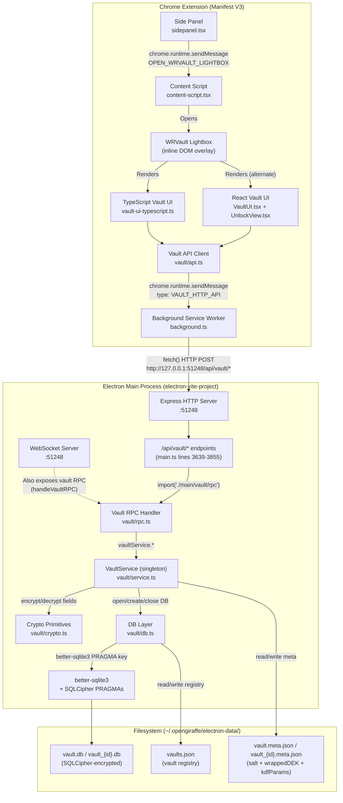

# WRVault Architecture Map

> **Generated:** 2026-02-15 | **Status:** Read-only analysis — no code was changed.
>
> This document maps the current WRVault implementation across the monorepo
> (`apps/electron-vite-project`, `apps/extension-chromium`, `packages/*`).

---

## 1. High-Level Architecture Diagram



---

## 2. File / Module Inventory

### 2.1 Electron Backend (`apps/electron-vite-project/`)

| File | Responsibility |
|------|---------------|
| `electron/main.ts` (lines 3639-3855) | Express HTTP endpoints for vault (`/api/vault/*`). Lazy-imports `vault/rpc.ts`. |
| `electron/main/vault/service.ts` | **Core business logic.** Singleton `VaultService` — create, unlock, lock, CRUD items/containers, auto-lock timer, rate limiting, CSV import/export. Holds the DEK (`session.vmk`) in memory while unlocked. |
| `electron/main/vault/crypto.ts` | Cryptographic primitives: scrypt KDF (KEK derivation), AES-256-GCM (DEK wrapping), HKDF-SHA256 (per-field key derivation), libsodium XChaCha20-Poly1305 (field encryption), buffer zeroization. |
| `electron/main/vault/db.ts` | SQLite layer: loads `better-sqlite3`, creates/opens databases with SQLCipher PRAGMAs, creates schema, manages vault file paths and registry. |
| `electron/main/vault/rpc.ts` | WebSocket RPC dispatcher. Maps `vault.*` method names to `VaultService` calls. Validates with Zod schemas. |
| `electron/main/vault/schemas.ts` | Zod schemas for all RPC requests/responses. |
| `electron/main/vault/types.ts` | TypeScript interfaces: `Container`, `VaultItem`, `Field`, `VaultSession`, `VaultStatus`, `VaultSettings`, `KDFParams`. |
| `electron/preload.ts` | Context bridge — **does NOT expose vault IPC** (vault uses HTTP, not IPC). |
| `src/auth/capabilities.ts` | Tier resolution: `resolveTier(wrdesk_plan, roles) → Tier`. 7 tiers: `free`, `private`, `private_lifetime`, `pro`, `publisher`, `publisher_lifetime`, `enterprise`. |
| `reset-vault.ps1` | Utility script — deletes `vault.db` + `vault.meta.json` for recovery. |

### 2.2 Chrome Extension (`apps/extension-chromium/`)

| File | Responsibility |
|------|---------------|
| `src/background.ts` (lines 1687-1819) | Service worker relay. Receives `VAULT_HTTP_API` messages from content scripts, forwards as `fetch()` to `http://127.0.0.1:51248/api/vault/*`. Includes retry logic with exponential backoff and 15s abort timeout. |
| `src/content-script.tsx` | Entry point for vault UI. Contains the `openWRVaultLightbox()` function (line 29963) that creates a DOM overlay. Registers `wrvault-open-btn` click handler. Listens for `OPEN_WRVAULT_LIGHTBOX` runtime message. |
| `src/sidepanel.tsx` (line 1928) | Side panel button `openWRVault()` — sends `OPEN_WRVAULT_LIGHTBOX` to the active tab's content script. |
| `src/vault/api.ts` | HTTP API client. All calls go through `chrome.runtime.sendMessage({ type: 'VAULT_HTTP_API', endpoint, body })`. Includes retry for service-worker suspension. |
| `src/vault/VaultUI.tsx` | React component — main vault dashboard (items list, category filter, CRUD operations). |
| `src/vault/UnlockView.tsx` | React component — master password entry / vault creation screen. |
| `src/vault/vault-ui-typescript.ts` | Pure TypeScript vault UI (no React dependency). Inline DOM generation for lightbox. Contains category options, create/unlock screens, item management. |
| `src/vault/types.ts` | Shared type definitions + standard field templates (`IDENTITY_STANDARD_FIELDS`, `COMPANY_STANDARD_FIELDS`, `PASSWORD_STANDARD_FIELDS`, etc.). |
| `src/policy/schema/domains/vault-access.ts` | Policy schema for vault access control (operations, compartment access, audit). **Schema only — not enforced at runtime yet.** |
| `manifest.config.ts` | Manifest V3. Permissions: `activeTab`, `storage`, `unlimitedStorage`, `scripting`, `sidePanel`, etc. |

### 2.3 Shared Packages

| Package | Vault Relevance |
|---------|----------------|
| `packages/shared/` (`@shared/core`) | No vault-specific code found. |
| `packages/shared-extension/` (`@shared/extension`) | No vault-specific code found. |

> **Note:** Vault types are duplicated between `electron/main/vault/types.ts` and `extension/src/vault/types.ts` rather than sharing via a common package.

---

## 3. Data Flow: Unlock → Get Item → Decrypt → Render

```
┌─────────────────────────────────────────────────────────────────────┐
│  USER enters master password in UnlockView.tsx                      │
└───────────────────────────┬─────────────────────────────────────────┘
                            │
                            ▼
┌─────────────────────────────────────────────────────────────────────┐
│  vault/api.ts: unlockVault(password, vaultId)                       │
│    → chrome.runtime.sendMessage({ type:'VAULT_HTTP_API',            │
│        endpoint:'/unlock', body:{ password, vaultId } })            │
└───────────────────────────┬─────────────────────────────────────────┘
                            │
                            ▼
┌─────────────────────────────────────────────────────────────────────┐
│  background.ts: relay → fetch('POST http://127.0.0.1:51248         │
│                                /api/vault/unlock', { password })    │
└───────────────────────────┬─────────────────────────────────────────┘
                            │
                            ▼
┌─────────────────────────────────────────────────────────────────────┐
│  Electron main.ts: POST /api/vault/unlock                           │
│    → import('./main/vault/rpc').vaultService.unlock(password, id)   │
└───────────────────────────┬─────────────────────────────────────────┘
                            │
                            ▼
┌─────────────────────────────────────────────────────────────────────┐
│  VaultService.unlock(masterPassword, vaultId):                      │
│                                                                     │
│  1. Rate limit check (max 5 attempts / minute)                      │
│  2. Load vault.meta.json → { salt, wrappedDEK, kdfParams }         │
│  3. KEK = scrypt(password, salt, N=16384, r=8, p=1) → 32 bytes     │
│  4. DEK = AES-256-GCM-unwrap(wrappedDEK, KEK)                      │
│     └─ Failure → "Incorrect password" error                         │
│  5. zeroize(KEK) — KEK never stored                                 │
│  6. db = openVaultDB(DEK) → better-sqlite3 PRAGMA key="x'<hex>'"   │
│  7. session = { vmk: DEK, extensionToken: random(32), lastActivity }│
│  8. Start auto-lock timer (default 30 min)                          │
│  9. Return extensionToken                                           │
└───────────────────────────┬─────────────────────────────────────────┘
                            │
                            ▼
┌─────────────────────────────────────────────────────────────────────┐
│  UI receives success → calls listItems(filters)                     │
│    → same relay chain → VaultService.listItems()                    │
│                                                                     │
│  For each row from SQLite:                                          │
│    1. Parse fields_json (JSON array of Field objects)                │
│    2. For each field where encrypted === true:                       │
│       a. fieldKey = HKDF-SHA256(DEK, "field-encryption", itemId)    │
│       b. plaintext = XChaCha20-Poly1305-decrypt(                    │
│              ciphertextB64, nonceB64, fieldKey)                      │
│    3. Return decrypted VaultItem[]                                   │
└───────────────────────────┬─────────────────────────────────────────┘
                            │
                            ▼
┌─────────────────────────────────────────────────────────────────────┐
│  VaultUI.tsx / vault-ui-typescript.ts renders items                  │
│    → Category tabs: Passwords, Private Data, Company, Business,     │
│      Custom                                                         │
│    → Sensitive fields shown as masked (•••) until clicked            │
└─────────────────────────────────────────────────────────────────────┘
```

---

## 4. Encryption Architecture

### 4.1 Key Hierarchy

```
Master Password (user input, never stored)
    │
    ├── scrypt(password, salt, N=16384, r=8, p=1) ──→ KEK (32 bytes)
    │       └── Transient: used to wrap/unwrap DEK, then zeroized
    │
    └── KEK ──unwrap──→ DEK (32 bytes, stored encrypted in vault.meta.json)
                │
                ├── SQLCipher PRAGMA key (hex-encoded DEK)
                │       └── Encrypts entire .db file at page level
                │
                └── HKDF-SHA256(DEK, "field-encryption", itemId) ──→ Field Key
                        └── XChaCha20-Poly1305 per-field encryption
                                └── Only fields with encrypted=true
```

### 4.2 SQLCipher Configuration

```
PRAGMA key = "x'<hex-encoded DEK>'"
PRAGMA cipher_page_size = 4096
PRAGMA kdf_iter = 64000
PRAGMA cipher_hmac_algorithm = HMAC_SHA512
PRAGMA cipher_kdf_algorithm = PBKDF2_HMAC_SHA512
PRAGMA journal_mode = WAL
PRAGMA synchronous = NORMAL
PRAGMA foreign_keys = ON
PRAGMA cache_size = -8000      (8 MB)
PRAGMA temp_store = MEMORY
PRAGMA mmap_size = 0
```

### 4.3 Field-Level Encryption

- **Algorithm:** libsodium XChaCha20-Poly1305 AEAD
- **Key derivation:** `HKDF-SHA256(DEK, context="field-encryption", info=itemId)`
- **Format:** JSON string `{ nonce: base64, ciphertext: base64 }` stored in `fields_json`
- **Selective:** Only fields with `encrypted: true` are encrypted (e.g., passwords, card numbers)

---

## 5. Data Model

### 5.1 Database Schema (3 tables)

```sql
-- Vault metadata (key-value store for salt, wrapped DEK, settings)
CREATE TABLE vault_meta (
    key        TEXT PRIMARY KEY,
    value      BLOB NOT NULL,
    updated_at INTEGER NOT NULL
);

-- Organizational containers (companies, identities)
CREATE TABLE containers (
    id         TEXT PRIMARY KEY,
    type       TEXT NOT NULL,        -- 'person' | 'company' | 'business'
    name       TEXT NOT NULL,
    favorite   INTEGER DEFAULT 0,
    created_at INTEGER NOT NULL,
    updated_at INTEGER NOT NULL
);

-- Vault items (passwords, identities, etc.)
CREATE TABLE vault_items (
    id           TEXT PRIMARY KEY,
    container_id TEXT,                -- FK → containers(id) ON DELETE CASCADE
    category     TEXT NOT NULL,       -- 'password'|'identity'|'company'|'business'|'custom'
    title        TEXT NOT NULL,
    domain       TEXT,                -- For password autofill matching
    fields_json  TEXT NOT NULL,       -- JSON array of Field objects
    favorite     INTEGER DEFAULT 0,
    created_at   INTEGER NOT NULL,
    updated_at   INTEGER NOT NULL,
    FOREIGN KEY(container_id) REFERENCES containers(id) ON DELETE CASCADE
);

-- Indexes
CREATE INDEX idx_items_container ON vault_items(container_id);
CREATE INDEX idx_items_domain    ON vault_items(domain);
CREATE INDEX idx_items_category  ON vault_items(category);
CREATE INDEX idx_items_favorite  ON vault_items(favorite);
```

### 5.2 Categories & Standard Fields

| Category | UI Label | Standard Fields |
|----------|----------|-----------------|
| `password` | Passwords | username, password*, url, notes, additional_info |
| `identity` | Private Data | first_name, surname, street, street_number, postal_code, city, state, country, email, phone, tax_id*, additional_info |
| `company` | Company Data | ceo_first_name, ceo_surname, street, street_number, postal_code, city, state, country, email, phone, vat_number, tax_id*, additional_info |
| `business` | Business Data | Same as Company (cloned with label adjustments) |
| `custom` | Custom Data | User-defined fields |

> Fields marked with `*` have `encrypted: true` by default.

### 5.3 Container Types

| Type | Description |
|------|-------------|
| `person` | Individual identity container |
| `company` | Company/organization container |
| `business` | Business entity container |

---

## 6. DB Location Strategy

### 6.1 Current Implementation (Electron only)

```
~/.opengiraffe/electron-data/
├── vault.db                        # Default vault (SQLCipher encrypted)
├── vault.meta.json                 # Default vault metadata (unencrypted: salt, wrappedDEK, kdfParams)
├── vault_{id}.db                   # Named vault databases
├── vault_{id}.meta.json            # Named vault metadata
└── vaults.json                     # Vault registry (id, name, created)
```

- **Path resolution:** `os.homedir() + '/.opengiraffe/electron-data/'`
- **Consistent across platforms:** Windows (`C:\Users\<user>\.opengiraffe\...`), macOS (`/Users/<user>/.opengiraffe/...`), Linux (`/home/<user>/.opengiraffe/...`)
- **Directory creation:** Automatic via `mkdirSync(recursive: true)` on first access

### 6.2 Extension Runtime

The Chrome extension **does not store vault data locally.** All vault operations are proxied through the background service worker to the Electron Express HTTP server at `http://127.0.0.1:51248`. The extension requires Electron to be running.

### 6.3 Legacy Desktop App

`apps/desktop/main.js` — Legacy Electron app on port 51247. **No vault functionality found** in this app; it is a WebSocket-only server for grid configuration.

---

## 7. Communication Channels

### 7.1 Extension → Electron (Primary: HTTP)

```
Content Script / Sidepanel
    ↓ chrome.runtime.sendMessage({ type: 'VAULT_HTTP_API', endpoint, body })
Background Service Worker
    ↓ fetch('POST http://127.0.0.1:51248/api/vault' + endpoint, body)
Electron Express Server
    ↓ lazy import → vaultService.*
VaultService (singleton)
```

**HTTP Endpoints:**

| Endpoint | Method | Description |
|----------|--------|-------------|
| `/api/vault/health` | GET | Health check |
| `/api/vault/status` | POST | Vault status (exists, locked, available vaults) |
| `/api/vault/create` | POST | Create new vault with master password |
| `/api/vault/delete` | POST | Delete vault (must be unlocked) |
| `/api/vault/unlock` | POST | Unlock vault with master password |
| `/api/vault/lock` | POST | Lock vault |
| `/api/vault/items` | POST | List items with filters |
| `/api/vault/item/create` | POST | Create item |
| `/api/vault/item/get` | POST | Get item by ID (decrypts) |
| `/api/vault/item/update` | POST | Update item |
| `/api/vault/item/delete` | POST | Delete item |
| `/api/vault/containers` | POST | List containers |
| `/api/vault/container/create` | POST | Create container |
| `/api/vault/settings/get` | POST | Get settings |
| `/api/vault/settings/update` | POST | Update settings |

### 7.2 WebSocket RPC (Secondary)

The Electron WebSocket server (port 51248) also handles vault RPC via `handleVaultRPC(method, params)` with method names like `vault.create`, `vault.unlock`, `vault.listItems`, etc. This path is available but the extension primarily uses the HTTP path.

---

## 8. Session & Auto-Lock

```typescript
interface VaultSession {
    vmk: Buffer              // DEK — the only long-lived key in memory
    extensionToken: string   // Random 32-byte hex token (capability token)
    lastActivity: number     // Epoch ms, reset on every operation
}
```

- **Auto-lock default:** 30 minutes of inactivity
- **Configurable:** 0 (never), 15, 30, 1440 (1 day) minutes
- **Lock behavior:** Closes SQLite DB, zeroizes DEK buffer, clears session, stops timer
- **Rate limiting:** Max 5 unlock attempts per 60-second window
- **Token validation:** `validateToken(token)` exists but is **not currently enforced** on HTTP endpoints (all calls hit service directly without token check)

---

## 9. Tier / Capability Logic

### 9.1 Tier System

Defined in `apps/electron-vite-project/src/auth/capabilities.ts`:

```
free → private → private_lifetime → pro → publisher → publisher_lifetime → enterprise
```

**Resolution priority:**
1. `wrdesk_plan` JWT claim (Keycloak User Attribute)
2. Keycloak roles (fallback)
3. Default: `'free'` (fail-closed)

### 9.2 Vault Tier Gating

- **Pricing UI** (content-script.tsx line 32703): WRVault is listed as a **Private tier** capability — "WRVault™ Local Data Vault + Password Manager (encrypted, scoped, policy-aware)"
- **Runtime enforcement: NONE.** There is no tier check in the vault service, HTTP endpoints, or extension UI. Any user can currently access the vault regardless of tier.
- **Vault Access Policy** (`vault-access.ts`): A Zod schema exists for granular vault access control (operations, compartments, audit), but it is **schema-only — not enforced** in the current code.

---

## 10. Risks & Uncertainties

### Critical

| # | Risk | Details |
|---|------|---------|
| R1 | **No auth on HTTP vault endpoints** | The Express server at `:51248` has no authentication, CORS restrictions, or origin checks. Any local process can call vault APIs while unlocked. The `extensionToken` from unlock is returned but never validated on subsequent calls. |
| R2 | **Metadata file is the single point of failure** | `vault.meta.json` stores `salt` + `wrappedDEK` unencrypted on disk. If deleted, the vault becomes permanently inaccessible. The DB also stores a copy, but cannot be read without the DEK (circular dependency). |
| R3 | **No tier enforcement** | WRVault is marketed as a Private+ tier feature, but there is zero runtime gating. |
| R4 | **Type duplication** | Vault types are manually duplicated between Electron (`vault/types.ts`) and extension (`vault/types.ts`). Drift risk is high. |

### Moderate

| # | Risk | Details |
|---|------|---------|
| R5 | **better-sqlite3 vs SQLCipher ambiguity** | Code comments reference `@journeyapps/sqlcipher` and known `.get()` bugs. The current implementation loads `better-sqlite3` (not SQLCipher). Whether the DB file is actually encrypted depends on whether the installed `better-sqlite3` was compiled with SQLCipher support. Needs confirmation. |
| R6 | **Vault access policy not enforced** | `VaultAccessPolicySchema` is defined with operations, compartment access levels, audit requirements, etc. — but no code wires it into the vault service. |
| R7 | **Two vault UI implementations** | Both a React UI (`VaultUI.tsx`) and a pure TypeScript UI (`vault-ui-typescript.ts`) exist. Feature parity is unknown. The lightbox in content-script uses the TypeScript version. |
| R8 | **DEK as SQLCipher key** | The DEK is used directly as the SQLCipher PRAGMA key (hex-encoded). If SQLCipher is not actually compiled in, the PRAGMA is silently ignored and the DB file is **unencrypted**. |
| R9 | **Service worker suspension** | The background script relay includes retry logic for service worker suspension, but edge cases around long-running vault operations (e.g., creating items with slow scrypt) may still fail silently. |

### Low / Informational

| # | Risk | Details |
|---|------|---------|
| R10 | **scrypt N capped at 16384** | The scrypt cost parameter is clamped to N=16384 due to OpenSSL memory limits. This is moderate security; higher N would be preferable. |
| R11 | **`.get()` bug workarounds** | `listContainers()` uses a LIMIT/OFFSET workaround due to a known bug with `.all()` in some SQLCipher builds. `listItems()` uses `better-sqlite3`'s `.all()` directly. Inconsistent approaches. |
| R12 | **CSV import is basic** | `importCSV` uses naive comma splitting (no proper CSV parser). Commas in field values will break parsing. |
| R13 | **Multi-vault support partially implemented** | `listVaults()`, `registerVault()`, and vault ID parameters exist, but the UI does not expose vault switching. |
| R14 | **No password-change flow** | There is no endpoint or UI to change the master password (re-wrap DEK with new KEK). |

---

## 11. Glossary

| Term | Definition |
|------|-----------|
| **KEK** | Key Encryption Key — derived from master password via scrypt. Transient; never stored. |
| **DEK** | Data Encryption Key — random 32-byte key used as SQLCipher PRAGMA key and HKDF root for field keys. Stored wrapped (AES-256-GCM) in `vault.meta.json`. Held in memory as `session.vmk` while unlocked. |
| **VMK** | Vault Master Key — alias for DEK in the codebase (`session.vmk`). |
| **Field Key** | Per-item key derived via HKDF-SHA256 from DEK. Used for XChaCha20-Poly1305 field encryption. |
| **Container** | Organizational grouping (person, company, business) that vault items can belong to. |
| **Category** | Classification of vault items: `password`, `identity`, `company`, `business`, `custom`. |
| **Auto-lock** | Timer-based vault locking after inactivity. Zeroizes DEK and closes DB. |
