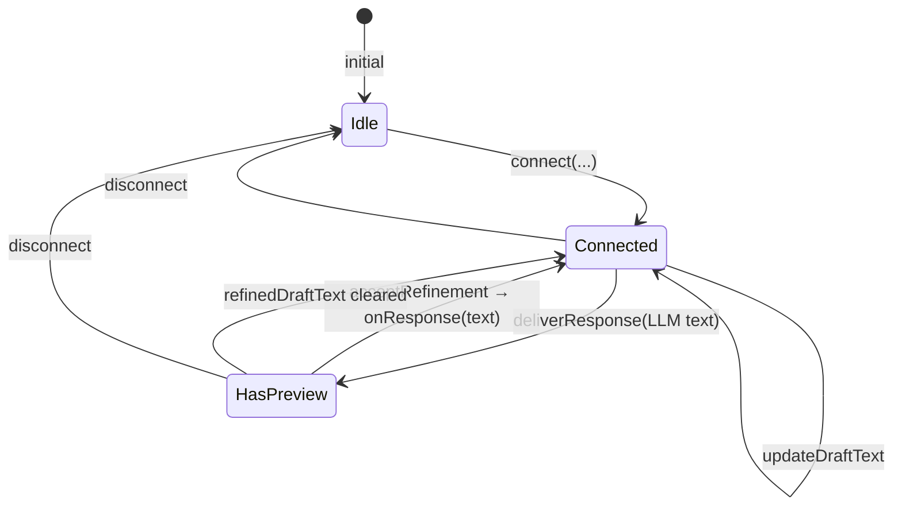
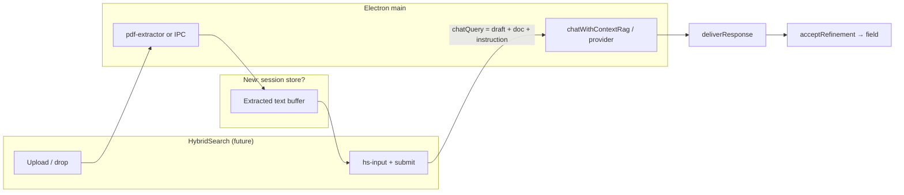
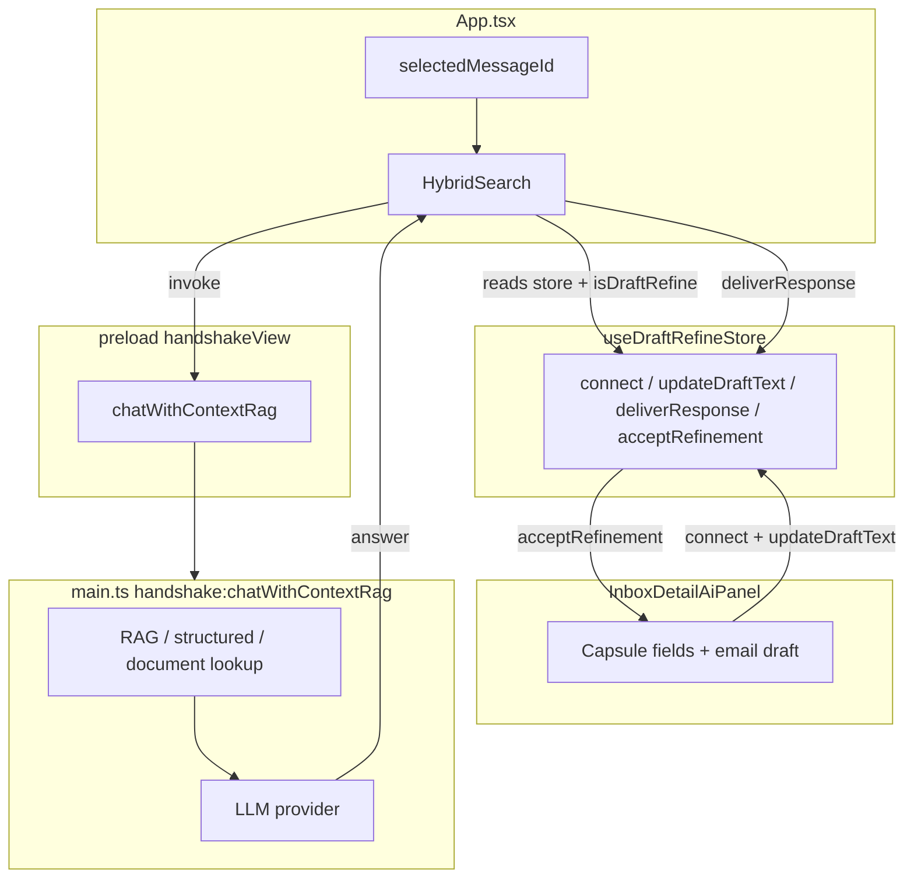

# Analysis: Chat Bar AI — Context Upload & Field Refinement

**Scope:** Architecture analysis only (no code changes).  
**Prerequisites:** [analysis-composer-popup-architecture.md](./analysis-composer-popup-architecture.md), [analysis-dashboard-layout.md](./analysis-dashboard-layout.md).

---

## Section 1: Current AI Refinement Pipeline

### 1A. `useDraftRefineStore`

#### 1. State shape and methods

**File:** `apps/electron-vite-project/src/stores/useDraftRefineStore.ts`

| Field / method | Purpose |
|----------------|---------|
| `connected: boolean` | Whether a field is actively wired to the chat bar. |
| `messageId: string \| null` | **Inbox message** id for the current refinement session. |
| `messageSubject: string \| null` | Shown in HybridSearch chip next to “✏️ Draft”. |
| `draftText: string` | Snapshot of the active field text (synced from the UI). |
| `refineTarget: DraftRefineTarget` | Which field is connected. |
| `refinedDraftText: string \| null` | LLM output **before** user clicks accept. |
| `onResponse: ((text: string) => void) \| null` | Callback to **apply** accepted text to React state. |
| `connect(messageId, messageSubject, draftText, onResponse, refineTarget?)` | Arms refinement; default `refineTarget` is `'email'`. |
| `updateDraftText(draftText)` | Keeps store in sync as user types. |
| `disconnect()` | Clears session. |
| `deliverResponse(text)` | Sets `refinedDraftText` (called by HybridSearch when LLM returns). |
| `acceptRefinement()` | Invokes `onResponse(refinedDraftText)` and clears `refinedDraftText`. |

**Targets today:** `'email' | 'capsule-public' | 'capsule-encrypted'` (**line 9**).

#### How `onResponse` routes to the correct field

`connect` stores **one** `onResponse` callback. Each callsite passes a closure that updates **its** piece of state:

- **Email draft:** `setDraft` / `setEditedDraft` — **`EmailInboxView.tsx` ~419–427**.
- **Public capsule:** `setCapsulePublicText` — **~439–446**.
- **Encrypted capsule:** `setCapsuleEncryptedText` — **~459–466**.

`refineTarget` does **not** dispatch by itself; it is used for **labels and prompt field names** in **`HybridSearch.tsx`** (**366–385**, **521–528**). Routing to the correct React setter is entirely via **`onResponse`**.

#### Can it support new targets?

**Yes, with type and callsite updates:** extend `DraftRefineTarget` and add branches in:

- **`HybridSearch.tsx`**: `draftRefineScopeSuffix`, `draftRefineChipTitle`, **`handleSubmit`** `fieldLabel` mapping (**521–528**), and any icon/title strings (**849–856**).

Names like `'email-body'`, `'email-subject'`, `'beap-public'` are **not** present today; they can be added as new union members. **Reuse vs split:** If only one compose session is active globally, you could **reuse** `'email'` for both body and subject **only if** `onResponse` + `refineTarget` together disambiguate (e.g. two different callbacks still require either two targets or a wrapper object — **two distinct targets are clearer**).

---

#### 2. `draftText` sync — who calls `updateDraftText`?

| Caller | When | File / lines |
|--------|------|----------------|
| **`InboxDetailAiPanel` `useEffect`** | While `draftRefineConnected` and `messageId` match, on every change of `capsulePublicText`, `capsuleEncryptedText`, or email `editedDraft`/`draft` | `EmailInboxView.tsx` **487–506** |
| **Bulk inbox** | When AI output updates `draftReply` | `EmailInboxBulkView.tsx` **~850** (per grep) |

So sync is **inbox-scoped** today: the panel that owns the text fields pushes updates into the store. An **inline email/BEAP composer** would need the **same pattern**: on change, call `updateDraftText` for the active target.

---

### State diagram — `useDraftRefineStore`

---

### 1B. `HybridSearch` (chat bar)

#### 3. “Draft refine” mode — what drives UI and prompts?

| Aspect | Implementation |
|--------|----------------|
| **Enters refine** | `useDraftRefineStore.connected === true` and **`draftRefineMessageId === selectedMessageId`** (must match **App-level** selected message). **`useEffect`** forces **`mode` to `'chat'`** (**388–390**). |
| **Placeholder** | If `draftRefineConnected && draftRefineMessageId === selectedMessageId`: **“Modify draft — …”** (**871–872**). Else generic chat placeholder (**875**). |
| **Badge: ✏️ Draft vs 📨 Message** | **`uiFocusContext`** (**347–359**): `kind: 'draft'` when refine is connected for that message **or** `inboxSubFocus.kind === 'draft'`. Otherwise **`kind: 'message'`** or **`attachment`**. Chip UI **697–763** (draft = green ✏️ styling). |
| **LLM prompt (refine)** | **`handleSubmit`** **514–551**: builds **`chatQuery`** only from **user instruction** + **`currentDraft`** + **`refineTarget`** → `fieldLabel` (`reply draft` / `preview summary of a reply` / `full reply draft`). **No** `getMessage` / attachment block in this branch (contrast **552–577** for normal chat). |

**Important:** Refinement calls **`window.handshakeView.chatWithContextRag`** with this **`query` string** (**582–592**). The **draft-refine branch does not prepend** inbox body/attachment text in **`HybridSearch`**; that prepend exists only in the **`else`** branch (**553–577**). So “personalize from message” in refine is limited to what is already inside **`draftText`** and the instruction string.

---

#### 4. Response handling — `deliverResponse` → accept

| Step | Code |
|------|------|
| LLM returns | **`answerText`** from `result` or stream (**619–625**). |
| If `isDraftRefine && answerText.trim()` | **`draftRefineDeliverResponse(refined)`** (**628**), append to **`draftRefineHistory`**, **`showUseButton: true`**, **`onUse: () => draftRefineAcceptRefinement()`** (**629–634**), **`setResponse(null)`**, **`setQuery('')`** (**635–636**). |
| User accepts | **`acceptRefinement`** runs **`onResponse(refinedDraftText)`** in the store (**72–77** in `useDraftRefineStore.ts`). |

**Can this work for a field not in the inbox?**

**Not as-is:** `isDraftRefine` requires **`draftRefineMessageId === selectedMessageId`** (**514**), and **`selectedMessageId`** comes from **`App`** (**216–217**). There is **no** `selectedMessageId` for “new compose only” unless you **synthesize** an id or **relax** the guard and optionally use **`messageId: null`** with a separate “compose session” flag (would require **store + HybridSearch** changes).

---

## Section 2: Context Upload for AI

### 2A. Current document handling in chat

#### 5. Chat bar file uploads?

| Question | Answer |
|----------|--------|
| Upload button / drag-drop on **`HybridSearch`**? | **No** — no `input type="file"` or drag handlers in **`HybridSearch.tsx`** (grep: only **search scope** “attachments”, **`selectedAttachmentId`** for **existing** inbox attachments). |
| Drag-drop files into chat? | **No** dedicated drop zone in **`hs-root`**. |
| How are files processed for LLM? | **Not via chat upload.** For **normal** (non–draft-refine) chat, **`HybridSearch`** may prepend **`window.emailInbox.getMessage`** and **`getAttachmentText(selectedAttachmentId)`** to the user query (**553–577**). That uses **already-ingested** attachment text, not an ad-hoc upload. |

---

#### 6. Existing infrastructure (reuse candidates)

| Capability | Location |
|------------|----------|
| **PDF text extraction (main)** | `apps/electron-vite-project/electron/main/email/pdf-extractor.ts` — **pdfjs-dist**, `reconstructPageText`, `extractPdfText`. |
| **Inbox AI context PDFs** | `apps/electron-vite-project/electron/main/email/ipc.ts` — imports **`extractPdf`**, file picker flows (~**4558+**), storage under inbox AI context dir. |
| **HTTP PDF extract (orchestrator)** | `electron/main.ts` **8147+** — `/api/parser/pdf/extract` using **pdfjs**. |
| **Handshake context documents** | `chatWithContextRag` in **`main.ts`** — **`selectedDocumentId`** resolves **`extracted_text`** from **context_blocks** payloads (**3211–3255**). **`App.tsx`** passes **`selectedDocumentId`** into **`HybridSearch`** (**215**, **230**) when handshake UI sets it. |
| **`chatWithContextRag` params** | **`handshakeViewTypes.ts` ~51**: `query`, `scope`, `model`, `provider`, `stream`, `conversationContext`, `selectedDocumentId`, `selectedAttachmentId`, `selectedMessageId`. Renderer invokes with **`query: chatQuery`** (**582–592**). |

**Search terms used:** `pdf-extractor`, `extractPdfText`, `pdfjs` — **not** `pdftotext` / `pdf-parse` as primary in Electron main (pdfjs is).

---

### 2B. Desired “upload → personalize draft” flow vs gaps

#### 7–8. What must be built (gap analysis)

| Desired step | Today |
|--------------|--------|
| **a.** Upload icon / drag-drop in chat | **Missing** in HybridSearch. |
| **b.** PDF text extraction | **Exists** (`pdf-extractor`, IPC, HTTP). Needs a **renderer → main** path chosen for chat (IPC invoke vs existing bridge). |
| **c.** Session-scoped “chat context” | **Missing** — no Zustand/React state for “ephemeral uploaded doc text for this compose session”. Handshake **`selectedDocumentId`** is for **graph** docs, not arbitrary uploads. |
| **d.** LLM sees draft + doc + instruction | **Draft refine:** only **instruction + `draftText`** in **`chatQuery`** (**531–541**). **Must append** extracted text to **`chatQuery`** (or add a dedicated param) when uploads exist. |
| **e.** Example (invoice → reminder) | Feasible once **d** + extraction exist. |
| **f.** Visual “📎 N documents” | **Missing** — would be new UI next to **`hs-bar`**. |

**Additional nuance:** For **`isDraftRefine === true`**, the backend still receives **`params.query`** as the constructed string; **RAG** may still run depending on **`main.ts`** pipeline. Verify **intent** does not strip or ignore the prepended document block — today draft prompts are plain “revise this text” strings; **appending** `[Context document]\n...` before the user line is the minimal approach.

---

### Flow diagram — desired context upload → LLM → refined text

---

## Section 3: Field Refinement for Compose (Beyond Inbox)

### 3A. Extending the refine pattern

#### 9. Inbox pattern (reference)

Click/focus field → **`draftRefineConnect(...)`** with **`messageId`**, **`onResponse`**, **`refineTarget`** — **`EmailInboxView.tsx` **414–469**. **`updateDraftText`** from **`useEffect`** **487–506**. Click-outside disconnect excludes **`.hs-root`** (**475–476**).

#### 10. Store changes

| Change | Rationale |
|--------|-----------|
| **New union members** e.g. `'compose-email-body'`, `'compose-email-subject'`, or namespaced `'email-subject'` | Distinct **`fieldLabel`** / chip strings in HybridSearch; distinct **`onResponse`** targets. |
| **Optional `messageId`** or **`composeSessionId`** | **Inline “new email/BEAP”** has **no** `selectedMessageId`. Either **drop** the equality check in HybridSearch (**514**) when in compose mode, or use a **sentinel** id (fragile). Cleanest: **`refineContext: 'inbox-message' \| 'standalone-compose'`** + optional ids. |
| **Reuse `'email'` / `capsule-*'`** | Possible **only** if a single compose field is refined at a time **and** callbacks differ — still need **target** discrimination for prompts and badges; **subject vs body** need **two targets** or metadata. |

---

#### 11. HybridSearch changes

| Area | Change |
|------|--------|
| **`isDraftRefine` guard** | Must allow refinement when **`App.selectedMessageId`** is null but **standalone compose** is active (**514**). |
| **Badges / placeholders** | New strings for compose-email vs inbox-email (**366–385**, **849–856**, **871**). |
| **`fieldLabel` mapping** | **521–528** — add subject/body/compose variants; fix naming if **capsule-public** vs **encrypted** labels are misleading (`preview summary` vs `full reply` — **verify product intent**). |
| **Context documents** | Prepend **`DOC`** block to **`chatQuery`** in **both** refine and non-refine paths as needed. |
| **`chatWithContextRag`** | May need **`params`** extension for **`ephemeralContextText`** if you want main to **inject** without stuffing the whole blob into **`query`** (cleaner for logs and intent classifier). |

---

## Tables

### Current vs proposed refine targets

| Target | Status | Typical `onResponse` |
|--------|--------|----------------------|
| `email` | **Shipped** | Email reply draft textarea |
| `capsule-public` | **Shipped** | pBEAP public field |
| `capsule-encrypted` | **Shipped** | qBEAP encrypted field |
| `email-subject` | **Needed** for AI subject suggestions | `setSubject` |
| `compose-email-body` | **Optional alias** of `email` if session disambiguated | Same as body field |
| `compose-beap-public` | **Optional** if compose-only UI duplicates capsule naming | Public BEAP in inline builder |

---

### Component diagram — chat bar ↔ inbox ↔ LLM

**Standalone compose (future):** add **Composer** box → **`connect`** without **`SM`** (requires **store + HS** guard changes).

---

## Summary: What needs to be extended

1. **`useDraftRefineStore`:** New **`DraftRefineTarget`** values; possibly **`composeSessionId`** or relaxed **`messageId`** for non-inbox compose; **`disconnect`** on compose exit.
2. **`HybridSearch`:** **`isDraftRefine`** condition; **prepend** uploaded/extracted text to **`chatQuery`** in draft-refine branch; **upload UI** + session indicator; optional **avoid** stuffing huge text into `query` by extending IPC.
3. **Main / IPC:** Optional **`ephemeralContext`** param to **`chatWithContextRag`**; reuse **`pdf-extractor`** or inbox attachment pipeline for uploads.
4. **Inline composers:** Mirror **InboxDetailAiPanel**’s **`connect` / `updateDraftText` / click-outside** behavior for each refinable field.

---

*End of report — input for Analysis Prompt 4 of 4.*
