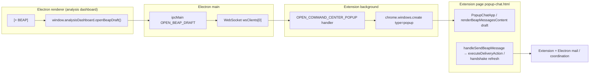
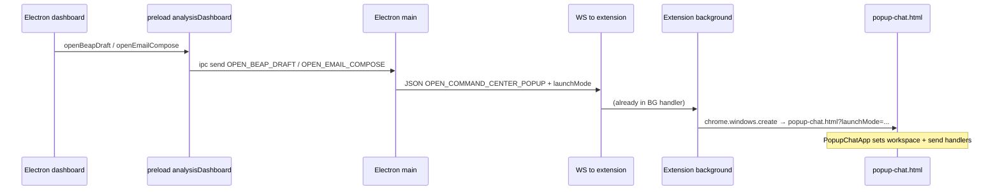

# Analysis: Composer Integration — Current Popup Architecture (Capsule Builder + Email Composer)

**Scope:** Architecture trace only (no code changes).  
**Codebase root:** `code/` (paths below are relative to this folder unless noted).

---

## Executive summary

- **Capsule builder (BEAP draft)** and **email compose** opened from the Electron analysis dashboard are **not** new `BrowserWindow` instances in Electron. The main process forwards a **WebSocket message** to the Chromium extension, which opens a **Chrome extension popup window** via `chrome.windows.create({ type: 'popup' })` loading **`src/popup-chat.html`** with query params (`launchMode`, theme).
- The popup UI is implemented by **`PopupChatApp`** in **`apps/extension-chromium/src/popup-chat.tsx`**, which mirrors the extension sidepanel’s workspace model (`dockedWorkspace`, `beapSubmode`).
- The Electron dashboard can also show **`EmailComposeOverlay`** as a **fixed overlay** when `window.analysisDashboard.openEmailCompose` is unavailable (fallback).
- **Native BEAP reply drafting inside the dashboard** (inline capsule fields + chat-bar draft refine) lives in **`EmailInboxView.tsx`** and is a **separate** path from the extension popup builder.

---

## Section 1: Capsule Builder Popup

### 1A. How the popup opens

#### 1. `[+ BEAP]` button (dashboard)

| Location | File | Lines |
|----------|------|-------|
| Primary AI inbox dashboard | `apps/electron-vite-project/src/components/EmailInboxView.tsx` | **2572–2591** (label `+ BEAP`, `title="New BEAP™ Message"`) |
| BEAP-focused dashboards | `apps/electron-vite-project/src/components/BeapInboxDashboard.tsx` | **599–617** (outer purple `+ BEAP`); first-run opens draft via **299–301** |
| Bulk inbox | `apps/electron-vite-project/src/components/EmailInboxBulkView.tsx` | Same pattern as `EmailInboxView` (compose handlers **3574–3609**, buttons **~5610+**) |
| Bulk BEAP dashboard | `apps/electron-vite-project/src/components/BeapBulkInboxDashboard.tsx` | **289–291** (`openBeapDraft`) |

**Note:** `apps/electron-vite-project/src/components/ComposeButtons.tsx` defines a reusable **floating `[+]` / `[✉+]`** pair (**56–71**) but is **not imported** elsewhere in this repo snapshot; production UIs use the inline buttons above.

#### 2. `onClick` behavior

- **EmailInboxView:** `onClick={() => handleComposeClick(handleOpenBeapDraft)}` (**2574**) → `handleOpenBeapDraft` (**2127–2131**) calls `window.analysisDashboard.openBeapDraft()` when defined.
- **BeapInboxDashboard:** `handleComposeClick(() => window.analysisDashboard?.openBeapDraft?.())` (**599–600**).

**Function name:** **`openBeapDraft`** (preload API), not `openCapsuleBuilder`.

#### 3. IPC / bridge

- **Preload:** `apps/electron-vite-project/electron/preload.ts` **369–371** — `openBeapDraft: () => ipcRenderer.send('OPEN_BEAP_DRAFT')`.
- **Main process:** `apps/electron-vite-project/electron/main.ts` **1095–1098** — `ipcMain.on('OPEN_BEAP_DRAFT', () => openBeapPopup('dashboard-beap-draft'))`.

#### 4. Popup window creation (not Electron `BrowserWindow`)

- **`openBeapPopup`** (**1057–1089**) builds JSON `{ type: 'OPEN_COMMAND_CENTER_POPUP', theme, launchMode, bounds, windowState }` and sends it on **`wsClients[0]`** (extension WebSocket). **No** `new BrowserWindow` for this flow in `main.ts` here.
- **Extension:** `apps/extension-chromium/src/background.ts` **1031–1115** handles `OPEN_COMMAND_CENTER_POPUP` from Electron: builds URL `chrome.runtime.getURL('src/popup-chat.html')` with `t=` and `launchMode=` (**1045–1049**), then **`chrome.windows.create`** with **`type: 'popup'`**, size from **`data.bounds`** (defaults 520×720) (**1056–1064**), **`focused: true`**. Duplicate popups are updated/focused instead of recreated (**1071–1091**).

#### 5. URL / page loaded

- **HTML entry:** `apps/extension-chromium/src/popup-chat.html` (bundled as extension resource `src/popup-chat.html`).
- **React entry:** `apps/extension-chromium/src/popup-chat.tsx` — `PopupChatApp` (**141+**).

#### 6. Size / position / z-order

- **Bounds:** Electron sends dashboard window bounds (**1061–1066**); extension uses them for the Chrome popup (**1058–1063**).
- **Focus:** Extension forces **`focused: true`** and retries focus (**1106–1112**).
- **Z-order risk:** Main sets **`win.setAlwaysOnTop(false)`** when opening the popup (**1068–1070**), so the Electron window may **no longer stay above** other windows—combined with separate OS/Chrome window stacking, the popup can end up **behind** the dashboard in some focus scenarios.

#### 7. What is rendered / mode

- **`launchMode=dashboard-beap-draft`** → `useEffect` in **popup-chat.tsx** **363–368** sets `dockedWorkspace` to **`'beap-messages'`** and `beapSubmode` to **`'draft'`**.
- **`dashboard-beap`** (from `openBeapInbox`) sets **`beapSubmode` `'inbox'`** (**363–365**).
- The popup is **not** `sidepanel.tsx`; it is the **popup-chat** bundle. It includes **WR Chat** (`CommandChatView` **1857–1865**) when `dockedWorkspace === 'wr-chat'`, but the BEAP draft launch lands in **BEAP Messages → Draft**, not the command chat strip by default.
- **“Stripped” vs full:** File header (**11–14**) states it **mirrors** docked sidepanel workspaces; BEAP draft is a **large inline form** inside `renderBeapMessagesContent`, not a separate mini page.

---

### 1B. Capsule Builder Content

#### 4–5. Fields and implementing components (BEAP draft in popup)

All BEAP **draft** UI for `beapSubmode === 'draft'` is in **`popup-chat.tsx`** inside **`renderBeapMessagesContent`** (**908–1577**), except shared building blocks imported from **`beap-messages`** and **`beap-builder`**.

| Area | Present in popup? | Implementation (file — lines) |
|------|-------------------|-------------------------------|
| Delivery method (Email / P2P / Download) | Yes | `<select>` **1038–1055** (`beapDeliveryMethod`) |
| Connected email accounts (when Email) | Yes | Section **1058–1211** |
| Fingerprint display | Yes | Block **1221–1261** (`ourFingerprintShort`, copy) |
| Distribution PRIVATE vs PUBLIC (qBEAP vs pBEAP) | Yes | **`RecipientModeSwitch`** **1264–1268** — `apps/extension-chromium/src/beap-messages/components/RecipientModeSwitch.tsx` |
| Handshake / recipient selector | Yes (private) | **`RecipientHandshakeSelect`** **1271–1281** — `.../RecipientHandshakeSelect.tsx` |
| Delivery sub-panel (email “to” etc.) | Yes | **`DeliveryMethodPanel`** **1284–1292** — `beap-messages` |
| BEAP™ Message (public / transport-visible) | Yes | `<textarea>` **1294–1319** |
| Encrypted message (qBEAP, private only) | Yes | **1322–1353** |
| Session selector (optional) | Yes | **1355–1364** |
| Attachments + PDF parse / retry / reader | Yes | **1365–1472**; **`AttachmentStatusBadge`**, **`runDraftAttachmentParseWithFallback`** from **`beap-builder`**; **`BeapDocumentReaderModal`** **2372+** |
| P2P relay / cooldown messaging | Yes | **`beapP2pRelayPendingMessage` banner** **1488–1521** |
| Send / Clear | Yes | **1522–1573**, `handleSendBeapMessage` **627–846** |
| Full **CapsuleSection** component | No | `apps/extension-chromium/src/beap-builder/components/CapsuleSection.tsx` exists but is **not** referenced in `popup-chat.tsx` |
| **EnvelopeSummaryPanel** | No | Not imported in `popup-chat.tsx` |

**Shared vs popup-specific:** **`RecipientModeSwitch`**, **`RecipientHandshakeSelect`**, **`DeliveryMethodPanel`**, **`executeDeliveryAction`**, **`useHandshakes`**, BEAP crypto init are **shared** (`beap-messages` / `beap-builder`). **Layout and state** (`beapDraftMessage`, etc.) are **owned inside `popup-chat.tsx`** (same pattern as docked sidepanel intent).

---

### 1C. Communication with Dashboard

| Question | Finding |
|----------|---------|
| IPC? | Yes: **preload → `OPEN_BEAP_DRAFT` → main `openBeapPopup`**. |
| `chrome.windows`? | Yes: **in extension background**, not in Electron renderer. |
| Shared React store with dashboard? | **No.** Popup is a **separate extension page**; dashboard is **Electron renderer**. |
| When BEAP is sent, how does inbox update? | Send path: **`handleSendBeapMessage`** → **`sendViaHandshakeRefresh`** or **`executeDeliveryAction`** (**692–764**, **764**) — extension **`chrome.runtime` / handshake RPC / mail** stack. Electron inbox refresh typically follows **mail sync / `inbox:newMessages`** from main (not direct popup→dashboard state). |
| Same handshake data as dashboard? | Both use **handshake services / extension storage** when running connected to Electron; **not** the same in-memory store as `EmailInboxView`. |
| Top dashboard chat bar? | **No.** Popup has its **own** header workspace switcher (**2205–2236**) and optional **`CommandChatView`** only when user selects **WR Chat** workspace—not the Electron analysis dashboard’s top chat bar. |



---

## Section 2: Email Composer

### 2A. How the email composer opens

#### 7. `[✉+]` button

| Surface | File | Lines |
|---------|------|-------|
| AI inbox | `EmailInboxView.tsx` | **2551–2570** |
| BEAP inbox | `BeapInboxDashboard.tsx` | **583–596** |
| Bulk variants | `EmailInboxBulkView.tsx`, `BeapBulkInboxDashboard.tsx` | Same pattern (**5610+**, **276–286**) |

**Handler:** `handleOpenEmailCompose` in **EmailInboxView** **2117–2125** — prefers `window.analysisDashboard.openEmailCompose()`; else **`setShowEmailCompose(true)`** for overlay fallback.

#### 8. Popup vs overlay

| Path | Mechanism | Location |
|------|-----------|----------|
| **Primary (Electron with preload)** | IPC **`OPEN_EMAIL_COMPOSE`** → same WebSocket **`OPEN_COMMAND_CENTER_POPUP`** with **`launchMode: 'dashboard-email-compose'`** | `preload.ts` **372–374**; `main.ts` **1099–1101**, **`openBeapPopup`** **1057–1089** |
| **Fallback** | **In-dashboard modal overlay** **`EmailComposeOverlay`** | `EmailInboxView.tsx` **2595–2637** |

**Result:** **Both** exist: **Chrome popup** for the normal Electron path, **React overlay** when `analysisDashboard` API is missing (e.g. certain dev setups).

**Popup content:** **`launchMode=dashboard-email-compose`** → **`popup-chat.tsx`** **369–370** sets **`dockedWorkspace` to `'email-compose'`**, which renders **`renderEmailComposeContent`** (**1826–1827**, **1582–1792**).

---

### 2B. Email Composer Content

#### 9. Fields

| Field | In `EmailComposeOverlay` (Electron) | In `popup-chat` `renderEmailComposeContent` |
|-------|--------------------------------------|---------------------------------------------|
| To | Yes **234–251** | Yes **~1713** (inline styles) |
| CC / BCC | **No** | **No** |
| Subject | Yes **253–270** | Yes **~1717** |
| Body | Plain **textarea** **272–290** | Plain **textarea** **~1721** |
| Attachments | Yes, file picker + list **292–366** | Yes **1600–1632**, list **1752+** |
| Signature | Fixed **`EMAIL_SIGNATURE`** appended on send **124**; preview **368–380** | **`EMAIL_SIGNATURE`** **1581**; pro users may omit append **1592–1593**, **1653** |
| Send | **`window.emailAccounts.sendEmail`** **156–161** | **`chrome.runtime.sendMessage({ type: 'EMAIL_SEND', ... })`** **1654–1665** |

#### 10. Component / send path

| Context | Component | Path |
|---------|-----------|------|
| Dashboard overlay | **`EmailComposeOverlay`** | `apps/electron-vite-project/src/components/EmailComposeOverlay.tsx` **33–405** |
| Extension popup | **`renderEmailComposeContent`** (inline in **`PopupChatApp`**) | `apps/extension-chromium/src/popup-chat.tsx` **1582–1792** |

**Props (overlay):** `onClose`, `onSent`, optional **`replyTo`** (**25–31**, **37–38**) for prefill.

**Send:** Electron overlay uses **`window.emailAccounts.sendEmail`** (preload IPC to main email stack). Popup uses **`EMAIL_SEND`** runtime message to background (**1654–1665**), which routes to the same underlying account/send pipeline inside the extension.

---

### 2C. Reply routing

#### 11. Dashboard reply behavior

Implemented in **`EmailInboxView.tsx`** **`handleReply`** **2133–2143**:

- **`email_plain` (depackaged):** sets reply prefill and **`setShowEmailCompose(true)`** → **`EmailComposeOverlay`** (inline path—**not** the extension popup).
- **Otherwise (BEAP / native):** **`window.analysisDashboard?.openBeapDraft?.()`** — opens **extension popup** in **BEAP draft** mode.

**Switching:** User can manually open the other composer via floating **✉+** vs **+ BEAP** (both call `analysisDashboard` APIs). There is **no** single unified “toggle reply mode” control in this handler—routing is **automatic** from `source_type` on first reply.

**`EmailMessageDetail`** documents the contract: **`onReply`** routes depackaged → overlay, BEAP → `openBeapDraft` (**22** in `EmailMessageDetail.tsx`).

---

## Section 3: Popup Limitations (vs main dashboard layout goal)

| # | Limitation | Basis in code |
|---|------------|----------------|
| 12a | Popup can open **behind** or compete for focus with the Electron window | `main.ts` **`setAlwaysOnTop(false)`** **1068–1070**; separate Chrome window **1031–1115** |
| 12b | Popup **cannot** use the Electron **top chat bar** for AI refinement | Popup is extension **`popup-chat`**; dashboard chat/refine lives in **`EmailInboxView`** (e.g. **`draftRefineConnect`** **433–469**) |
| 12c | Popup fields **not** integrated with **select/deselect for AI** | Draft refine + capsule field selection is **dashboard** state, not in `popup-chat` BEAP draft |
| 12d | No **dashboard-style context document upload** for AI in popup | Not wired to dashboard AI context |
| 12e | No **chat bar draft refinement** for capsule/email text in popup | **`CommandChatView`** is a **different workspace**; not connected to BEAP draft text state |
| 12f | **Disconnected** from Electron **handshake context graph** UI | **`HandshakeContextSection`**-style panels are on **`EmailInboxView`**, not in popup draft |
| 12g | **Cold start**: new Chrome window + full **`PopupChatApp`** init | **`chrome.windows.create`** + React auth/workspace bootstrap |

---

## Component tree (popup, BEAP draft path)

```text
popup-chat.html
└── PopupChatApp (popup-chat.tsx ~141)
    ├── Toast overlay (~2174+)
    ├── Header: workspace <select> dockedWorkspace (~2205–2236)
    ├── beapSubmode <select> when dockedWorkspace === 'beap-messages' (~2273+)
    └── renderContent()
        └── renderBeapMessagesContent()  [beapSubmode === 'draft' ~1031–1575]
            ├── Delivery <select> (email | p2p | download)
            ├── [email] Connected accounts panel
            ├── Fingerprint block
            ├── RecipientModeSwitch (beap-messages)
            ├── RecipientHandshakeSelect (private)
            ├── DeliveryMethodPanel
            ├── Public message <textarea>
            ├── Encrypted <textarea> (private)
            ├── Session <select> + Attachments + BeapDocumentReaderModal (modal ~2372+)
            ├── P2P pending banner
            └── Clear | Send (handleSendBeapMessage)
```

---

## Communication flow (summary diagram)



---

## References (quick index)

| Topic | File |
|-------|------|
| Dashboard BEAP button + overlay fallback | `apps/electron-vite-project/src/components/EmailInboxView.tsx` |
| IPC + WebSocket open | `apps/electron-vite-project/electron/main.ts` **1057–1102** |
| Preload API | `apps/electron-vite-project/electron/preload.ts` **344–378** |
| Extension window create | `apps/extension-chromium/src/background.ts` **1031–1115**, **3785–3830** |
| Popup UI | `apps/extension-chromium/src/popup-chat.tsx` |
| Email overlay (Electron) | `apps/electron-vite-project/src/components/EmailComposeOverlay.tsx` |

---

*End of report — input for Analysis Prompt 2 of 4.*
