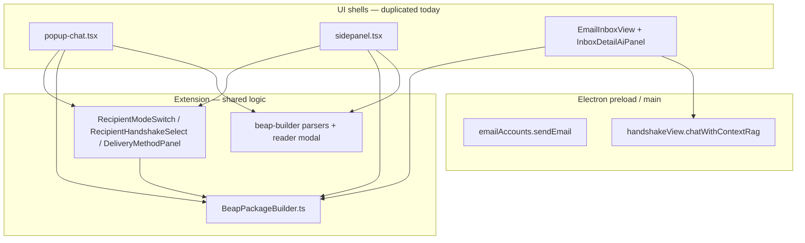

# Analysis: Shared Code — Popup vs Inline Composers

**Scope:** Architecture inventory only (no code changes).  
**Prerequisites:** [analysis-composer-popup-architecture.md](./analysis-composer-popup-architecture.md), [analysis-dashboard-layout.md](./analysis-dashboard-layout.md), [analysis-chat-ai-integration.md](./analysis-chat-ai-integration.md).

---

## Executive summary

- **Package send logic** (`executeDeliveryAction`, `buildPackage`, types) lives in **`apps/extension-chromium/src/beap-messages/services/`** and is **already reused** in the Electron dashboard via the **`@ext` → extension** path alias (`EmailInboxView.tsx` imports `BeapPackageBuilder`).
- **Popup vs sidepanel vs dashboard:** **`popup-chat.tsx`** and **`sidepanel.tsx`** each embed a **large inline BEAP draft form** (duplicated JSX/state), using **shared** `beap-messages` components (`RecipientModeSwitch`, `RecipientHandshakeSelect`, `DeliveryMethodPanel`) and **`beap-builder`** helpers (`runDraftAttachmentParseWithFallback`, `BeapDocumentReaderModal`). They do **not** use **`CapsuleSection.tsx`** or **`DeliveryOptions.tsx`** from `beap-builder` (those are exported but **not wired** into popup/sidepanel).
- **`packages/shared-beap-ui`** implements **`CapsuleFields`**, **`SessionSelector`**, **`AttachmentPicker`**, **`BeapMessageBody`**, **`BeapIdentityBadge`** — **present in repo**, **not referenced** by `electron-vite-project` or `extension-chromium` (no workspace dependency in `electron-vite-project/package.json`). **Adoption** would be “wire package + replace duplicated markup,” not “implement from scratch.”
- **Email:** **`EmailComposeOverlay.tsx`** is self-contained Electron UI; send path is **`window.emailAccounts.sendEmail`** (preload → main email stack). Extension popup email uses **`chrome.runtime.sendMessage({ type: 'EMAIL_SEND', ... })`**.

---

## Section 1: Capsule Builder — File Map

### 1. Files involved (inventory)

| Area | Path | Role |
|------|------|------|
| **Package / delivery core** | `apps/extension-chromium/src/beap-messages/services/BeapPackageBuilder.ts` | `buildPackage`, `executeDeliveryAction`, email/P2P/download |
| **Supporting services** | `beap-messages/services/*` (email/download/P2P actions, tests) | Transport |
| **UI primitives (shared)** | `beap-messages/components/RecipientModeSwitch.tsx`, `RecipientHandshakeSelect.tsx`, `DeliveryMethodPanel.tsx` | Recipient + delivery UX |
| **Legacy / alternate composer** | `beap-messages/components/BeapDraftComposer.tsx` | Full composer using **`useBeapMessagesStore`** (outbox demo model) |
| **Popup draft UI** | `apps/extension-chromium/src/popup-chat.tsx` | `renderBeapMessagesContent` + `beapSubmode === 'draft'` — **inline JSX**, not `CapsuleSection` |
| **Docked draft UI** | `apps/extension-chromium/src/sidepanel.tsx` | Same pattern as popup (parallel state) |
| **BEAP builder (advanced)** | `beap-builder/components/CapsuleSection.tsx`, `DeliveryOptions.tsx`, `EnvelopeSummaryPanel.tsx`, `EnvelopeSection.tsx`, `ExecutionBoundary*.tsx` | Exported from `beap-builder/index.ts`; **not** imported by `popup-chat` / `sidepanel` in current tree |
| **Builder utilities** | `beap-builder/parserService.ts`, `draftAttachmentAutoParse.ts`, `handshakeRefresh.ts`, `canonical-types.ts`, `types.ts` | Parsing, handshake refresh path |
| **Modals / badges** | `beap-builder/components/BeapDocumentReaderModal.tsx`, `AttachmentStatusBadge.tsx` | **Used** by popup & sidepanel |
| **Hooks** | `beap-messages/hooks/useBeapDraftActions.ts` | Package actions (may overlap sidepanel logic) |
| **Electron — AI inbox reply** | `apps/electron-vite-project/src/components/EmailInboxView.tsx` (`InboxDetailAiPanel`) | Native BEAP capsule fields, **`executeDeliveryAction`** for send |
| **Electron — standalone BEAP inbox demo** | `apps/electron-vite-project/src/components/BeapInboxView.tsx` | Imports **`BeapDraftComposer`** from `@ext/beap-messages` (legacy store UI) |
| **Electron — handshake .beap upload** | `CapsuleUploadZone.tsx` | **Handshake** capsule upload, not product “composer” |
| **Electron — inbox .beap import** | `BeapMessageImportZone.tsx`, `BeapMessageUploadZone.tsx` | Import packages into inbox |
| **Main process handshake wire caps** | `electron/main/handshake/capsuleBuilder.ts` | **Initiate/accept/refresh** handshake JSON — **different** from `BeapPackageBuilder` product packages |

---

### 2. Reusability table (selected files)

| File | Popup-specific? | Reusable for inline dashboard? |
|------|-------------------|--------------------------------|
| `beap-messages/services/BeapPackageBuilder.ts` | No (pure TS) | **Yes** — already used from Electron via `@ext` |
| `beap-messages/components/RecipientModeSwitch.tsx` | No | **Yes** — import from extension path or extract to shared package |
| `RecipientHandshakeSelect.tsx`, `DeliveryMethodPanel.tsx` | No | **Yes** — same |
| `beap-builder/handshakeRefresh.ts` | No | **Yes** — email+private handshake refresh |
| `beap-builder` draft attachment parse / reader | No | **Yes** |
| `beap-builder/components/CapsuleSection.tsx` | No | **Yes in principle** — currently **unused** by popup; could unify draft UI |
| `beap-builder/components/DeliveryOptions.tsx` | No | **Yes** — same |
| `popup-chat.tsx` | **Yes** (Chrome popup shell, auth, workspace chrome) | **No** as a whole; **extract** child fragments |
| `sidepanel.tsx` | **Yes** (docked extension shell) | **No** as a whole; same extraction as popup |
| `BeapDraftComposer.tsx` | No | **Partial** — ties to **`useBeapMessagesStore`** / demo outbox; **not** the production AI inbox path |
| `EmailInboxView` / `InboxDetailAiPanel` | Electron dashboard | **Yes** — this **is** the inline native BEAP reply surface today |
| `electron/.../handshake/capsuleBuilder.ts` | Main IPC | **Handshake protocol** only — do not conflate with BEAP™ package builder UI |

---

## Section 2: Email Composer — File Map

### 3. Files involved

| Path | Role |
|------|------|
| `apps/electron-vite-project/src/components/EmailComposeOverlay.tsx` | To, subject, body, attachments, signature, **`sendEmail`** |
| `apps/extension-chromium/src/popup-chat.tsx` | `renderEmailComposeContent` — parallel form, **`EMAIL_SEND`** runtime message |
| `apps/electron-vite-project/electron/preload.ts` | `emailAccounts.sendEmail`, bridges |
| `apps/electron-vite-project/electron/main/email/*` | Gateway, SMTP/Graph, **`ipc`** handlers |
| `EmailInboxView.tsx` | Opens overlay on reply (plain email), **`handleSendDraft`** for depackaged |

### 4. Reusable for inline?

| Piece | Assessment |
|-------|------------|
| **`EmailComposeOverlay` UI** | **Yes** — lift markup into a **non-modal** component or render same component in a panel |
| **Send pipeline** | **Yes** — unchanged (`window.emailAccounts.sendEmail`) |
| **Attachments (File → base64)** | **Yes** — same as overlay |
| **Popup `EMAIL_SEND`** | **Extension-only** — not used by Electron dashboard compose |

---

## Section 3: `@repo/shared-beap-ui`

### 5–6. Proposed components — status

| Component | Implemented under `packages/shared-beap-ui/src/`? | Used by apps? |
|-----------|-----------------------------------------------------|---------------|
| `CapsuleFields.tsx` | **Yes** | **No** — grep shows **no** imports outside the package |
| `SessionSelector.tsx` | **Yes** | **No** |
| `AttachmentPicker.tsx` | **Yes** | **No** |
| `BeapMessageBody.tsx` | **Yes** | **No** |
| `BeapIdentityBadge.tsx` | **Yes** | **No** |

**Conclusion:** The package is **implemented** and exported from **`index.ts`**, but **`electron-vite-project` does not list `@repo/shared-beap-ui` in `package.json`**, and **extension code does not import it**. **Migration work** = add workspace dependency, import CSS, replace duplicated textarea blocks — **not** greenfield implementation of those five names.

---

## Section 4: What Must Be Built New (gap)

| Need | Notes |
|------|--------|
| **Inline BEAP “new compose”** | Full parity with popup: recipient, delivery, fingerprint, session, attachments — **compose as extracted module** from popup/sidepanel or **`CapsuleSection`** + `beap-messages` widgets |
| **`useDraftRefineStore` for compose** | **messageId** coupling — see chat AI analysis; extend store + **`HybridSearch`** |
| **Chat context upload** | **Not** in `HybridSearch` today |
| **To/CC/BCC for inline email** | **Not** in `EmailComposeOverlay` today (To only) — product decision |
| **Exit compose mode** | New dashboard state (see layout analysis) |

---

## Section 5: Migration Strategy

### 10. Phased rollout (suggested)

| Phase | Goal | Likely files / areas |
|-------|------|----------------------|
| **1** | Inline **native BEAP reply** (already strong in AI column) | `EmailInboxView.tsx`, `InboxDetailAiPanel`, `useDraftRefineStore`, `HybridSearch.tsx` |
| **2** | Inline **new BEAP** in dashboard | New panel or grid region; reuse `beap-messages` + `executeDeliveryAction`; stop calling `openBeapDraft` from FAB |
| **3** | Inline **email** replace overlay | Extract from `EmailComposeOverlay.tsx`; `App.tsx` layout state |
| **4** | **Context upload** in chat bar | `HybridSearch.tsx`, `useDraftRefineStore` or sibling store, IPC/pdf |
| **5** | **Remove / gate popup** paths | `main.ts` `openBeapPopup`, `background.ts` `OPEN_COMMAND_CENTER_POPUP`, `preload` `openBeapDraft` / `openEmailCompose` |

**Incremental:** Yes — phases **1→2** reuse the same **`@ext`** services; **5** can be feature-flagged.

### 11. Risk matrix

| Risk | Mitigation |
|------|------------|
| **Users on extension-only** (no Electron) lose compose if popup removed | **Keep** `chrome.windows.create` path until extension has an alternative surface |
| **Duplicate logic** drift (popup vs inline) | Extract **one** `BeapDashboardComposer` module consumed by both until popup removed |
| **`BeapDraftComposer` / legacy store** confusion | **`BeapInboxView.tsx`** (Electron) is a **separate** demo; do not treat as production AI inbox |
| **Removing popup breaks `analysisDashboard.openBeapDraft`** | Maintain IPC as **no-op** redirect to inline, or keep popup behind flag |
| **Minimal viable inline** | **Already exists** for **native BEAP reply** in **`InboxDetailAiPanel`**; “new message” still needs **Phase 2** |

---

## Component dependency graph (conceptual)

**Target end state:** one **Composer** module (or **`@repo/shared-beap-ui`** + thin wrappers) feeding **`Surfaces`** without duplicating **`popup-chat`**-sized files.

---

## File inventory — complete table (composer-adjacent)

| File | Layer | Notes |
|------|-------|------|
| `beap-messages/services/BeapPackageBuilder.ts` | Extension | Core send |
| `beap-messages/index.ts` | Extension | Public exports |
| `beap-messages/components/BeapDraftComposer.tsx` | Extension | Legacy outbox composer |
| `beap-messages/components/BeapReplyComposer.tsx` | Extension | Reply UI in BEAP message flows |
| `popup-chat.tsx` | Extension | Popup: draft + email compose |
| `sidepanel.tsx` | Extension | Docked: same |
| `beap-builder/components/*` | Extension | CapsuleSection, DeliveryOptions, Envelope*, reader |
| `EmailInboxView.tsx` | Electron | Inline capsule + AI |
| `EmailComposeOverlay.tsx` | Electron | Email modal |
| `BeapInboxDashboard.tsx` | Electron | BEAP-focused dashboard shell |
| `CapsuleUploadZone.tsx` | Electron | Handshake upload |
| `BeapMessageImportZone.tsx` | Electron | Inbox import |
| `packages/shared-beap-ui/*` | Package | Unused presentation components |

---

*End of Prompt 4 of 4 — Composer shared-code analysis.*
