# Iteration 04 — 2026-09-26

This iteration continues from `docs/analysis/iteration-03-2026-09-26.md`. It is the first increment of S2b UI: WR Codes can now be entered, found and accepted in the desktop mail view. The code tip is `93cb50f2` on `integration/consolidated-current`.

## Decision applied

The Author approved the proposed design on 2026-09-26: a **WR Code** action in the message view with manual entry and "Find WR Codes in this message", the result in a panel with Accept and Decline, and screenshots for review (Q16 = A, surfaces beside the mail view first).

## What changed (`93cb50f2`)

| Piece | Change |
|---|---|
| Panel | `src/components/WrCodePanel.tsx` (+ `.css`), opened by a **WR Code** button in the message toolbar of `EmailMessageDetail.tsx`. Manual entry with a local format check while typing; **Check** runs the six gates; the result is the offer with Accept and Decline, or a status. |
| View model in main | `wrc/wrcSubmissionView.ts`, returned by `wrc.submitReference` as `view`. An offer is the EVP-first projection of `offerPresentation.ts` (signed value statement and self-description, the Gate-2 namespace and its verified domain, the locally rendered code); a status reuses the three-layer copy of `entryStatusSurface.ts`; every other refusal carries human copy and a tone (input, status, warning, neutral). The gate and reason code are only a secondary line. |
| Scan decided in main | `wrc.scanMessage` (`wrc/wrcMessageScan.ts`) reads the sealed inbox row and scans only when its Channel Provenance Record decodes with `channel_pass`. An unauthenticated sender, a missing or tampered record, or an unverifiable seal is never scanned. Without `scan: true` it only reports whether scanning is allowed, so the panel knows whether to offer the button. |
| Decline | `wrc.declineReference` spends the acceptance token and releases the §XVI.8.4 reservation at once. The panel declines an offer left open when the user checks another code, closes the panel or opens another message, so a one-time offer is not held for the 10-minute claim timeout. |
| Renderer client | `src/lib/wrcRpc.ts`, a typed client over the existing `dashboard:vaultRpc` bridge (session-gated in main). |

## Hand checks this increment makes performable (in the test build)

| Check | How |
|---|---|
| HC2 | An unauthenticated message shows the provenance alert and no scan affordance; main never scans it. Screenshot 11. |
| HC3 | Manual entry completes the chain for that same message. Screenshot 11, then 02–04. |
| HC4 | The offer shows only the signed value statement and self-description from the verified EVP, never message text. Screenshots 03, 06, 12. |
| HC6 | Status surfaces: revoked, inactive, superseded (successor named), compromised (warning, `role="alert"`), expired, suspended, retired; unknown code and typing error on the capture-error path. Screenshots 07–10. |
| W1, W2, W5 | Every class captures or is refused with its reason; a one-time offer accepts once and then reports "already been used"; no ingest detection, the explicit trigger works, mail failing channel authentication is never scanned. |

**Not in this increment:**
- HC5, consent with `expected_preview_hash`: that is the separate connect-offer path (`handshake.listConnectOffers` / `consentToOffer`), which has no UI caller yet. It is the next S2b increment.
- The displayed responsible domain (S5, client work C8).
- The audit link: `audit_url` is null, because no audit base is configured.
- Forming a handshake after acceptance (S7).

## Screenshots

The screenshots render the real `WrCodePanel` component with the app's own `App.css` and shared-beap-ui styles, inside the app's mail-pane markup. Every response is a real one:
- The offers and refusals are the view models the real pipeline and `buildWrcSubmissionView` produced for the built-in test registry's codes.
- The format check is the real grammar module.
- The scan results come from the real detector over the sample body.

They were taken in a local preview page (not committed), not in the running app, because the running app needs your SSO login.

| # | Step | |
|---|---|---|
| 01 | Panel open on an authenticated message: "Test data" badge, entry field, scan button | 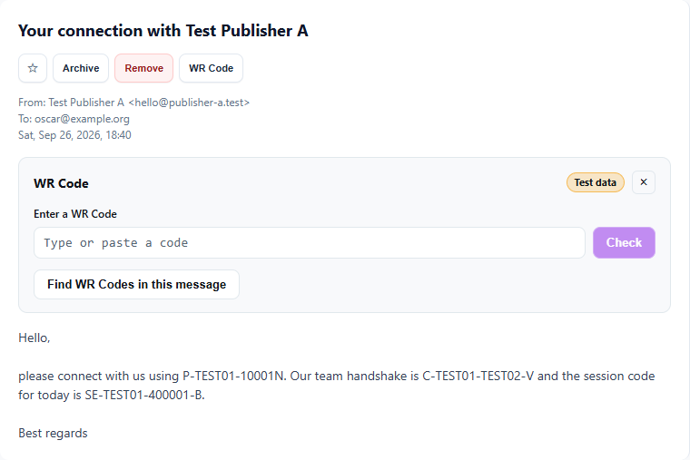 |
| 02 | Typing: lowercase with spaces is recognized as `P-TEST01-10001N` | 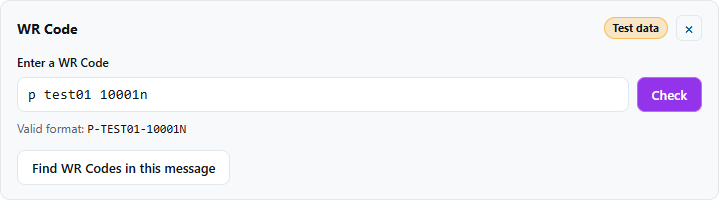 |
| 03 | After Check: the EVP-first offer | 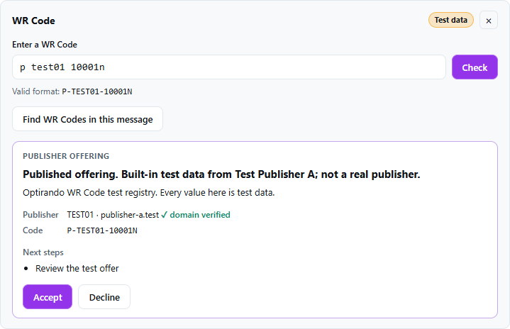 |
| 04 | After Accept | 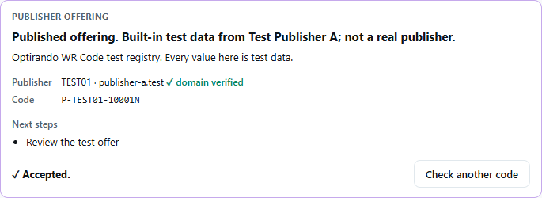 |
| 05 | Find WR Codes in this message: three codes found | 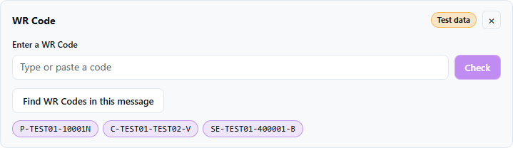 |
| 06 | Clicking the C code: the cross-organization offer | 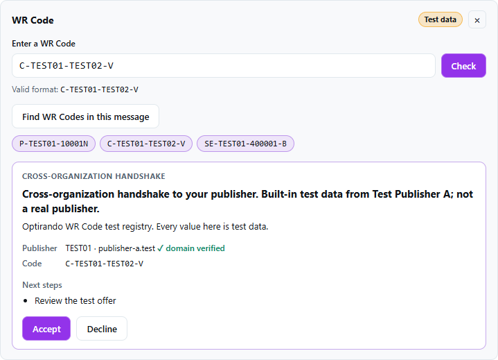 |
| 07 | Superseded publisher, successor named | 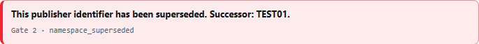 |
| 08 | Compromised publisher: warning | 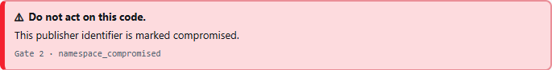 |
| 09 | Addressed to someone else | 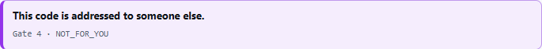 |
| 10 | Typing error | 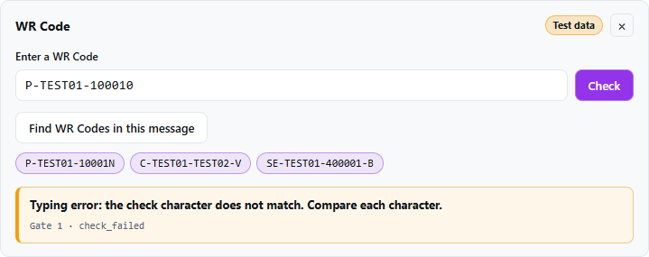 |
| 11 | Unauthenticated message: alert, no scan, manual entry | 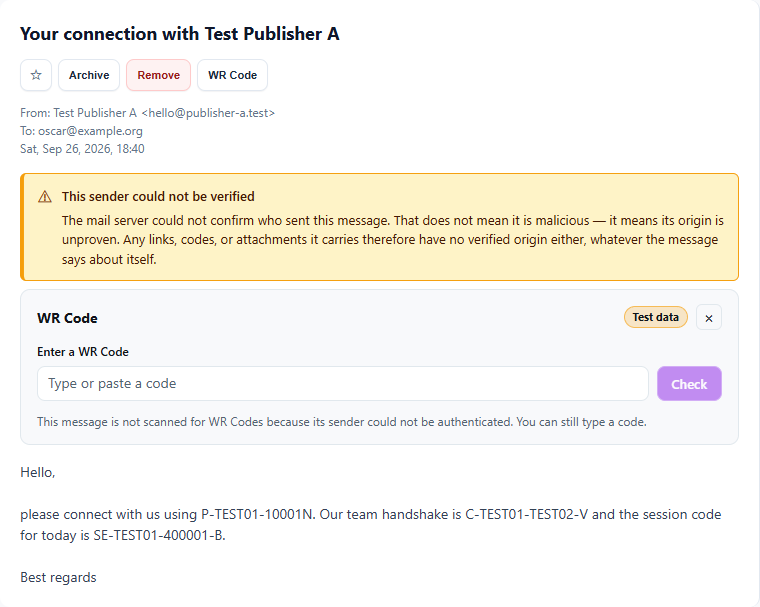 |
| 12 | Dark theme, session sub-handshake offer | 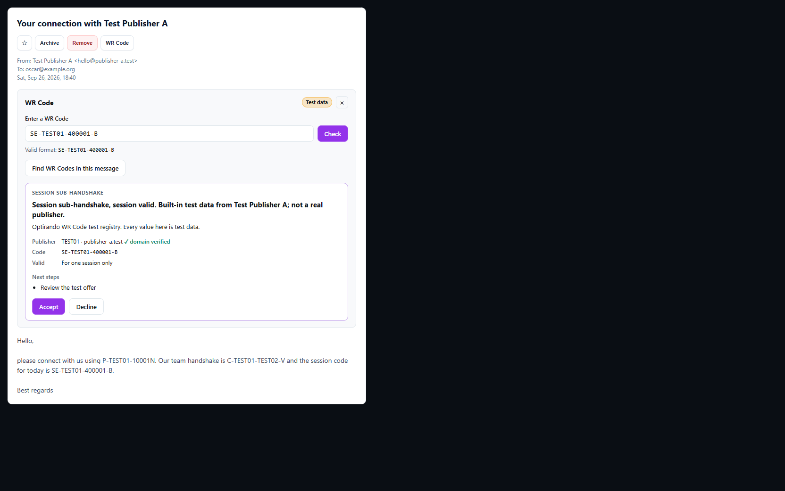 |

## Verification (this checkout, sanctioned runner, after `pnpm test:prepare`)

- **Tests:** 597 files, 2,193 suites, 6,698 tests (+30), 154 failing: the standing 153-set plus the `userDataBootstrapPersistence` timeout flake. **0 regressions, 0 repaired** against `iteration-03.after.ca181c45.txt`. Captured in `captures/iteration-04.after.93cb50f2.txt`.
- **New suites:**
  - `wrcSubmissionView.test.ts`: every test code's view.
  - `wrcMessageScan.test.ts`: authenticated, unauthenticated, tampered and missing records.
  - `WrCodePanel.test.tsx` (jsdom): scan gating, offer render, decline on a new check and on leaving, none after accept.

  The runtime e2e gained the decline path, and the route guard now pins eight `wrc.*` methods.
- **Negative control:** without the decline on a new check, exactly that panel test fails.
- **Typecheck:** workspace 428, unchanged; none in new or touched files.
- **Builds:**
  - `pnpm run build`: the release bundle contains no test registry.
  - `pnpm run build:wrc-test`: the test bundle contains it and packages into `C:\build-output\build007-wrc-test`. The renderer bundle contains the panel.

## Observed, not changed

- The mail pane (`.inbox-detail-message`) is light in every theme, with fixed colors in `App.css`. The panel follows it: themed tokens by default, the Standard tokens inside the mail pane (screenshot 12).

## Next

- **S2b, second increment:** connect-offer consent in the handshake surface with `expected_preview_hash` taken from the rendered preview (HC5).
- **Test phase 2 in the test build:** HC2–HC4, HC6 and W1–W7 with the codes in `docs/operational/wrc-test-build.md`.
- **Client work C3–C8** (contract v2.0 §9); C8 comes with S5.
