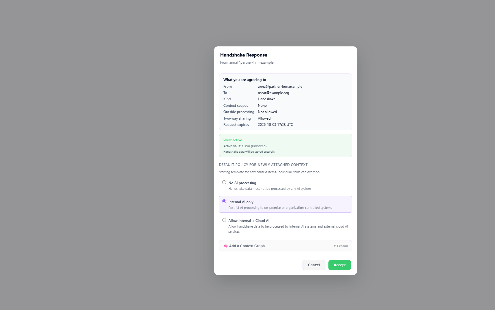
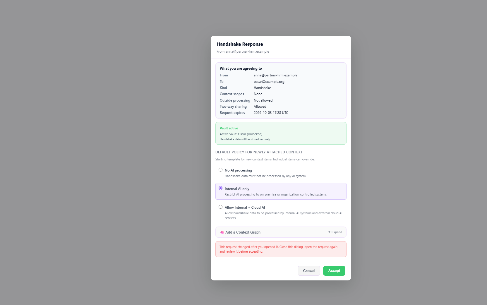
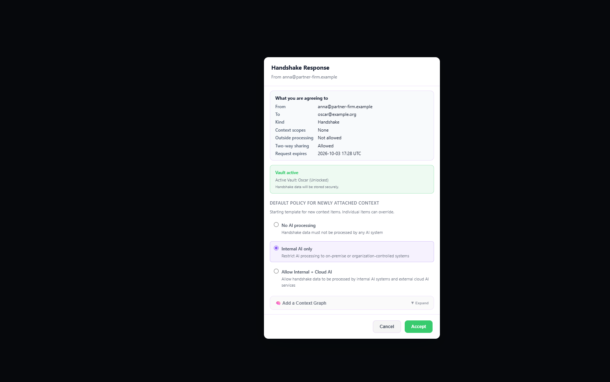

# Iteration 05 — 2026-09-26

This iteration continues from `docs/analysis/iteration-04-2026-09-26.md`. It is the second S2b increment (HC5, consent pinned to the rendered preview) plus the contract v2.0 client work that can be verified without a WRC service. The code tip is `e1014a4e` on `integration/consolidated-current`.

## Finding: the desktop app could not accept any incoming handshake request

Since Phase 4 (`0ed24437`, 2026-07-24), every inbound handshake-initiate is staged as a Connect offer, and only the consent creates the relationship record. The pending list shows these offers. But the desktop `handshake:accept` handler in `electron/main.ts` looked the id up in the relationship store first and answered `HANDSHAKE_NOT_FOUND` when there was no record (a guard from `7116e30e`, 2026-04-24). So Accept in the desktop handshake view failed for every incoming request, including cross-device requests from another machine.

The extension was not affected. It calls `handleHandshakeRPC('handshake.accept')` directly, and that path already consents to a staged offer. The existing test `ipc.handshake.test.ts` T5 exercises exactly that path, which is why no suite caught the desktop gap.

Fixed in `e1014a4e` (next section). The release build `C:\build-output\build007\win-unpacked\WRDeskT.exe` was rebuilt with the fix.

## What changed (`e1014a4e`)

| Piece | Change |
|---|---|
| Desktop accept | `handshake/desktopAcceptTarget.ts` resolves the accept target as an existing record or a staged offer. `main.ts` uses it instead of the record-only lookup, derives internal vs normal from the offer's profile as the pending list does, and forwards `expected_preview_hash`. |
| HC5 pin, desktop | For a staged offer the desktop path **requires** `expected_preview_hash` (64 lowercase hex); without it the accept is refused with `PREVIEW_HASH_REQUIRED` before anything is consented. `handshake.accept` passes the hash to `consentToStagedOffer`, where `prepareFormationConsent` recomputes the preview from the staged row and refuses a different one with `PREVIEW_HASH_MISMATCH`. The offer stays pending after a refusal. |
| Preview in the list | `handshake.list` display records for staged offers carry `connect_offer_preview: { preview, preview_hash }` from `buildConnectOfferPreview`, the same object consent hashes. |
| Accept dialog | `AcceptHandshakeModal` shows "What you are agreeing to" from that preview (`src/lib/connectOfferPreviewView.ts`: parties, kind, WR Code and signed offer when present, scopes, outside processing, two-way sharing, expiry) and returns its hash. Consent refusals get plain-language copy. |
| Preload allowlist | `buildHandshakeAcceptSafeOpts` forwards `expected_preview_hash` only as a 64-character lowercase hex digest. |
| C3 | The SC responder check uses the verified directory record (signatures, vetting, DNS proof) and its signed status, not the unsigned resolve claim (Q25). |
| C4 | The directory record carries `connector: { script_version, code_hash }` (`code_hash` is `sha256:` + 64 hex, or `null`). The record stays closed: a missing or malformed connector is `record_malformed`; an extra connector key breaks the operator signature. |
| C5 | A record whose `grammar_version` is not `"2"` is refused at Gate 2 (`grammar_unsupported`). The fixture's `"1.95"` was the annex version and is now `"2"`. |
| C8 | `displayOriginOf` checks `display_origin` before anything may render it: lowercase ASCII/punycode host name, at least two labels, no scheme, port, path, `www.` label or IP address, one of `domains[]`, and not a subdomain of another registered domain. The Gate-2 namespace verdict carries only the checked value (`display_origin`, null when the check fails). |
| Test registry | Serves `connector` on every directory record. |

C6 (operator rollover channel) and C7 (account credential on reads) are not in this iteration. C6 adds a transport method to every transport and a fetch at startup; C7 needs the OIDC token on registry reads and the service's `401 account_required`. Both are the next client items.

## HC5 status

- **Desktop:** pinned end to end. The list carries the preview, the dialog renders it and returns its hash, main requires the hash, consent recomputes and compares.
- **Extension:** `handshake.accept` and `handshake.consentToOffer` accept an optional `expected_preview_hash`. The extension does not send one yet, so its consent is not pinned to a rendered preview. Pinning it needs the extension's accept UI to render the preview first.

## Screenshots

These show the real `AcceptHandshakeModal` with the app's `App.css`, rendered in the local preview page (not committed). The record is the real `handshake.list` output for a staged inbound initiate, written by a throwaway run of the real ingest and list path. Accept goes to a stub that records its arguments. The stub received the listed hash (`ec5692d5…`) as `expected_preview_hash`.

| # | Step | |
|---|---|---|
| 01 | A staged request: "What you are agreeing to" above the vault and policy sections |  |
| 02 | Consent refused because the preview changed: plain-language message, the request stays open |  |
| 03 | Dark theme: the dialog keeps its light surface and explicit text colors |  |

## Verification (this checkout, sanctioned runner, after `pnpm test:prepare`)

- **Tests:** 600 files, 2,205 suites, 6,742 tests (+44), 155 failing:
  - the standing 153-set;
  - two known flakes (the `userDataBootstrapPersistence` timeout and the `hardware-capability` host probe), both green in isolation.

  **0 regressions, 0 repaired** against `iteration-04.after.93cb50f2.txt`. The seven known load errors are unchanged. Captured in `captures/iteration-05.after.e1014a4e.txt`.
- **New and extended suites:**
  - `desktopAcceptStagedOffer.test.ts`:
    - the target resolution;
    - the pin requirement;
    - the list preview equals the consent's recomputation;
    - accept with the listed hash forms the relationship;
    - accept against another hash is refused, forms nothing and leaves the offer pending;
    - a source guard on the `handshake:accept` handler.
  - `connectOfferPreviewView.test.ts`.
  - `AcceptHandshakeModal.preview.test.tsx` (jsdom): the preview renders and its hash is sent; a mismatch shows plain language; a record without a preview accepts without a hash.
  - `handshakeAcceptSafeOpts.regression.test.ts`: T10.
  - `directoryGate2.e2e.test.ts`: connector, grammar and display-origin vectors.
  - `entryDesignation.e2e.test.ts`: an SC toward a responder whose resolve claim says active but whose signed directory record is revoked.
- **Negative controls:**
  - Without the hash pass-through in `handshake.accept`, exactly the mismatch test fails.
  - Without the responder status check, exactly the new SC test fails.
  - With `"1.95"` accepted as a grammar, exactly the grammar test fails.
- **Typecheck:** workspace 428, unchanged; none in new files or edited regions.
- **Builds:**
  - `pnpm run build`: the release package in `C:\build-output\build007` contains no test registry, and its `app.asar` contains the accept fix, the dialog preview and the grammar check.
  - `pnpm run build:wrc-test`: the test package in `C:\build-output\build007-wrc-test` contains the registry and the same changes.
  - The extension is unchanged and was not rebuilt.

## Observed, not changed

- `display_origin`: whether the value is a registrable domain in the Public Suffix List sense is not checked. `tldts` is present only as a transitive dependency; adding it (or a PSL snapshot) as a runtime dependency of the app is a supply-chain decision left to the Author.
- `AcceptHandshakeModal` uses fixed light colors instead of theme tokens. It is readable in both themes (screenshot 03). The new section follows the dialog's existing colors.

## Next

- **Cross-device test (user):** with the rebuilt `build007`, a handshake request from the Linux machine can now be accepted in the Windows desktop app.
- **Client work C6 and C7** (contract v2.0 §9); C8's rendering comes with S5.
- **Extension:** render the connect-offer preview before accept and send its hash.
- **Test phase 2 in the test build:** HC2–HC6 and W1–W7 with the codes in `docs/operational/wrc-test-build.md`.
