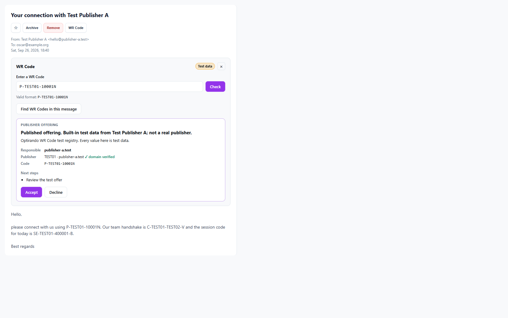
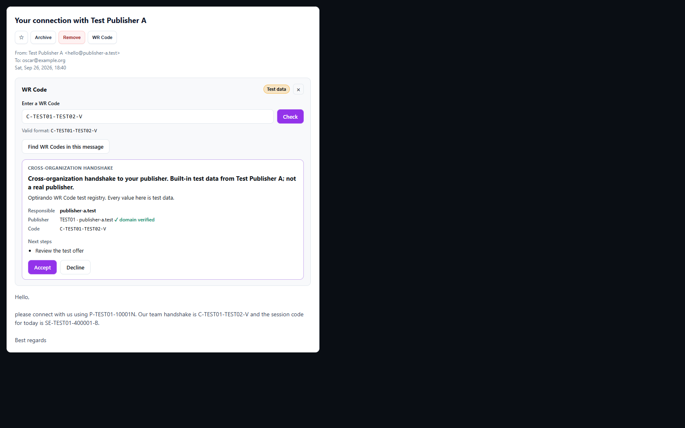

# Iteration 06 — 2026-09-26

This iteration continues from `docs/analysis/iteration-05-2026-09-26.md`. It implements the open items from the gap analysis and contract v2.0 that can be verified without a WRC service or hand tests. The code tip is `3927cfaa` on `integration/consolidated-current`.

## What changed (`3927cfaa`)

| Item | Change |
|---|---|
| S5, responsible domain | The WR Code offer shows **Responsible: `<domain>`** above the publisher line. The value is the Gate-2 namespace's `display_origin` after the C8 check, re-rendered from the verified directory record; it is plain text, never a link. No value means no row (`offerPresentation.ts` `responsible_domain`, `WrCodePanel.tsx`). |
| C6, operator rollovers | New channel `GET /v1/directory/operator-rollovers` with body `{ "rollovers": [ ... ] }` in chain order from the pinned anchor (`wrcTransport.ts`). Each link is decoded with `decodeOperatorRollover` before folding, so it is verified as a closed object; the list ends at the first link that does not decode. The directory client fetches the chain when a record names an operator key it does not know, at most once a minute, and concurrent lookups share one fetch. Keys only ever get added, and always from the pinned anchor (`namespaceDirectory.ts`). |
| C6 in the test build | The test registry's directory operator key has rolled over once. `TEST03`'s record is signed by the incoming key, so `P-TEST03-100011` reaches its documented `namespace_inactive` only through the channel; without it the code is `namespace_unverified` (`operator_key_unknown`). |
| C7, account tier | The HTTP client takes a `bearer` option restricted to RFC 6750 token syntax; anything else is refused before a request. The transport sends it on entry and object reads only. Resolve, directory, head, delegations, rollovers and the publisher's own manifest and DNS never carry it. A `401` on an entry, its EVP or a parent entry becomes the Gate-3 reason `entry_account_required` with its own copy ("The registry needs your WR Desk sign-in to show this code…"), not the "not registered" capture error. |
| HC5, extension | The extension keeps `connect_offer_id` and `connect_offer_preview` from `handshake.list`, shows "What you are agreeing to" in its accept dialog and sends `expected_preview_hash`. The row helper moved to `packages/shared/src/handshake/connectOfferPreview.ts`, so the app and the extension render identical rows. |
| HC5, every product route | Both product RPC dispatchers in `main.ts` (renderer `vaultRpc`, extension WebSocket) refuse `handshake.accept` of a staged offer and `handshake.consentToOffer` without the hash (`productRoutePreviewPinRefusal`). With the desktop `handshake:accept` from iteration 05, no product surface can consent unpinned. `handleHandshakeRPC` itself stays permissive for internal callers. |
| Extension bug | The extension accept dialog reported a refused accept (`success: false`) as accepted, because `sendHandshakeRpc` resolves business failures instead of throwing. It now stays open and shows the refusal. |
| S4, hygiene | The interim comments in `gatePipeline.ts` (account-holder attestation, dual signature, Gate 6 capsule chain) now describe the directory and `capsuleAdmission.ts` path that exists. |

## Decisions taken, and what stays open

- **C6 fetches on demand, not unconditionally at startup.** The ratified answer to Q24 says "folded from the pinned anchor at startup". The client fetches the chain the first time a record names an unknown operator key, which includes the first such lookup after start. That avoids a registry call at every app start when no WR Code is used. The wire shape `{ "rollovers": [...] }` is a choice the service has to match; the next contract delta should record it.
- **C7 production credential is not wired.** Q20 A says the registry is "its own audience". The only token the app holds today is the product SSO access token used for the coordination service. Forwarding it would let the registry replay it there. The transport takes a credential provider (`accountCredential`); the runtime passes none until the IdP issues a registry-scoped token. Until then a live registry's account-tier entries answer `401` and show the sign-in copy.
- **S4, second part** (the stored-row reason "unknown class") waits for Q5, which is unanswered.
- **The carrier cross-check of §XVI.9.4** (OCR the domain printed next to a visual code, compare it after Gate 2, unsuppressible warning on a mismatch) applies only to capture of visual composites. The app has no such capture path; for text carriers the annex says a missing domain "is not a finding".
- **Public Suffix List for `display_origin`:** `registrableDomain()` in `packages/shared/src/vault/originPolicy.ts` is a "last two labels" heuristic. It would turn `example.co.uk` into `co.uk` and so refuse legitimate domains; it is not used. The gap from iteration 05 stands.

## Screenshots

The real `WrCodePanel` in the local preview page (not committed), with views the real pipeline produced for the built-in test registry, regenerated for this iteration by a throwaway run.

| # | Step | |
|---|---|---|
| 01 | Published offering: "Responsible: publisher-a.test" above the publisher line |  |
| 02 | Dark theme, cross-organization offer: same row, readable (the mail pane stays light) |  |

The extension's accept dialog uses the same rows as the desktop dialog in `screens/iteration-05/hc5-01-accept-preview.png`, styled with the extension's theme tokens (`cardStyle`); it is covered by a jsdom test, not a screenshot.

## Verification (this checkout, sanctioned runner, after `pnpm test:prepare`)

- **Tests:** 602 files, 2,214 suites, 6,776 tests (+34), 154 failing: the standing 153-set plus the `userDataBootstrapPersistence` timeout flake. **0 regressions, 0 repaired** against `iteration-05.after.e1014a4e.txt`. The seven known load errors are unchanged. Captured in `captures/iteration-06.after.3927cfaa.txt`.
- **New and extended suites:**
  - `accountTier.test.ts`: the bearer reaches entry and object reads only; no provider, a null token or a throwing provider sends none; a malformed token is refused; a 401 on the entry or the EVP is `entry_account_required` with its copy; a 404 stays the capture error.
  - `directoryGate2.e2e.test.ts`: the rollover channel (fold through the served link, no fetch for the pinned key, rogue link, extra-field link, wrong body, transport failure, once-a-minute refetch with one shared fetch, list decoding).
  - `wrcTestRegistry.test.ts`: `TEST03` with and without the channel; the served link.
  - `wrcTestRegistryRuntime.e2e.test.ts`: the composed runtime follows the channel.
  - `offerPresentation.e2e.test.ts`, `wrcSubmissionView.test.ts`, `WrCodePanel.test.tsx`: the responsible domain, and no row without one.
  - `desktopAcceptStagedOffer.test.ts`: the product-route pin, and a source guard over both dispatchers.
  - Extension: `handshakeRpc.test.ts` (the offer fields survive `normalizeRecord`; the hash is forwarded) and `HandshakeAcceptModal.preview.test.tsx` (preview renders, hash sent, a refusal stays in the dialog).
- **Negative controls:**
  - Without the refresh on an unknown operator key, exactly the five channel-dependent tests fail.
  - Without the channel in `initWrcClient`, exactly the new runtime test fails.
  - Without the 401 mapping on the entry, exactly that account-tier test fails.
  - Without the `success: false` check in the extension dialog, exactly the refusal test fails.
- **Typecheck:** app workspace 428, extension 183, both unchanged; none in new code.
- **Builds:**
  - `pnpm run build`: `C:\build-output\build007`, no test registry, contains all changes.
  - `pnpm run build:wrc-test`: `C:\build-output\build007-wrc-test`, with the registry.
  - Extension `pnpm build`: `apps/extension-chromium/build007`, contains the preview section and the hash.

## Next

- **Your decision:** the registry credential for C7 (a registry-scoped token from the IdP, or reuse of the SSO token).
- **Your answers still open:** Q5 (unknown-class reason), Q9 (merging the WIP branch, S6), Q18 (the tracked Google OAuth client secret).
- **Hand tests (you):** cross-device accept with the new `build007` app and extension; test phase 2 in the test build.
- **Needs the WRC service:** S7 (relay and capsule wire, contract v2.1).
