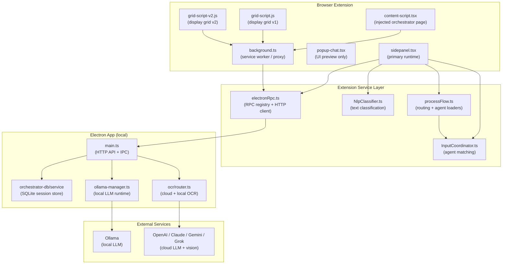
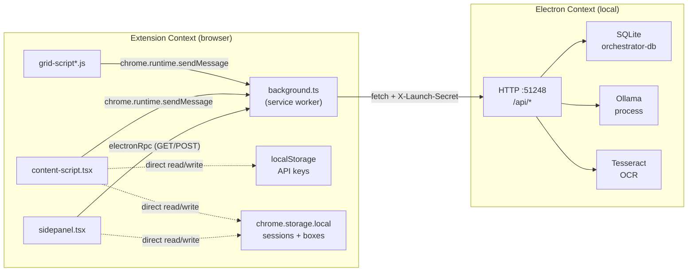

# Orchestrator Architecture — Ground-Truth System Analysis

**Status:** Analysis-only. No implementation changes proposed.  
**Date:** 2026-04-01  
**Covers:** WR Chat · AI Agents · Agent Boxes · Display Grids · OCR · NLP · Input Coordination · Provider/Model Discovery · API Key Management · Session Persistence · Electron Backend · Extension Frontend

---

## Table of Contents

1. [Executive Summary](#1-executive-summary)
2. [High-Level Architecture](#2-high-level-architecture)
3. [Subsystem Map](#3-subsystem-map)
4. [Frontend / Backend Boundary](#4-frontend--backend-boundary)
5. [Critical Entrypoints](#5-critical-entrypoints)
6. [Responsibility Matrix](#6-responsibility-matrix)
7. [Source-of-Truth Matrix](#7-source-of-truth-matrix)
8. [Current Split-Brain Risks](#8-current-split-brain-risks)
9. [Canonical vs Duplicate Surfaces](#9-canonical-vs-duplicate-surfaces)
10. [Central Architectural Risks](#10-central-architectural-risks)
11. [Questions for Prompt 2](#11-questions-for-prompt-2)

---

## 1. Executive Summary

The orchestrator is a multi-surface system built across a Chromium browser extension and a local Electron application. The extension provides the operator-facing UI (sidepanel, popup, content-script injected page, display-grid pages). The Electron app provides the local LLM runtime (Ollama), OCR processing, session persistence (SQLite via orchestrator-db), and a local HTTP API on `127.0.0.1:51248`.

The orchestrator's job: accept text or image input from the operator (WR Chat), classify it (NLP), route it to the correct AI agent (Input Coordinator), load the agent's configuration (listeners / reasoning / execution), find its connected Agent Box(es), call the LLM, and deliver output to the right destination.

**Key architectural tensions:**
- Runtime orchestration logic lives almost entirely in `sidepanel.tsx`, not in a dedicated service layer.
- Session persistence has two competing paths: `chrome.storage.local` (extension) and SQLite via HTTP (Electron), with inconsistent use across surfaces.
- API keys are stored in `localStorage` (extension content-script), isolated from the Electron backend's own key store.
- The popup surface delegates all real work to `CommandChatView` via a mock reply path, making it UI-only.
- OCR runs as a post-fetch enrichment step in `processMessagesWithOCR`, not as an upfront routing signal.

---

## 2. High-Level Architecture

---

## 3. Subsystem Map

### WR Chat

| Attribute | Detail |
|---|---|
| **Entry point** | `sidepanel.tsx` inline chat handler (no dedicated WR Chat module) |
| **Input** | Text from operator UI; optionally includes `imageUrl` on message objects |
| **OCR enrichment** | `processMessagesWithOCR()` (~line 2373–2414): POST `/api/ocr/process` per user message with image; OCR text appended to message content **before LLM call** |
| **NLP** | `nlpClassifier.classify(rawText)` at ~2661 and ~2967; returns `ClassifiedInput` with triggers, entities, intents |
| **Routing** | `inputCoordinator.routeClassifiedInput(classifiedInput)` at ~2675, ~2983 |
| **Agent run** | `processWithAgent(agentMatch, wrappedInput)` — resolves model via `resolveModelForAgent`, calls LLM, delivers output via `updateAgentBoxOutput` |
| **Risk** | OCR runs during message prep, not before routing; routing decision is made on the pre-OCR text |

---

### AI Agent Forms

| Attribute | Detail |
|---|---|
| **Where defined** | `content-script.tsx` (`openAgentConfigDialog`, `openAddNewAgentDialog`) |
| **Sections** | Listener, Reasoning, Execution — map directly to `CanonicalAgentConfig.listening`, `.reasoningSections[]`, `.executionSections[]` |
| **Schema** | `types/CanonicalAgentConfig.ts` (v2.1.0); `agent.schema.json` |
| **Persistence write** | Content-script saves to session blob → `storageSet` → `chrome.storage.local` (and optionally SQLite via `SAVE_SESSION_TO_SQLITE`) |
| **Canonical type** | `CanonicalAgentConfig` — single unified trigger model (legacy passive/active removed in schema) |
| **Risk** | Form UI is ahead of runtime wiring in some areas (e.g., `acceptFrom` field defined in schema but not read by `InputCoordinator`) |

---

### Agent Boxes

| Attribute | Detail |
|---|---|
| **Schema** | `types/CanonicalAgentBoxConfig.ts` (v1.0.0); `agentbox.schema.json` |
| **Key fields** | `identifier` (ABxxyy), `agentNumber` (links to `agent.number`), `provider`, `model`, `boxNumber`, placement fields |
| **Connection to agents** | `agent.number === agentBox.agentNumber` + agent has `execution.destinations` with `kind: 'agentBox'` |
| **Surfaces** | Sidepanel Agent Box rendering, content-script add/edit dialogs, grid-script v1/v2 slot editors |
| **Persistence** | Session blob under `agentBoxes[]`; SQLite via `SAVE_AGENT_BOX_TO_SQLITE` from grid scripts |
| **Model source** | Provider/model fields in `CanonicalAgentBoxConfig`; runtime loading from Ollama via `llm.status` (post stabilization pass) |

---

### Display Grids

| Attribute | Detail |
|---|---|
| **Files** | `public/grid-script.js`, `public/grid-script-v2.js` |
| **Runtime context** | Separate HTML pages, loaded in new tabs/windows; communicate to background via `chrome.runtime.sendMessage` |
| **Session read** | `GET_SESSION_FROM_SQLITE` message (v1), direct HTTP `GET /api/orchestrator/get` (v2 fallback) |
| **Session write** | `SAVE_AGENT_BOX_TO_SQLITE` message type (both v1 and v2) |
| **Agent Box editing** | `window.openGridSlotEditor` (v1), `showV2Dialog` (v2) — same conceptual dialog |
| **Local model fetch** | `ELECTRON_RPC` → `llm.status` (post stabilization pass) |
| **Risk** | Partially dead code in v1 (unreachable `GRID_SAVE` + `window.opener.postMessage` block after a `return` at ~815+) |

---

### OCR

| Attribute | Detail |
|---|---|
| **Router** | `electron/main/ocr/router.ts` (`OCRRouter`) |
| **Decision logic** | `shouldUseCloud()`: checks `forceLocal/Cloud` options, then `CloudAIConfig.preference`, then `useCloudForImages`, then available provider API keys |
| **Providers** | Local: Tesseract (`ocrService.processImage`); Cloud: OpenAI / Claude / Gemini / Grok vision |
| **Cloud fallback** | Cloud errors fall back to local Tesseract |
| **Extension use** | Sidepanel POSTs image to `/api/ocr/process` (via `processMessagesWithOCR`); result text is appended to the message content array |
| **Critical gap (inferred)** | OCR text is only available **after** `processMessagesWithOCR` pre-processes messages; `routeClassifiedInput` receives pre-OCR text. OCR-derived text does not participate in initial routing trigger matching. |

---

### NLP / Input Coordinator

| Attribute | Detail |
|---|---|
| **NLP** | `NlpClassifier` (wink-nlp + regex fallback); extracts `triggers` (`#word`), `entities`, optional `intents` from raw text |
| **Coordinator** | `InputCoordinator` singleton; `routeToAgents` (raw text path), `routeClassifiedInput` (NLP output path), `routeEventTagTrigger` (event-tag path) |
| **Agent matching** | Per-agent: website filter → trigger name match → keyword conditions → expected context → `applyFor` input type |
| **`acceptFrom`** | Defined in `CanonicalAgentConfig.reasoningSections[].acceptFrom` but **not evaluated** in `InputCoordinator` routing (gap) |
| **Event tags** | `routeEventTagTrigger` handles `#tag`-driven routing with `evaluateEventTagConditions` |

---

### Backend LLM

| Attribute | Detail |
|---|---|
| **Manager** | `electron/main/llm/ollama-manager.ts` |
| **Model listing** | `/api/tags` → `InstalledModel[]` (`name`, `size`, `modified`, `digest`, `isActive`) |
| **Status** | `OllamaStatus`: `installed`, `running`, `version`, `port`, `modelsInstalled`, `activeModel` |
| **HTTP endpoints** | `GET /api/llm/status` → full `OllamaStatus`; `GET /api/llm/models` → `InstalledModel[]` |
| **Active model** | `getStoredActiveOllamaModelId` + `resolveEffectiveOllamaModel`; persisted preference |
| **IPC** | `handshake:getAvailableModels` builds unified local + cloud model list; cloud falls back to `optimando-api-keys` in orchestrator store |

---

### Provider / Model Discovery

| Attribute | Detail |
|---|---|
| **Local models** | `ollama-manager.ts` → `/api/llm/status` → `modelsInstalled[]` |
| **Cloud models** | `handshake:getAvailableModels`: fixed `CLOUD_MODEL_MAP` per provider; provider availability depends on API key presence |
| **API keys** | Extension: `localStorage['optimando-api-keys']` (JSON, flat `Record<string, string>`). Electron: reads same key from orchestrator store as fallback in `handshake:getAvailableModels` |
| **Extension model UI** | Agent Box dialogs call `electronRpc('llm.status')` (TS) or `ELECTRON_RPC` message (JS) for local models |
| **Settings UI** | `LlmSettings.tsx` uses `electronRpc('llm.status')` for installed models + `llm:setActiveModel` IPC for activation |
| **Risk** | No single registry. API keys in `localStorage` vs Electron store. Cloud models hardcoded in `CLOUD_MODEL_MAP`. |

---

### Session Persistence

| Attribute | Detail |
|---|---|
| **Extension path** | `chrome.storage.local` (via `storageWrapper.ts` with adapter routing for `session_*` keys) |
| **Electron path** | SQLite via `orchestrator-db/service`; `GET /api/orchestrator/get?key=` and `POST /api/orchestrator/set` |
| **Background proxy** | `GET_SESSION_FROM_SQLITE` → HTTP GET → SQLite; `SAVE_SESSION_TO_SQLITE` → HTTP POST → SQLite |
| **Session structure** | Blob per `session_<timestamp>_<id>` key; top-level fields: `agents[]`, `agentBoxes[]`, `displayGrids[]`, plus workspace/chat state |
| **Who writes what** | `sidepanel.tsx` owns agent run state; `content-script.tsx` owns agent form saves (chrome.storage); grid scripts save boxes via `SAVE_AGENT_BOX_TO_SQLITE` |
| **GRID_SAVE path** | `background.ts` handles; reads+merges session from `storageWrapper`, writes back — merges `displayGrids` by `sessionId` and `agentBoxes` by `identifier` |
| **Risk** | `loadAgentBoxesFromSession` in `processFlow.ts` reads **`chrome.storage.local` only** (line 566–574) — does not go through SQLite path even if box was saved there |

---

## 4. Frontend / Backend Boundary

**Security boundary:** `X-Launch-Secret` header required on all Electron HTTP calls; managed by `background.ts` `_electronHeaders()`.

---

## 5. Critical Entrypoints

| Entrypoint | File | Line (approx) | Description |
|---|---|---|---|
| WR Chat send | `sidepanel.tsx` | ~2943 | Triggers `processMessagesWithOCR` → NLP → `routeClassifiedInput` → agent run |
| Agent config save | `content-script.tsx` | ~25639+ | `openAddNewAgentDialog` — saves agent to session blob → storage |
| Box save (grid) | `grid-script.js` | ~770 | `SAVE_AGENT_BOX_TO_SQLITE` message |
| Session load | `background.ts` | ~4072 | `GET_SESSION_FROM_SQLITE` → Electron HTTP |
| Model list | `electron/main.ts` | ~7473 | `GET /api/llm/status` → `OllamaStatus` |
| OCR process | `electron/main.ts` | OCR route | `POST /api/ocr/process` → `OCRRouter.processImage` |
| Active model set | `electron/main/llm/ollama-manager.ts` | `getStatus()` | Persisted preference + runtime resolution |

---

## 6. Responsibility Matrix

### Summary Table

| Module / Cluster | Owns (Current) | Should Own | Leaks Into | Stability |
|---|---|---|---|---|
| `sidepanel.tsx` | LLM orchestration loop, NLP call, route dispatch, processWithAgent, OCR enrichment, session load, agent box rendering | WR Chat runtime only; routing should delegate to service layer | Everything — session, UI, LLM, routing, OCR | **Fragile hotspot** |
| `popup-chat.tsx` | Auth-gated UI shell, session picker display, model fetch | UI shell only (correct) | Nothing critical | Stable (UI layer) |
| `content-script.tsx` | Injected page UI, agent form dialogs, session create/load, API key store, box add/edit | Injected page UI + form rendering only | Session persistence, API key management | **Fragile hotspot** |
| `background.ts` | Service worker, RPC proxy, session SQLite proxy, GRID_SAVE merge | RPC proxy + message routing | Merge logic (GRID_SAVE) duplicates storageWrapper concern | Medium risk |
| `processFlow.ts` | Agent/box loaders, routing decision types, resolveModelForAgent, wrapInputForAgent, updateAgentBoxOutput | Agent resolution + routing coordination | Nothing beyond own scope | Stable extension point |
| `InputCoordinator.ts` | Agent matching (trigger/NLP/context/website), box resolution, execution config resolution | Agent matching + allocation | Partial execution config building (overlaps processFlow) | Medium risk |
| `NlpClassifier.ts` | Text classification (triggers, entities, intents) | Text classification only | Nothing | Stable extension point |
| `electronRpc.ts` | RPC registry, HTTP client, method routing to Electron API | RPC transport only | Nothing | Stable extension point |
| Electron `main.ts` (HTTP routes) | HTTP API surface: OCR, LLM, sessions, handshake | HTTP API surface only | IPC handlers and HTTP mixed in one file (scale risk) | Medium risk (file size) |
| OCR router (`ocr/router.ts`) | Cloud vs local OCR routing, provider selection, fallback | OCR routing + cloud fallback | Nothing | Stable extension point |
| Model/provider discovery | Ollama model listing, status, active model; cloud model list via hardcoded map | Local model management | Cloud model list leaked as hardcoded CLOUD_MODEL_MAP | Medium risk |
| Session import/export | Partial: canonical schema types only | Canonical schema + import/export serialization | Not clearly owned by any file | **Fragile (no single owner)** |
| Agent Box rendering surfaces | `content-script.tsx` dialogs, `grid-script.js`, `grid-script-v2.js` slot editors | Box config UI rendering | Persistence calls inline in UI code; model loading inline in event handlers | **Fragile hotspot** |

---

### Detailed Module Profiles

#### `sidepanel.tsx`

**What it owns:**
- The primary WR Chat UI and input handling loop
- Calls `nlpClassifier.classify` → `inputCoordinator.routeClassifiedInput` → `processWithAgent`
- `processMessagesWithOCR` (OCR pre-enrichment of messages before LLM call)
- `loadAgentsFromSession` and `loadAgentBoxesFromSession` to refresh agent data
- `resolveModelForAgent` → LLM API calls
- `updateAgentBoxOutput` to push results to Agent Box display
- Session load on startup (`GET_SESSION_FROM_SQLITE`)
- Provider/model UI (calls `electronRpc('llm.status')` at ~1003 and ~1036)

**What it leaks into:** Business logic that belongs in the service layer (`processWithAgent` is inline, not in processFlow); session persistence decisions mixed with UI rendering; OCR enrichment logic inline; provider/model refresh logic not centralized.

**Stability: Fragile hotspot.** This file is the main orchestration engine AND the main UI component. Changes to routing, model selection, session, or OCR all require edits here.

---

#### `popup-chat.tsx`

**What it owns:** Auth-gated UI shell; workspace switcher; session picker (read-only from `chrome.storage.local`); local model refresh for display only; `CommandChatView` rendering without `onSend`.

**Critical gap (confirmed):** `CommandChatView` receives no `onSend` handler; `CommandChatView.tsx` lines 106–116 produce mock assistant replies for all user input. The popup is UI-only for WR Chat.

**Stability: Stable as a UI shell.** Safe to modify in isolation.

---

#### `content-script.tsx`

**What it owns:** Injected orchestrator page UI; agent form dialogs; Agent Box add/edit dialogs; `ensureActiveSession`; API key management (`loadApiKeys` / `saveApiKeys` → `localStorage['optimando-api-keys']`); `storageGet` / `storageSet` wrappers.

**What it leaks into:** Session persistence (directly reads/writes session blob and `chrome.storage.local`); API key storage (writes to `localStorage` without sync to Electron store).

**Stability: Fragile hotspot.** Extremely large file (~32,000+ lines). Mixes UI, persistence, and business logic.

---

#### `background.ts`

**What it owns:** Service worker lifecycle; all `chrome.runtime.onMessage` dispatching; `ELECTRON_RPC` proxy; `GET_SESSION_FROM_SQLITE` / `SAVE_SESSION_TO_SQLITE` handlers; `GRID_SAVE` merge handler; `_electronHeaders()`.

**Unresolved:** `SAVE_AGENT_BOX_TO_SQLITE` message — sent by grid scripts, but handler location in `background.ts` not confirmed in this analysis round. Needs Prompt 2 verification.

**Stability: Medium risk.** Core proxy is stable. `GRID_SAVE` merge logic is a hotspot.

---

#### `processFlow.ts`

**What it owns:** `AgentMatch`, `AgentConfig`, `AgentBox`, `RoutingDecision` types; `loadAgentsFromSession` (SQLite path); `loadAgentBoxesFromSession` (**chrome.storage.local only** — inconsistency); `matchInputToAgents`; `routeInput`; `wrapInputForAgent`; `updateAgentBoxOutput`; `resolveModelForAgent`.

**Should also own:** `processWithAgent` (currently inline in sidepanel). `loadAgentBoxesFromSession` should use the SQLite path.

**Stability: Stable extension point.** Clean types, well-scoped. Primary risk: wrong persistence layer for box reads.

---

#### `InputCoordinator.ts`

**What it owns:** `routeToAgents`; `evaluateAgentListener` (website → trigger → keyword → context → `applyFor`); `findAgentBoxesForAgent`; `routeClassifiedInput`; `routeEventTagTrigger`; `resolveExecutionConfig` / `resolveReasoningConfig`.

**Known gap:** `acceptFrom` in `reasoningSections[].acceptFrom` is not evaluated in `evaluateAgentListener` or `routeClassifiedInput`. Schema/UI declares it; runtime ignores it.

**Stability: Medium risk.** Large file (1400+ lines); event-tag vs classified-input paths have partial overlap.

---

#### `NlpClassifier.ts`

**What it owns:** `classify(rawText)` → `ClassifiedInput`; wink-nlp + regex fallback; trigger extraction (`#word`), entity extraction, optional intent detection.

**Stability: Stable extension point.** Self-contained. Only risk: wink-nlp failure silently degrades to regex; intents may not be populated consistently.

---

#### Electron `main.ts` HTTP Routes

**What it owns:** `GET /api/llm/status`; `GET /api/llm/models`; `GET /api/orchestrator/get` / `POST /api/orchestrator/set`; `POST /api/ocr/process`; `handshake:getAvailableModels` IPC.

**What it leaks into:** Cloud model list building inline in `handshake:getAvailableModels` (hardcoded `CLOUD_MODEL_MAP`); API key reading from orchestrator store mixed into model discovery.

**Stability: Medium risk.** Very large file; HTTP and IPC interleaved.

---

#### OCR Router (`ocr/router.ts`)

**What it owns:** `shouldUseCloud()`; `processImage()` dispatch to cloud or Tesseract; cloud error → local fallback; `CloudAIConfig` type.

**Stability: Stable extension point.** Clean strategy pattern. Main risk is external: OCR runs after routing in the extension pipeline.

---

#### Model / Provider Discovery

**Files:** `ollama-manager.ts`, `main.ts` IPC, `electronRpc.ts`, `localOllamaModels.ts`, `LlmSettings.tsx`

**What it leaks into:** Cloud model list building is inline in `handshake:getAvailableModels`; not a reusable service. API key availability check mixed into model discovery. `LlmSettings.tsx` re-implements installed model display logic.

**Stability: Medium risk.** Local model path is now cleaner (post-stabilization pass). Cloud model path is fragile (hardcoded list, no single registry).

---

#### Session Import / Export

**Files:** `CanonicalAgentConfig.ts`, `CanonicalAgentBoxConfig.ts` (types only), `background.ts` (session proxy)

Session blob assembly is scattered: content-script creates sessions, sidepanel loads them, grid scripts update box entries, background merges grid data. No single module coordinates the full session lifecycle.

**Stability: Fragile (no single owner).** Schema types are solid but there is no dedicated session service.

---

#### Agent Box Rendering Surfaces

**Files:** `content-script.tsx` (dialogs), `grid-script.js`, `grid-script-v2.js`

Three separate implementations of the same conceptual editor. Persistence calls (`SAVE_AGENT_BOX_TO_SQLITE`) are embedded in UI event handlers. Model loading logic is duplicated across all three files (partially unified by `localOllamaModels.ts` / `fetchLocalModelNamesV2`).

**Stability: Fragile hotspot.** Any schema change to `CanonicalAgentBoxConfig` requires three simultaneous updates.

---

## 7. Source-of-Truth Matrix

### Sessions

| Attribute | Detail |
|---|---|
| **Primary store** | SQLite via `orchestrator-db/service` (Electron local) |
| **Key format** | `session_<timestamp>_<id>` |
| **Who writes** | `background.ts` `SAVE_SESSION_TO_SQLITE` → `POST /api/orchestrator/set`; `content-script.tsx` `ensureActiveSession` → `storageSet` (chrome.storage) |
| **Who reads** | `background.ts` `GET_SESSION_FROM_SQLITE` → `GET /api/orchestrator/get`; `content-script.tsx` `ensureActiveSession` → `storageGet`; `grid-script-v2.js` direct HTTP GET; `popup-chat.tsx` reads `session_*` from `chrome.storage.local` |
| **Competing stores** | `chrome.storage.local` AND SQLite. `storageWrapper.ts` routes `session_*` through an "active adapter" that may be SQLite — but fallback returns `chrome.storage.local` data on HTTP failure |
| **Drift risk** | **High** |

### Agents

| Attribute | Detail |
|---|---|
| **Primary store** | Session blob field `session.agents[]` |
| **Canonical schema** | `CanonicalAgentConfig` (v2.1.0) |
| **Who writes** | `content-script.tsx` agent form dialogs → `storageSet` |
| **Who reads** | `processFlow.ts` `loadAgentsFromSession` → SQLite (via background); `content-script.tsx` `getAllAgentsFromSession` → `storageGet` |
| **Drift risk** | **Medium** — forms save to chrome.storage; routing reads from SQLite |

### Agent Config

| Attribute | Detail |
|---|---|
| **Primary store** | Embedded in `session.agents[]` |
| **Who writes** | Agent form dialogs in `content-script.tsx` |
| **Who reads** | `InputCoordinator` (via `evaluateAgentListener`); `processFlow.ts` (via local `AgentConfig` mapping — not identical to `CanonicalAgentConfig`) |
| **Known gap** | `processFlow.ts` defines its own `AgentConfig` type (lines 170–222); if this mapping is incomplete, fields like `acceptFrom` are silently dropped at runtime |
| **Drift risk** | **Medium** — schema/UI is ahead of runtime |

### Agent Boxes

| Attribute | Detail |
|---|---|
| **Primary store** | Session blob field `session.agentBoxes[]` |
| **Canonical schema** | `CanonicalAgentBoxConfig` (v1.0.0) |
| **Who writes** | `content-script.tsx` add/edit dialogs → `storageSet`; grid scripts → `SAVE_AGENT_BOX_TO_SQLITE` (SQLite); `background.ts` `GRID_SAVE` merges by `identifier` |
| **Who reads** | `processFlow.ts` `loadAgentBoxesFromSession` → **`chrome.storage.local` only** (line 566–574) |
| **Competing stores** | **Critical conflict:** grid scripts write to SQLite; routing reads from chrome.storage only |
| **Drift risk** | **Critical** |

### Display Grids

| Attribute | Detail |
|---|---|
| **Primary store** | Session blob field `session.displayGrids[]` |
| **Who writes** | `background.ts` `GRID_SAVE` handler (merges by `sessionId`); grid scripts `SAVE_AGENT_BOX_TO_SQLITE` (individual box) |
| **Who reads** | Grid pages on load; sidepanel for grid rendering (inferred) |
| **Drift risk** | **Medium** |

### API Keys

| Attribute | Detail |
|---|---|
| **Primary store (extension)** | `localStorage['optimando-api-keys']` — written by `content-script.tsx` `saveApiKeys` |
| **Primary store (Electron)** | Orchestrator SQLite store, key `optimando-api-keys` — read by `handshake:getAvailableModels` as fallback |
| **Who writes** | Extension: `content-script.tsx` → `localStorage.setItem`. Electron write path: unconfirmed |
| **Who reads** | Extension: `loadApiKeys`; Electron IPC: reads orchestrator store for cloud model availability |
| **Competing stores** | **Two separate stores with no confirmed sync** |
| **Drift risk** | **High** |

### Local LLM Models

| Attribute | Detail |
|---|---|
| **Primary store** | Ollama process (live state); `ollama-manager.ts` cache |
| **Who writes** | Ollama itself; `setActiveModelPreference` for active model |
| **Who reads** | `main.ts` `/api/llm/status` and `/api/llm/models`; extension via `electronRpc('llm.status')` |
| **Competing stores** | None — Ollama is single ground truth |
| **Drift risk** | **Low** (post-stabilization pass) |

### Active Model

| Attribute | Detail |
|---|---|
| **Primary store** | `ollama-manager.ts` `getStoredActiveOllamaModelId` — persisted preference |
| **Who writes** | `llm:setActiveModel` IPC / `llm.activateModel` HTTP → `setActiveModelPreference` |
| **Who reads** | `ollama-manager.getStatus()` → `activeModel`; extension via `electronRpc('llm.status')` |
| **Drift risk** | **Low** |

### Global Context / Global Memory / Agent Memory

| Concept | Store | Drift Risk | Confidence |
|---|---|---|---|
| Global context | Unknown — likely `contextSettings` in `CanonicalAgentConfig` | Unknown | Not verified |
| Global memory | `CanonicalAgentConfig.memorySettings` (per-agent; global vs per-agent unclear) | Unknown | Inferred |
| Agent memory / context | `memorySettings` + `reasoningSections[].memoryContext` | Medium | Inferred |

### Box Output

| Attribute | Detail |
|---|---|
| **Primary store** | DOM element only — not persisted |
| **Who writes** | `processFlow.ts` `updateAgentBoxOutput` |
| **Drift risk** | N/A for persistence. Risk: DOM element not found if Agent Box UI is not present on the active page |

### Provider Availability

| Attribute | Detail |
|---|---|
| **Primary store** | Determined at runtime from API key presence — three separate read points |
| **Who reads** | `handshake:getAvailableModels` (Electron SQLite); agent box UI provider dropdown (static, not key-gated); OCR router `shouldUseCloud` (`CloudAIConfig.apiKeys`, origin unconfirmed) |
| **Competing stores** | extension `localStorage`, Electron SQLite, `CloudAIConfig.apiKeys` |
| **Drift risk** | **High** |

### Summary Risk Table

| Concept | Store Count | Drift Risk | Confirmed |
|---|---|---|---|
| Sessions | 2 | High | Yes |
| Agents | 1 (session blob) | Medium | Yes |
| Agent Config | 1 (session blob, two type mappings) | Medium | Yes |
| Agent Boxes | 2 (chrome.storage read, SQLite write) | **Critical** | Yes |
| Display Grids | 2 (GRID_SAVE + SAVE_AGENT_BOX) | Medium | Yes |
| API Keys | 2 (localStorage + SQLite) | High | Yes |
| Local LLM Models | 1 (Ollama process) | Low | Yes |
| Active Model | 1 (Electron preference) | Low | Yes |
| Global Context | Unknown | Unknown | No |
| Global Memory | Unclear | Unknown | No |
| Agent Memory/Context | 1 (session blob, partial) | Medium | Inferred |
| Box Output | DOM only | N/A | Yes |
| Provider Availability | 3+ | High | Yes |

---

## 8. Current Split-Brain Risks

### SB-1: Agent Boxes — Grid Write vs Routing Read

**Severity: Critical**

Grid scripts save Agent Box configurations via `SAVE_AGENT_BOX_TO_SQLITE` → background → SQLite.

`processFlow.ts` `loadAgentBoxesFromSession` reads Agent Boxes from **`chrome.storage.local` only** (line 566–574).

**Effect:** Agent Boxes configured or updated in display grid editors will never be seen by the routing engine until either `loadAgentBoxesFromSession` is updated to use the SQLite path, or grid scripts are updated to also write to `chrome.storage.local`. Users who configure boxes from a grid page will have the routing engine use stale or missing box data.

---

### SB-2: API Keys — Extension localStorage vs Electron SQLite

**Severity: High**

Extension saves API keys to `localStorage['optimando-api-keys']` (content-script `saveApiKeys`). Electron's `handshake:getAvailableModels` IPC reads API key availability from the **orchestrator SQLite store** (same key name, different storage location).

**Effect:** Cloud provider availability seen by the extension may differ from what Electron believes is available. OCR routing (`shouldUseCloud`) uses `CloudAIConfig.apiKeys` whose origin is a third potential divergence point.

---

### SB-3: Session Persistence — chrome.storage vs SQLite

**Severity: High**

Session data has two stores. `storageWrapper.ts` routes `session_*` through an "active adapter" that may use SQLite, but the fallback in `background.ts` `GET_SESSION_FROM_SQLITE` returns `chrome.storage.local` data on HTTP failure. Grid-script-v2 reads directly from HTTP, bypassing the proxy.

**Effect:** Under Electron failures, extension surfaces read chrome.storage while grid pages see SQLite (or fail). A session created offline may not appear in SQLite when Electron is available.

---

### SB-4: Agent Config Schema vs Runtime Mapping

**Severity: Medium**

`CanonicalAgentConfig` defines `reasoningSections[].acceptFrom` and `executionSections[].destinations` with full type safety. `processFlow.ts` defines its own local `AgentConfig` type (lines 170–222). `InputCoordinator` operates on `AgentConfig`, not `CanonicalAgentConfig`.

**Effect:** Fields like `acceptFrom` that exist in the schema/UI are silently dropped at runtime. Confirmed: `acceptFrom` is not used anywhere in `InputCoordinator.ts` routing.

---

### SB-5: Cloud Model List — Hardcoded vs Key-Gated

**Severity: Medium**

Cloud model selectors in Agent Box dialogs show all four providers (OpenAI, Claude, Gemini, Grok) regardless of API key state. `handshake:getAvailableModels` in Electron filters by key presence — but this IPC path is not used by Agent Box provider/model dropdowns in content-script or grid-scripts.

**Effect:** A user with no OpenAI key can select OpenAI models in an Agent Box. At runtime `resolveModelForAgent` will return a provider/model pair that cannot execute successfully.

---

## 9. Canonical vs Duplicate Surfaces

### Classification Summary

| Surface | Classification | Production-Critical | Real Orchestration | Reference for |
|---|---|---|---|---|
| Sidepanel WR Chat | **Canonical** | Yes | Yes | All orchestration behavior |
| Popup chat | **UI Shell / Mocked** | Partial (auth/display) | No (mock replies) | Auth shell, session picker display only |
| Content-script page | **Canonical (Management)** | Yes | No | Agent + box configuration UI |
| Display grid v1 | **Canonical (Grid Boxes)** | Yes | No | Grid-slot box management |
| Display grid v2 | **Canonical (Grid Boxes)** | Yes | No | Grid-slot box management (preferred base) |
| Settings lightbox | **Canonical (Config)** | Yes | No | Model activation, Ollama status |
| API key section | **Functional / Unsynced** | Yes (user-facing) | No | Key storage (not synced to Electron) |
| Electron renderer | **Secondary** | Backend only | No | Backend service surfaces |

---

### Sidepanel WR Chat — CANONICAL

`sidepanel.tsx` is the only surface where real orchestration occurs. All of NLP classification, agent routing, LLM calls, OCR enrichment, session management, and Agent Box output happen here. No evidence of mock or stub behavior. **All orchestration logic changes must treat sidepanel as the canonical runtime.**

---

### Popup Chat — UI SHELL (Mocked)

`popup-chat.tsx` is an auth-gated UI shell. `CommandChatView` is rendered without an `onSend` handler; `CommandChatView.tsx` lines 106–116 confirm a mock reply path for all user input. No NLP, routing, or LLM calls occur in the popup. Session picker is read-only display.

**Do not use popup as a reference for orchestration behavior.**

---

### Content-Script Orchestrator Page — CANONICAL for Management

`content-script.tsx` owns agent form dialogs (Listener / Reasoning / Execution), Agent Box add/edit dialogs, session create/load (`ensureActiveSession`), and API key storage. It is NOT part of the live orchestration loop — no `routeInput`, no `processWithAgent`, no LLM calls.

**Agent form and Agent Box editor dialogs here are canonical for configuration UI. Any schema changes must be reflected here.**

---

### Display Grid Pages — CANONICAL for Grid Boxes (Fragile Dual Implementation)

Both `grid-script.js` (v1) and `grid-script-v2.js` (v2) are production-critical write paths for grid Agent Box configuration. They are the same conceptual editor implemented twice. v2 is more robust (explicit var declarations, HTTP fallback). Dead code exists in v1 (`GRID_SAVE` + `window.opener.postMessage` block, unreachable after `return` at ~815+).

**Both must be kept consistent. v2 is the better base if consolidation is needed.**

---

### Settings Lightbox — CANONICAL for Configuration

`LlmSettings.tsx` is the canonical UI for Ollama model management and active model selection (`handleActivateModel` → `llm:setActiveModel` IPC). The API key section in `content-script.tsx` is functional but not synced to the Electron store (SB-2).

---

### What Appears Legacy or Parallel

1. **`GRID_SAVE` + `window.opener.postMessage` block in `grid-script.js`** (~815+) — dead code after `return`; replaced-but-not-removed save mechanism.
2. **Passive/active trigger branches in `InputCoordinator`** — `CanonicalAgentConfig` v2.1.0 uses `unifiedTriggers`; runtime still has legacy branches for old config formats. New agents should use unified triggers only.
3. **`processFlow.ts` local `AgentConfig` type** — parallel to `CanonicalAgentConfig`; mapping layer that may not stay in sync with schema evolution.

---

### Reference Behavior for Future Implementation

| Area | Reference |
|---|---|
| Routing logic | `sidepanel.tsx` WR Chat path — preserve NLP → `routeClassifiedInput` → `processWithAgent` observable behavior |
| Agent/box configuration | `content-script.tsx` dialogs + `CanonicalAgentConfig.ts` / `CanonicalAgentBoxConfig.ts` schema types |
| Session management | SQLite path (`GET_SESSION_FROM_SQLITE` / `SAVE_SESSION_TO_SQLITE`) is the intended canonical store; chrome.storage is fallback/cache |
| Agent Box reads in routing | `loadAgentBoxesFromSession` must be updated to use SQLite before any Agent Box routing work begins |
| API keys | Extension `localStorage` is the operative store; sync to Electron orchestrator store is required for reliable cloud provider availability |

---

## 10. Central Architectural Risks

| # | Risk | Severity | Basis |
|---|---|---|---|
| R1 | **OCR too late for routing** — OCR text appended after `routeClassifiedInput` has already run; OCR-derived content does not influence routing trigger matching | High | `processMessagesWithOCR` at ~2373–2414; routing at ~2675, ~2983 |
| R2 | **Agent Box split-brain** — grid scripts write to SQLite; `loadAgentBoxesFromSession` reads chrome.storage only | **Critical** | `processFlow.ts` line 566–574 vs grid-script `SAVE_AGENT_BOX_TO_SQLITE` |
| R3 | **API key split-brain** — extension saves to `localStorage`; Electron reads from orchestrator store; no sync | High | `content-script.tsx` `saveApiKeys` vs `handshake:getAvailableModels` in `main.ts` |
| R4 | **`acceptFrom` declared but not enforced** — schema/UI defines it; `InputCoordinator` does not evaluate it | Medium | `evaluateAgentListener` code path; confirmed absent from `InputCoordinator.ts` |
| R5 | **Popup is UI-only** — `CommandChatView` in popup-chat has no `onSend`; mock replies confirmed | Medium | `CommandChatView.tsx` lines 106–116 |
| R6 | **No dedicated session service** — session lifecycle scattered across content-script, sidepanel, grid scripts, and background | High | Structural: no single file owns session create/load/save/merge/export |
| R7 | **Cloud model list hardcoded** — `CLOUD_MODEL_MAP` in `handshake:getAvailableModels`; not key-gated in Agent Box dropdowns | Medium | `main.ts` IPC handler ~2721–2790; Agent Box dialog static provider lists |
| R8 | **Dead code in grid-script.js v1** — unreachable `GRID_SAVE` block after `return` at ~815+ | Low | grid-script.js ~815+ |
| R9 | **Three separate Agent Box editors** — content-script, grid-script v1, grid-script v2 all re-implement the same form | High | No shared AgentBoxEditor component; schema changes require 3 simultaneous updates |
| R10 | **`processWithAgent` not in service layer** — inline in sidepanel; cannot be tested or reused independently | Medium | sidepanel.tsx; absent from processFlow.ts |

---

## 11. Questions for Prompt 2

The following are the highest-priority open questions, consolidated from across this analysis. They must be answered with code evidence and/or screenshots before any implementation work begins.

1. **Where exactly does OCR text re-enter the routing pipeline?** Is there any path where `source: 'ocr'` in `ClassifiedInput` triggers re-routing after OCR completes? Or is OCR permanently post-routing?

2. **Does `background.ts` have a `SAVE_AGENT_BOX_TO_SQLITE` message handler?** If not, where does that message terminate? Does it sync back to `chrome.storage.local`?

3. **What does `storageWrapper.ts` adapter routing actually do for `session_*` keys?** Does it route writes directly to SQLite, or only add SQLite as a read fallback?

4. **Are API keys ever synced from `localStorage` to the Electron orchestrator store?** Is there a settings save path that writes to both?

5. **What does `processWithAgent` in sidepanel actually do?** Is it a wrapper for `resolveModelForAgent` + LLM call + `updateAgentBoxOutput`, or does it contain additional orchestration logic?

6. **What does `resolveModelForAgent` return when no Agent Box is matched or when the box has an empty `provider` field?** Is there a fallback?

7. **Does `InputCoordinator.routeEventTagTrigger` run in the current WR Chat path?** Or is it only triggered from a separate event-tag mechanism?

8. **Are passive/active trigger branches in `InputCoordinator` still live code paths for existing saved agents, or can they be removed?**

9. **What is the full structure of the `displayGrids` field in the session blob?** How does a grid page know which session and which grid config to load?

10. **Is there a `CLOUD_MODEL_MAP` or cloud model registry that could replace the hardcoded list in `handshake:getAvailableModels`?**

11. **What session key does the popup session picker use?** Is it the same `session_*` key as sidepanel, and do they share a session at runtime?

12. **Is there a mechanism that prevents `chrome.storage.local` and SQLite from permanently diverging on a typical user's machine?**
