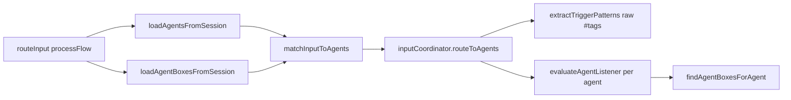

# Orchestrator: Agents, Agent Boxes, and Input Coordinator

## Purpose

Document how the extension-side “orchestrator” wires **agents**, **agent boxes**, **session storage**, and **routing logic** (`processFlow` + `InputCoordinator`), as implemented in code. This is a pre-implementation scan; no behavioral claims are made without code evidence.

## Executive summary

- **Routing brain** lives in `apps/extension-chromium/src/services/InputCoordinator.ts` (class `InputCoordinator`), re-exported and used from `processFlow.ts`.
- **`routeInput()`** loads agents (prefer SQLite via background → Electron HTTP) and agent boxes (chrome.storage.local only), then delegates matching to **`inputCoordinator.routeToAgents()`**.
- **Agent ↔ box linkage** uses `agent.number` vs `box.agentNumber` (plus `execution.specialDestinations`, `listening.reportTo`). Boxes carry **`provider`** / **`model`** used by **`resolveModelForAgent()`** (Ollama/local only; other providers fall back).
- **`processEventTagMatch()`** in `processFlow.ts` builds prompts but **does not call the LLM yet** (placeholder return). **Needs runtime verification** if product expects full Event Tag execution here.

## Relevant files and modules

| Area | Path |
|------|------|
| Routing + types + loaders | `apps/extension-chromium/src/services/processFlow.ts` |
| Listener / trigger / box resolution | `apps/extension-chromium/src/services/InputCoordinator.ts` |
| NLP classification | `apps/extension-chromium/src/nlp/NlpClassifier.ts`, `apps/extension-chromium/src/nlp/types.ts` |
| Automation types (Event Tag batch) | `apps/extension-chromium/src/automation/types.ts` (imported by `InputCoordinator`) |
| Legacy orchestration types (partial overlap) | `apps/extension-chromium/src/types/orchestration.ts` |
| SQLite session fetch (background) | `apps/extension-chromium/src/background.ts` (`GET_SESSION_FROM_SQLITE`) |
| Orchestrator HTTP API (Electron) | `apps/electron-vite-project/electron/main.ts` (`/api/orchestrator/*`) |
| Static orchestration UI (legacy) | `apps/extension-chromium/public/orchestration.js`, `orchestration.html` |

**Singleton:** `inputCoordinator` is exported from `InputCoordinator.ts` and imported by `sidepanel.tsx` and `processFlow.ts`.

## Key flows and dependencies

### 1. Load agents (`loadAgentsFromSession`)

1. Read `optimando-active-session-key` via `getCurrentSessionKeyAsync()` → `chrome.storage.local`.
2. `chrome.runtime.sendMessage({ type: 'GET_SESSION_FROM_SQLITE', sessionKey })`.
3. Background (`background.ts`) calls `GET http://127.0.0.1:51248/api/orchestrator/get?key=...`; on failure falls back to `chrome.storage.local[key]`.
4. `parseAgentsFromSession()` merges `config.instructions` JSON when present and sets **`number`** via **`extractAgentNumber()`**.

### 2. Load agent boxes (`loadAgentBoxesFromSession`)

- Reads **`chrome.storage.local[sessionKey]`** only (no SQLite message in this function in current code). Normalizes **`boxNumber`**, **`agentNumber`** via **`extractBoxAgentNumber()`**.

**Asymmetry:** Agents can come from SQLite-backed session; boxes for routing load from chrome.storage for the same key. **Needs runtime verification:** whether background always syncs SQLite → chrome.storage so both stay aligned.

### 3. Primary routing: `routeInput` → `matchInputToAgents` → `routeToAgents`

- **Triggers for routing** are extracted from **raw input text** with regex (`#word`, `@word`), not from NLP output, in `routeToAgents` (see `InputCoordinator.ts` ~512–521).

### 4. NLP parallel paths (not the same as `routeToAgents`)

- **`routeClassifiedInput()`** enriches `ClassifiedInput` with **`agentAllocations`** using the same listener evaluation but driven by **NLP-extracted triggers** (`InputCoordinator.ts` ~646+).
- **`routeEventTagTrigger()`** requires **event tag triggers** from agent config (`extractEventTagTriggers`) and matches classified triggers; resolves LLM/reasoning/execution into **`EventTagRoutingBatch`**.

### 5. Output to UI grid

- **`updateAgentBoxOutput()`** (`processFlow.ts`) writes to **`chrome.storage.local[sessionKey].agentBoxes[]`**, then **`chrome.runtime.sendMessage({ type: 'UPDATE_AGENT_BOX_OUTPUT', ... })`** so the sidepanel updates.

## State / config sources

| Key / mechanism | Purpose |
|-----------------|--------|
| `optimando-active-session-key` | Current session key (async) |
| `localStorage` / `sessionStorage` fallbacks | `getCurrentSessionKey()` sync fallbacks in `processFlow.ts` |
| `chrome.storage.local[sessionKey]` | Session blob: `agents`, `agentBoxes`, etc. |
| `GET /api/orchestrator/get` | Electron SQLite-backed session for **agents** load path |
| `optimando-tagged-triggers` | Separate trigger list (`loadSavedTriggers`) |

## Known behavior (code-evidenced)

- **`resolveModelForAgent`**: If box has `provider`/`model` and provider is treated as local (`ollama`, `local`, `''`), uses **box model**; else falls back to active chat model (`processFlow.ts` ~1210–1244).
- **`wrapInputForAgent`**: Prepends reasoning **role/goals/rules/custom**, then user input and optional OCR text (`processFlow.ts` ~1089–1131).
- **System queries** (`isSystemQuery`) short-circuit `routeInput` to a **non-LLM** status string via `generateSystemStatusResponse`.
- **`processEventTagMatch`**: Explicit **TODO** for LLM call; returns placeholder string (`processFlow.ts` ~1059–1075).

## Ambiguities / gaps

1. **`classifiedWithAllocations`** from `routeClassifiedInput` in `sidepanel.tsx` is computed and logged; **actual LLM dispatch for Path A uses `routingDecision.matchedAgents` from `routeInput`**, not necessarily the NLP allocations list. Confirm product intent vs duplicate/conflicting semantics.
2. **Agent boxes** not loaded via SQLite in `loadAgentBoxesFromSession` while agents can be — **consistency risk** under partial failures.
3. **`initializeAutomationsFromSession` / `processWithAutomation`** use `ListenerManager`; **unclear** how much of WR Chat uses this vs `routeInput` (parallel systems).

## Runtime verification checklist

- [ ] With only SQLite populated and empty chrome.storage for session key: do agents/boxes still appear in Admin grid and routing?
- [ ] Edit agent box in UI: confirm write path updates both SQLite and chrome.storage (if applicable).
- [ ] Send message with `#tag` matching two agents: order of `routeToAgents` matches and duplicate removal.
- [ ] Non-Ollama `provider` on box: confirm fallback model used in real chat (`resolveModelForAgent`).
- [ ] Call `processEventTagMatch` from any UI path (if exposed): confirm still placeholder only.

## Follow-up questions (next round)

- Should **`routeClassifiedInput` allocations** drive execution instead of or in addition to **`routeToAgents`** matches?
- Is there a planned completion for **`processEventTagMatch`** LLM invocation and destination routing?
- What is the **single source of truth** for session after edits: SQLite only, chrome.storage only, or both with sync rules?
