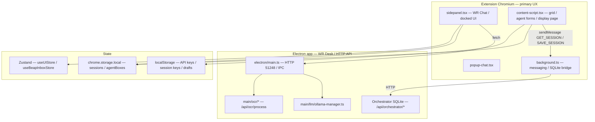
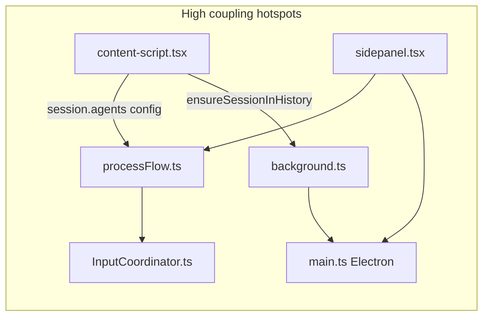

# Repo Map and Scan Plan

## Purpose

Broad, code-grounded orientation for continuing pre-implementation investigation across **AI agents**, **orchestrator routing**, **WR Chat**, **settings/API keys/models**, **agent boxes**, **display grids**, and **OCR/parsing**. This document complements the narrower topic reports in the same folder; it does not replace them.

---

## 1. Concise architectural map of relevant subsystems

**Boundary:** The extension **never** runs Ollama or SQLite directly in the renderer; it talks to **localhost HTTP** (`127.0.0.1:51248`) or **chrome.runtime** to the background script. Port **51248** is **hardcoded** in the extension and **must** match Electron (`HTTP_PORT` in `apps/electron-vite-project/electron/main.ts` ~518; comment ~8993–8996).

**Monorepo:** Root `package.json` is pnpm-oriented; main product code for this scan lives in **`apps/extension-chromium`** and **`apps/electron-vite-project`**. Additional packages (`packages/shared*`, `ingestion-core`, `beap-pod`, etc.) feed BEAP/ingress but are secondary for orchestrator chat unless tracing package flows.

---

## 2. Important files/modules by concern

| Concern | Primary locations | Role |
|--------|-------------------|------|
| **WR Chat UI** | `apps/extension-chromium/src/sidepanel.tsx`, `popup-chat.tsx`, `ui/components/CommandChatView.tsx`, `ui/docked/DockedCommandChat.tsx` | Send pipeline, model dropdown, messages |
| **Orchestrator routing** | `apps/extension-chromium/src/services/processFlow.ts`, `InputCoordinator.ts`, `nlp/NlpClassifier.ts` | `routeInput`, `routeEventTagInput`, agent/box loads |
| **Agent config (rich form)** | `apps/extension-chromium/src/content-script.tsx` (`openAgentConfigDialog`, `saveAgentConfig`) | Listener / Reasoning / Execution JSON → `session.agents[].config` |
| **Agent boxes** | Same `content-script.tsx` (add/edit box dialogs); `processFlow.ts` `AgentBox` type; session `agentBoxes[]` | `provider`/`model`, linkage by `agentNumber` |
| **Display grids** | `content-script.tsx` (master grid UX); `build03/grid-display*.html`, `grid-script*.js` (standalone grid pages); `session.displayGrids` | Layouts, slot config, URL params `sessionKey` |
| **Settings / API keys** | `content-script.tsx` `openSettingsLightbox`; `localStorage['optimando-api-keys']` | BYOK rows; subscription gate on save |
| **LLM backend** | `apps/electron-vite-project/electron/main.ts` (`POST /api/llm/chat`, `/api/llm/models`, …), `electron/main/llm/ollama-manager.ts` | Ollama chat; model list |
| **Orchestrator DB** | `main.ts` `/api/orchestrator/*`; `background.ts` `GET_SESSION_FROM_SQLITE` / `SAVE_SESSION_TO_SQLITE` | Session blob sync |
| **OCR** | `sidepanel.tsx` → `fetch /api/ocr/process`; `electron/main/ocr/*` | Image text before LLM |
| **BEAP / inbox** | `beap-messages/*`, `useBeapInboxStore.ts`, `ingress/` | Parallel chat-adjacent flows |
| **Types / schemas** | `types/CanonicalAgentConfig.ts`, `schemas/agent.schema.json`, `services/TypeSystemService.ts` | Export/import contracts |
| **Minimal agent list** | `agent-manager-v2.ts` | `agentsV2` — separate from rich form |

---

## 3. Likely “critical path” (code-anchored)

### 3.1 Chat input

1. User submits in **`sidepanel.tsx`** → **`handleSendMessage`** (or trigger/screenshot paths).
2. **`routeInput`** (`processFlow.ts`) — loads agents/boxes, **`matchInputToAgents`** → **`InputCoordinator.routeToAgents`**.
3. Parallel: **`nlpClassifier.classify`**, **`inputCoordinator.routeClassifiedInput`**, optional **`routeEventTagInput`** (feedback when NLP finds `#` triggers).
4. OCR: **`processMessagesWithOCR`** → **`POST http://127.0.0.1:51248/api/ocr/process`** (`sidepanel.tsx` ~2943–2944 region).

### 3.2 Orchestrator dispatch

- **Primary:** `routeInput` / `routeToAgents` + **`evaluateAgentListener`** / **`findAgentBoxesForAgent`** (`InputCoordinator.ts`).
- **Alternative:** Event-tag batch (`routeEventTagInput` → `routeEventTagTrigger`); **`processEventTagMatch`** exists but **LLM TODO** in `processFlow.ts` (see prior scan doc).

### 3.3 Provider/model resolution

- **WR Chat:** `activeLlmModel` in sidepanel + **`resolveModelForAgent(agentBoxProvider, agentBoxModel, fallback)`** (`processFlow.ts` ~1210+).
- **Backend:** `POST /api/llm/chat` resolves missing `modelId` via **`ollamaManager.getEffectiveChatModelName()`** (`main.ts` ~7666–7691).
- **Agent box UI:** Static **`getPlaceholderModels`** in `content-script.tsx` (not live catalog).

### 3.4 Agent response rendering

- **Chat stream:** Assistant messages appended to **`chatMessages`** in **`sidepanel.tsx`**.
- **Agent box output:** **`updateAgentBoxOutput`** → **`chrome.storage`** + **`UPDATE_AGENT_BOX_OUTPUT`** message → sidepanel **`setAgentBoxes`** (`processFlow.ts` ~1137–1184; `sidepanel.tsx` ~1576–1588).
- **Grid:** Display page reads **`session.displayGrids`** / slot config from **`chrome.storage.local[sessionKey]`** (`build03/grid-display-v2.html` ~155–168).

---

## 4. Dependency map — where wiring lives

- **Fattest coupling:** **`content-script.tsx`** (agent grid + forms + settings + SQLite session orchestration) and **`sidepanel.tsx`** (WR Chat + LLM + inbox).
- **Routing truth:** **`InputCoordinator`** + **`processFlow`** — single place to reason about triggers vs NLP.
- **Persistence truth:** **Split** — agents often via **SQLite → parse**; agent boxes in **`loadAgentBoxesFromSession`** still read **`chrome.storage`** first (`processFlow.ts`); **SQLite sync** via **`ensureSessionInHistory`** / **`SAVE_SESSION_TO_SQLITE`** from `content-script.tsx` (~3015–3028).

---

## 5. Central config, environment, provider integration

| Mechanism | Where |
|-----------|--------|
| HTTP port | `51248` — `main.ts` + extension hardcodes |
| Launch secret | `main.ts` ~4504 — extension headers for Electron HTTP |
| Active LLM | Ollama persisted preference + `/api/llm/models/activate` (see `broadcastActiveModel.ts`) |
| API keys (extension UI) | `localStorage` `optimando-api-keys` — **not** wired to Agent Box dropdown lists in code |
| Session key | `optimando-active-session-key`, `optimando-global-active-session`, sessionStorage keys — see `processFlow.ts` |

---

## 6. State management approach

| Layer | Pattern |
|-------|---------|
| WR Chat / docked UI | React **useState** + refs in **`sidepanel.tsx`**; **Zustand** for workspace/mode (`useUIStore`) and BEAP inbox (`useBeapInboxStore`) |
| Orchestrator session | **`chrome.storage.local`** keyed by session id; **SQLite** mirror via background |
| Grid / agent editor | **Imperative DOM** + **`chrome.storage`** / **`localStorage`** in **`content-script.tsx`** |
| Electron renderer | Vite React app in **`electron-vite-project/src`** — separate from extension WR Chat |

---

## 7. Main risks — hidden wiring / indirect coupling

1. **Dual sources of truth** for session (SQLite vs `chrome.storage`) for **agents vs boxes** — subtle drift.
2. **Three “matching” concepts** — regex triggers in **`routeToAgents`**, NLP allocations, Event Tag batch — easy to misread which drives execution.
3. **content-script size** — behavior spread across one file; grep-based navigation is fragile.
4. **Placeholder provider/model** on agent boxes vs **runtime `resolveModelForAgent`** string rules (`Local AI` vs `ollama`).
5. **Electron IPC vs HTTP** — handshake/vault paths in **`main.ts`** (`handshake:chatWithContext*`) vs extension **`/api/llm/chat`** — parallel stacks.
6. **Packages** (`packages/*`) — BEAP/ingress may touch stores indirectly; not obvious from extension entrypoints alone.

---

## 8. Ranked list — what to inspect next

| Rank | Focus | Why |
|------|--------|-----|
| 1 | **`background.ts`** message handlers (`GET_SESSION_FROM_SQLITE`, `SAVE_SESSION_TO_SQLITE`, agent box saves) | Defines real persistence/sync behavior |
| 2 | **`processFlow.ts`** `loadAgentsFromSession` vs `loadAgentBoxesFromSession` asymmetry | Confirms or refutes storage split |
| 3 | **`sidepanel.tsx`** `handleSendMessage` + `processWithAgent` only | End-to-end WR Chat contract |
| 4 | **`InputCoordinator.ts`** `routeToAgents` vs `routeClassifiedInput` | Product intent for single dispatch path |
| 5 | **Electron `main.ts`** `/api/orchestrator/*` + `/api/llm/*` | Backend contract for extension |
| 6 | **`packages/ingestion-core`** / **`ingress`** if BEAP + chat overlap | Cross-feature contamination |
| 7 | **`build03/grid-*`** vs **inline grid** in content-script | Which grid path is primary for users |

---

## 9. Probable runtime-only behaviors (screenshot / E2E later)

- **Model dropdown** in WR Chat vs Admin LLM Settings — refresh timing, empty list UX.
- **SQLite vs storage** after offline edits or partial Electron shutdown.
- **Subscription gate** on API key save (`optimandoHasActiveSubscription`) vs user expectation of BYOK.
- **CORS / launch secret** — only visible when wrong origin or missing header.
- **Event Tag** feedback messages vs actual agent execution (placeholder `processEventTagMatch`).
- **Multi-agent** order when several agents match one message.
- **Popup vs sidepanel** parity (`popup-chat.tsx` vs `sidepanel.tsx`).
- **Grid display** page loaded without `sessionKey` — empty grid vs error.

---

## 10. File index note

This report is named **`01-repo-map-and-scan-plan.md`**. The same directory also contains **`01-orchestrator-agents-input-coordinator.md`** — a deeper dive on the orchestrator slice. **Renumber or merge** filenames if you want a strict single ordering scheme.
