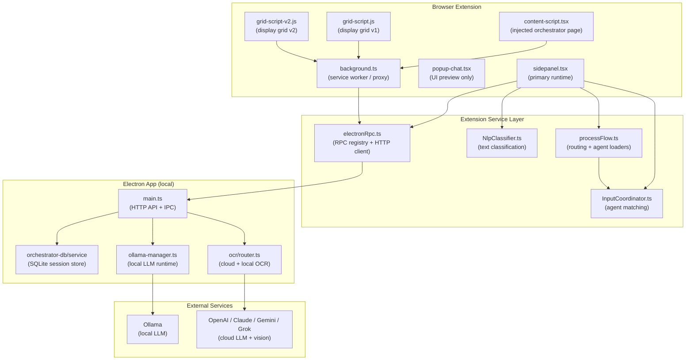
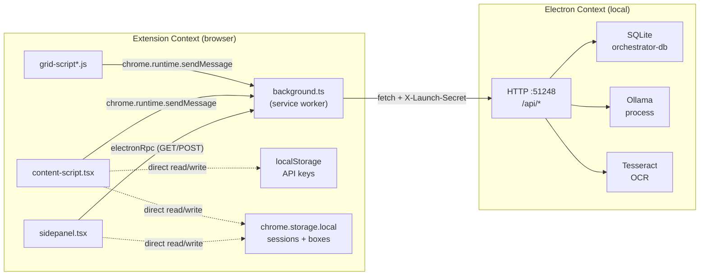

# 01 — System Map

**Purpose:** Ground-truth architectural map of the orchestrator system.  
**Status:** Analysis-only. No implementation changes proposed.  
**Date:** 2026-04-01  

---

## Executive Summary

The orchestrator is a multi-surface system built across a Chromium browser extension and a local Electron application. The extension provides the operator-facing UI (sidepanel, popup, content-script injected page, display-grid pages). The Electron app provides the local LLM runtime (Ollama), OCR processing, session persistence (SQLite via orchestrator-db), and a local HTTP API on `127.0.0.1:51248`.

The orchestrator's job: accept text or image input from the operator (WR Chat), classify it (NLP), route it to the correct AI agent (Input Coordinator), load the agent's configuration (listeners / reasoning / execution), find its connected Agent Box(es), call the LLM, and deliver output to the right destination.

**Key architectural tensions:**
- Runtime orchestration logic lives almost entirely in `sidepanel.tsx`, not in a dedicated service layer.
- Session persistence has two competing paths: `chrome.storage.local` (extension) and SQLite via HTTP (Electron), with inconsistent use across surfaces.
- API keys are stored in `localStorage` (extension content-script), isolated from the Electron backend's own key store.
- The popup surface delegates all real work to `CommandChatView` via a mock reply path, making it UI-only.
- OCR runs as a post-fetch enrichment step in `processMessagesWithOCR`, not as an upfront routing signal.

---

## High-Level Architecture Diagram

---

## Subsystem Map

### WR Chat

| Attribute | Detail |
|---|---|
| **Entry point** | `sidepanel.tsx` inline chat handler (no dedicated WR Chat module) |
| **Input** | Text from operator UI; optionally includes `imageUrl` on message objects |
| **OCR enrichment** | `processMessagesWithOCR()` (~line 2373–2414): POST `/api/ocr/process` per user message with image; OCR text appended to message content **before LLM call** |
| **NLP** | `nlpClassifier.classify(rawText)` at ~2661 and ~2967; returns `ClassifiedInput` with triggers, entities, intents |
| **Routing** | `inputCoordinator.routeClassifiedInput(classifiedInput)` at ~2675, ~2983 |
| **Agent run** | `processWithAgent(agentMatch, wrappedInput)` — resolves model via `resolveModelForAgent`, calls LLM, delivers output via `updateAgentBoxOutput` |
| **Risk** | OCR runs during message prep, not before routing; routing decision is made on the pre-OCR text |

---

### AI Agent Forms

| Attribute | Detail |
|---|---|
| **Where defined** | `content-script.tsx` (`openAgentConfigDialog`, `openAddNewAgentDialog`) |
| **Sections** | Listener, Reasoning, Execution — map directly to `CanonicalAgentConfig.listening`, `.reasoningSections[]`, `.executionSections[]` |
| **Schema** | `types/CanonicalAgentConfig.ts` (v2.1.0); `agent.schema.json` |
| **Persistence write** | Content-script saves to session blob → `storageSet` → `chrome.storage.local` (and optionally SQLite via `SAVE_SESSION_TO_SQLITE`) |
| **Canonical type** | `CanonicalAgentConfig` — single unified trigger model (legacy passive/active removed in schema) |
| **Risk** | Form UI is ahead of runtime wiring in some areas (e.g., `acceptFrom` field defined in schema but not read by `InputCoordinator`) |

---

### Agent Boxes

| Attribute | Detail |
|---|---|
| **Schema** | `types/CanonicalAgentBoxConfig.ts` (v1.0.0); `agentbox.schema.json` |
| **Key fields** | `identifier` (ABxxyy), `agentNumber` (links to `agent.number`), `provider`, `model`, `boxNumber`, placement fields |
| **Connection to agents** | `agent.number === agentBox.agentNumber` + agent has `execution.destinations` with `kind: 'agentBox'` |
| **Surfaces** | Sidepanel Agent Box rendering, content-script add/edit dialogs, grid-script v1/v2 slot editors |
| **Persistence** | Session blob under `agentBoxes[]`; SQLite via `SAVE_AGENT_BOX_TO_SQLITE` from grid scripts |
| **Model source** | Provider/model fields in `CanonicalAgentBoxConfig`; runtime loading from Ollama via `llm.status` (after stabilization pass) |

---

### Display Grids

| Attribute | Detail |
|---|---|
| **Files** | `public/grid-script.js`, `public/grid-script-v2.js` |
| **Runtime context** | Separate HTML pages (`grid-display.html`?), loaded in new tabs/windows; communicate to background via `chrome.runtime.sendMessage` |
| **Session read** | `GET_SESSION_FROM_SQLITE` message (v1), direct HTTP `GET /api/orchestrator/get` (v2 fallback) |
| **Session write** | `SAVE_AGENT_BOX_TO_SQLITE` message type (both v1 and v2) |
| **Agent Box editing** | `window.openGridSlotEditor` (v1), `showV2Dialog` (v2) — same conceptual dialog |
| **Local model fetch** | `ELECTRON_RPC` → `llm.status` (post stabilization pass) |
| **Risk** | Partially dead code in v1 (unreachable `GRID_SAVE` + `window.opener.postMessage` block after a `return` at ~815+) |

---

### OCR

| Attribute | Detail |
|---|---|
| **Router** | `electron/main/ocr/router.ts` (`OCRRouter`) |
| **Decision logic** | `shouldUseCloud()`: checks `forceLocal/Cloud` options, then `CloudAIConfig.preference`, then `useCloudForImages`, then available provider API keys |
| **Providers** | Local: Tesseract (`ocrService.processImage`); Cloud: OpenAI / Claude / Gemini / Grok vision |
| **Cloud fallback** | Cloud errors fall back to local Tesseract |
| **Extension use** | Sidepanel POSTs image to `/api/ocr/process` (via `processMessagesWithOCR`); result text is appended to the message content array |
| **Critical gap (inferred)** | OCR text is only available **after** `processMessagesWithOCR` pre-processes messages; `routeClassifiedInput` receives pre-OCR text. OCR-derived text does not participate in initial routing trigger matching. |

---

### NLP / Input Coordinator

| Attribute | Detail |
|---|---|
| **NLP** | `NlpClassifier` (wink-nlp + regex fallback); extracts `triggers` (`#word`), `entities`, optional `intents` from raw text |
| **Coordinator** | `InputCoordinator` singleton; `routeToAgents` (raw text path), `routeClassifiedInput` (NLP output path), `routeEventTagTrigger` (event-tag path) |
| **Agent matching** | Per-agent: website filter → trigger name match → keyword conditions → expected context → `applyFor` input type |
| **`acceptFrom`** | Defined in `CanonicalAgentConfig.reasoningSections[].acceptFrom` but **not evaluated** in `InputCoordinator` routing (gap) |
| **Event tags** | `routeEventTagTrigger` handles `#tag`-driven routing with `evaluateEventTagConditions` |

---

### Backend LLM

| Attribute | Detail |
|---|---|
| **Manager** | `electron/main/llm/ollama-manager.ts` |
| **Model listing** | `/api/tags` → `InstalledModel[]` (`name`, `size`, `modified`, `digest`, `isActive`) |
| **Status** | `OllamaStatus`: `installed`, `running`, `version`, `port`, `modelsInstalled`, `activeModel` |
| **HTTP endpoints** | `GET /api/llm/status` → full `OllamaStatus`; `GET /api/llm/models` → `InstalledModel[]` |
| **Active model** | `getStoredActiveOllamaModelId` + `resolveEffectiveOllamaModel`; persisted preference |
| **IPC** | `handshake:getAvailableModels` builds unified local + cloud model list; cloud falls back to `optimando-api-keys` in orchestrator store |

---

### Provider / Model Discovery

| Attribute | Detail |
|---|---|
| **Local models** | `ollama-manager.ts` → `/api/llm/status` → `modelsInstalled[]` |
| **Cloud models** | `handshake:getAvailableModels`: fixed `CLOUD_MODEL_MAP` per provider; provider availability depends on API key presence |
| **API keys** | Extension: `localStorage['optimando-api-keys']` (JSON, flat `Record<string, string>`). Electron: reads same key from orchestrator store as fallback in `handshake:getAvailableModels` |
| **Extension model UI** | Agent Box dialogs call `electronRpc('llm.status')` (TS) or `ELECTRON_RPC` message (JS) for local models |
| **Settings UI** | `LlmSettings.tsx` uses `electronRpc('llm.status')` for installed models + `llm:setActiveModel` IPC for activation |
| **Risk** | No single registry. API keys in `localStorage` vs Electron store. Cloud models hardcoded in `CLOUD_MODEL_MAP`. |

---

### Session Persistence

| Attribute | Detail |
|---|---|
| **Extension path** | `chrome.storage.local` (via `storageWrapper.ts` with adapter routing for `session_*` keys) |
| **Electron path** | SQLite via `orchestrator-db/service`; `GET /api/orchestrator/get?key=` and `POST /api/orchestrator/set` |
| **Background proxy** | `GET_SESSION_FROM_SQLITE` → HTTP GET → SQLite; `SAVE_SESSION_TO_SQLITE` → HTTP POST → SQLite |
| **Session structure** | Blob per `session_<timestamp>_<id>` key; top-level fields: `agents[]`, `agentBoxes[]`, `displayGrids[]`, plus workspace/chat state |
| **Who writes what** | `sidepanel.tsx` owns agent run state; `content-script.tsx` owns agent form saves (chrome.storage); grid scripts save boxes via `SAVE_AGENT_BOX_TO_SQLITE` |
| **GRID_SAVE path** | `background.ts` handles; reads+merges session from `storageWrapper`, writes back — merges `displayGrids` by `sessionId` and `agentBoxes` by `identifier` |
| **Risk** | `loadAgentBoxesFromSession` in `processFlow.ts` reads **`chrome.storage.local` only** (line 566–574) — does not go through SQLite path even if box was saved there |

---

## Frontend / Backend Boundary Diagram

**Security boundary:** `X-Launch-Secret` header required on all Electron HTTP calls; managed by background.ts `_electronHeaders()`.

---

## Critical Entrypoints

| Entrypoint | File | Line (approx) | Description |
|---|---|---|---|
| WR Chat send | `sidepanel.tsx` | ~2943 | Triggers `processMessagesWithOCR` → NLP → `routeClassifiedInput` → agent run |
| Agent config save | `content-script.tsx` | ~25639+ (`openAddNewAgentDialog`) | Saves agent to session blob → storage |
| Box save (grid) | `grid-script.js` | ~770 | `SAVE_AGENT_BOX_TO_SQLITE` message |
| Session load | `background.ts` | ~4072 | `GET_SESSION_FROM_SQLITE` → Electron HTTP |
| Model list | `electron/main.ts` | ~7473 | `GET /api/llm/status` → `OllamaStatus` |
| OCR process | `electron/main.ts` | ~OCR route | `POST /api/ocr/process` → `OCRRouter.processImage` |
| Active model set | `electron/main/llm/ollama-manager.ts` | `getStatus()` | Persisted preference + runtime resolution |

---

## Central Risks Visible at Architecture Level

| # | Risk | Severity | Basis |
|---|---|---|---|
| R1 | **OCR too late for routing** — OCR text is appended to message content after routing classification has already occurred | High | `processMessagesWithOCR` runs before LLM call but after `routeClassifiedInput`; OCR source is `source: 'ocr'` only when passed via classified path, not from WR Chat inline OCR | 
| R2 | **Session persistence split-brain** — `loadAgentBoxesFromSession` reads only `chrome.storage.local`; grid scripts write only to SQLite; boxes may exist in one store but not the other | High | `processFlow.ts` line 566–574 vs grid-script `SAVE_AGENT_BOX_TO_SQLITE` |
| R3 | **API key split-brain** — extension saves to `localStorage`; Electron reads from orchestrator store as fallback; no synchronization mechanism confirmed | High | `content-script.tsx` `saveApiKeys` vs `handshake:getAvailableModels` fallback in `main.ts` |
| R4 | **`acceptFrom` declared but not enforced** — `CanonicalAgentConfig.reasoningSections[].acceptFrom` exists in schema/UI but `InputCoordinator` does not evaluate it | Medium | `evaluateAgentListener` code path; `acceptFrom` not referenced in `InputCoordinator.ts` |
| R5 | **Popup is UI-only** — `CommandChatView` in popup-chat receives no `onSend` handler; mock replies are returned; no real orchestration | Medium | `popup-chat.tsx` `CommandChatView` usage without `onSend`; `CommandChatView.tsx` lines 106–116 |
| R6 | **Dead code in grid-script.js** — `GRID_SAVE` + `window.opener.postMessage` block is unreachable (after `return`) | Low | grid-script.js ~815+ |
| R7 | **Cloud model list hardcoded** — `CLOUD_MODEL_MAP` in Electron `main.ts` `handshake:getAvailableModels`; cloud models do not reflect actual API availability, only key presence | Medium | `main.ts` IPC handler ~2721–2790 |

---

## Most Important Questions That Prompt 2 Must Answer Next

1. **Where exactly does OCR text re-enter the routing pipeline?** Is there any path where `source: 'ocr'` in `ClassifiedInput` triggers re-routing after OCR completes? Or is OCR always post-routing?

2. **What is the actual flow when `SAVE_AGENT_BOX_TO_SQLITE` is sent from a grid script?** Does `background.ts` handle this message type directly, and does it sync back to `chrome.storage.local`?

3. **Are API keys in `localStorage` ever synced to the Electron SQLite store?** Who triggers that sync if it exists?

4. **What does `storageWrapper.ts` adapter routing actually do for `session_*` keys?** Does it route to SQLite, or only use `chrome.storage.local` with SQLite as fallback?

5. **Is `processWithAgent` in sidepanel the canonical LLM call path?** Is there any equivalent in content-script or another surface?

6. **What does `resolveModelForAgent` return when no Agent Box is matched or when the box has an empty `provider` field?**

7. **Does `InputCoordinator.routeEventTagTrigger` ever run in the current WR Chat path?** Or is it only triggered from a separate event-tag mechanism?

8. **What is the `displayGrids` structure in the session blob?** How do grid-script pages know which session to load?

9. **How does the popup's `CommandChatView` session picker interact with the sidepanel's active session?** Are they the same key?

10. **Is there a `SAVE_AGENT_BOX_TO_SQLITE` handler in background.ts?** If not, where does that message terminate?
