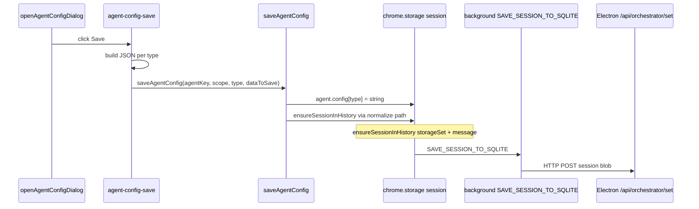

# AI Agent Form — Pre-Implementation Scan

## Purpose

Document the **AI agent creation/edit experience** in this codebase: form surface area, persistence, validation, provider/model UI, and how saved data connects to **orchestrator runtime** (`processFlow`, `InputCoordinator`, WR Chat). Evidence is drawn from implementation (primarily `content-script.tsx`); runtime product behavior may differ and is flagged for verification.

## Executive summary

- The **canonical UI** for the rich agent editor is **`openAgentConfigDialog(...)`** in `apps/extension-chromium/src/content-script.tsx` — a large **imperative DOM** overlay, not a React component tree.
- The editor is opened in **three variants** via the `type` argument: **`instructions`** (main AI Instructions + Listener / Reasoning / Execution), **`context`** (Memory tab), **`settings`** (priority / auto-activation / delay). Users switch tabs by reopening the dialog with a different `type` (e.g. from grid/lightbox actions), not by in-modal tab buttons in the snippet inspected.
- **Persisted shape**: for session scope, `saveAgentConfig` writes **`agent.config[type]`** as a **JSON string** (`instructions` | `context` | `settings`). The **`instructions`** payload is a **single merged JSON object** (capabilities, listening, reasoning, execution, files, etc.), not separate keys per section.
- **Provider/model for LLM calls** in WR Chat are **not** configured on the agent instructions form; they live on **Agent Box** rows (`session.agentBoxes[].provider` / `model`) edited via **Add/Edit Agent Box** dialogs in the same file. Model lists for those dialogs are **`getPlaceholderModels(provider)`** — **static** strings per provider; **no** coupling to **`optimando-api-keys`** or live Ollama fetches in that path.
- **API keys** are configured in **Extension Settings** (`openSettingsLightbox`), stored in **`localStorage['optimando-api-keys']`**. Saving keys is **gated on** `(window as any).optimandoHasActiveSubscription === true`; otherwise save is blocked and a notice is shown. **This gate does not change** Agent Box model dropdowns (they remain placeholder-based).
- **No temperature / top_p / max_tokens** fields were found in the agent instructions schema usage or the main form save path (grep over `src/types` and agent form save). **Mini Apps** on Agent Boxes are optional chips in the Add/Edit Agent Box dialogs.

---

## 1. Full field inventory

### 1.1 Modal entry: `openAgentConfigDialog(agentName, type, parentOverlay, agentScope, agentNumber?)`

| `type` | Title (header) | Primary content |
|--------|------------------|-----------------|
| `instructions` | `🤖 AI Instructions - Agent NN` | See §1.2 |
| `context` | `🧠 Memory - Agent NN` | See §1.3 |
| `settings` | `⚙️ Agent Settings - {Name}` | See §1.4 |

**Shared chrome (all types):** Export / Schema / Template / Import, Cancel, **Save** (`agent-config-save`).

### 1.2 `instructions` — static shell + dynamic sections

**Header grid**

| Field | Element id / class | Notes |
|-------|-------------------|--------|
| Name (command identifier) | `ag-name` | Used in triggers; help text references `@` / `#` |
| Icon | `ag-icon` | Default `🤖` in template |
| Description | `ag-description` | Free text |

**Capability toggles** (control which sections are considered “active”; save path still persists nested data per design comments)

| Toggle | id | Maps to `capabilities[]` |
|--------|-----|---------------------------|
| Listener | `cap-listening` | `'listening'` |
| Reasoning | `cap-reasoning` | `'reasoning'` |
| Execution | `cap-execution` | `'execution'` |

**Container:** `#agent-sections` — populated by large block of JS that builds **Listener**, **Reasoning**, **Execution** UIs when toggles are on.

**Listener (representative ids / structures — non-exhaustive; file is ~45k lines)**

- Passives / actives: `L-toggle-passive`, `L-toggle-active`, `#L-context`, `#L-website`, `#L-source`, `.L-tag`, `#L-active-list`, `#L-passive-triggers`, `#L-unified-triggers` with rows `.unified-trigger-row` and fields such as `.trigger-tag`, `.trigger-channel`, `.trigger-keywords`, `eventTagConditions` (WRCode, sender whitelist, body keywords, website patterns), DOM/overlay/manual trigger types with many sub-fields (see auto-save collector ~13895–14030).
- Advanced: `#L-conditions-list`, `#L-sensor-workflows`, `#L-action-workflows`, `#L-workflow-sources`, modalities `.L-modality`, cron `L-cron-schedule`, API `L-api-endpoint`, memory sharing hooks tied to listener example files, etc.
- **Agent Context** (files for RAG-style use): checkboxes `#AC-session`, `#AC-account`, `#AC-agent`, file staging UI, `agentContextFiles[]` in saved JSON.
- **Memory** sidebar in instructions: `#MEM-session`, `#MEM-account`, read/write toggles, etc. (see `memorySettings` in save/auto-save).

**Reasoning**

- Main: goals/role/rules textareas (classes like `.R-goals`, `.R-role`, `.R-rules`), **Apply For** lists (`#R-apply-list`, additional sections `#R-sections-extra`), **Accept From** wiring, **Reasoning workflows** with conditions (`#R-workflow-list`, `.r-wcond-*`), optional **additional reasoning sections** `.R-section`.
- Saved as `reasoning`, `reasoningSections` (see save handler).

**Execution**

- **Execution mode** (section): `#E-execution-mode-main` (e.g. `agent_workflow`).
- Workflows: `#E-workflow-list`, rows `.exec-workflow-row`, `.e-workflow-id`, run-when types, boolean/tag/signal conditions.
- **Report to / special destinations:** `#E-special-list`, rows `.esp-row`, `.esp-kind` → `agentBox` | `agent` | … with follow-up selects.
- **Extra execution sections:** `#E-sections-extra`, `.E-section`, `.E-apply-list-sub`, `.E-special-list-sub`.

**Footer actions**

- `ag-export-btn`, `ag-schema-btn`, `ag-template-btn`, `ag-import-btn`, `ag-import-file`.

### 1.3 `context` tab

| Field | id | Purpose |
|-------|-----|---------|
| Memory body | `agent-context` | Large textarea |
| Memory allocation tier | `agent-memory` | `low` / `medium` / `high` / `ultra` |
| Persist across sessions | `agent-persist-memory` | checkbox |

Saved as JSON with keys like `text`, `memory`, `source` (see save branch `type === 'context'` ~248+ in save handler region).

### 1.4 `settings` tab

| Field | id | Purpose |
|-------|-----|---------|
| Priority | `agent-priority` | low / normal / high / critical |
| Auto-start | `agent-auto-start` | checkbox |
| Auto-respond | `agent-auto-respond` | checkbox |
| Response delay ms | `agent-delay` | number 0–5000 |

---

## 2. Data model behind the form

### 2.1 Session agent record

Agents live in **`session.agents[]`** with shapes such as:

- `key`, `name`, `icon`, `number`, `enabled`, `scope`, `kind`, `config`

**`config` keys** (strings holding JSON):

- `config.instructions` — stringified **unified** instructions object (capabilities + listening + reasoning + execution + files + settings embedded as per save logic).
- `config.context` — memory tab.
- `config.settings` — priority/autostart/delay.

**Canonical / schema documentation:** `apps/extension-chromium/src/types/CanonicalAgentConfig.ts`, `schemas/agent.schema.json`. Comments there note **deprecations** (e.g. move toward `reasoningSections[]`); the **live form** still writes **`reasoning`** and **`reasoningSections`** in parallel in places — **semantic overlap** (see gaps).

### 2.2 Draft / auto-save

- Draft keys: `agent_${agentName}_draft_session_${sessionKey}` or `agent_${agentName}_draft_${agentScope}`.
- Auto-save debounced (~500ms) writes draft object to **`chrome.storage`** via `storageSet` (see `autoSaveToChromeStorage` / sync logic ~12194+).

### 2.3 Agent number

- **`optimando-agent-number-map`** in `localStorage` maps agent key → number when UI does not pass `data-number` (`getAgentNumberFallback`, ~11948–11959).
- Session **`session.nextNumber`** used when creating new agents in `saveAgentConfig`.

---

## 3. Validation and defaults

| Aspect | Behavior |
|--------|----------|
| Schema validation in UI | **No** Zod/Yup in path reviewed; import path may use `importAgentFromJson` / validators in `AgentValidator.ts` for **file import** only. |
| Required fields | Largely **permissive**; empty triggers skipped in collectors; agent enabled forced **true** on successful config save (`saveAgentConfig` ~3929–3931). |
| Defaults | Icon `🤖`, various `__any__` for applyFor, execution mode `agent_workflow`, placeholder models in Agent Box dialogs. |
| API key save | **Blocked** if `optimandoHasActiveSubscription` is not true (~32201–32213). |

---

## 4. Submit/save flow end-to-end

1. **`agent-config-save` click** (~23504+): builds `dataToSave` from DOM + `previouslySavedData` merges.
2. **`saveAgentConfig(agentKey, scope, type, configData, cb)`** (~3851+): parses JSON for logs; for **`scope === 'session'`** updates **`agent.config[configType]`**, sets **`agent.enabled = true`**, calls **`ensureSessionInHistory`** (indirectly via `normalizeSessionAgents` / storage — exact call chain in `saveAgentConfig` uses `ensureSessionInHistory` in the session branch at ~3951).
3. **`ensureSessionInHistory`** (~2940+): `storageSet({ [sessionKey]: completeSessionData })`, then **`chrome.runtime.sendMessage({ type: 'SAVE_SESSION_TO_SQLITE', sessionKey, session })`**.
4. **Draft removal** after successful save: `chrome.storage.local.remove(autoSaveDraftKey)` (~25036+).

**Account scope:** separate branch `getAccountAgents` (~4013+) — not detailed here; session is primary for grid/orchestrator.

---

## 5. Mapping from form fields to runtime configuration

| Saved concept | Runtime consumer | Mechanism |
|---------------|------------------|-----------|
| `capabilities` includes `listening` | `InputCoordinator.evaluateAgentListener` | `processFlow.parseAgentsFromSession` merges `config.instructions` JSON into agent; requires `capabilities` / `listening` / `reasoning` / `execution` on agent object |
| Unified triggers `listening.unifiedTriggers` | `routeToAgents` + `routeEventTagTrigger` | Trigger name matching, `eventTagConditions` |
| `reasoning.goals` / `role` / `rules` | `wrapInputForAgent` in `processFlow.ts` | Prepended to LLM system content in WR Chat |
| `execution.specialDestinations` | `InputCoordinator.findAgentBoxesForAgent` | Explicit `agentBox` targets |
| `agent.number` | Matching `agentBox.agentNumber` | **Critical** for box output routing |
| `contextSettings` / `memorySettings` | **Unclear in orchestrator path** | Stored in JSON; **not** referenced in `processFlow.ts` / `InputCoordinator.ts` snippets from prior scan — likely **future** or other features |
| `settings` tab (priority, delay) | **Not** found in `processFlow` | **Likely inert** for current WR Chat/Ollama path unless another subsystem reads `config.settings` |

**Agent Box `provider` / `model`:** used by **`resolveModelForAgent`** in `processFlow.ts`; non-local providers fall back to local model string.

---

## 6. Provider/model selector wiring

### 6.1 Where it lives

- **Add Agent Box** and **Edit Agent Box** dialogs (~5860–6760): `#agent-provider` / `#agent-model`, `#edit-agent-provider` / `#edit-agent-model`.
- Options: **OpenAI, Claude, Gemini, Grok, Local AI, Image AI** (plus “select provider first”).

### 6.2 What drives available options

- **`getPlaceholderModels(provider)`** (~6009–6027, ~6703+): **hard-coded** string lists per provider (e.g. OpenAI → `gpt-4o-mini`, …; Local AI → long list including Ollama-style names).
- **`refreshModels`**: replaces `<option>` elements from that list; **does not** call Electron **`/api/llm/models`** in this path (contrast: sidepanel WR Chat **does** fetch live models).

### 6.3 Cloud vs local

- **Local AI** branch uses a **static** list of model name strings intended to mirror common Ollama tags — **not** dynamically enumerated.
- **Cloud** branches use **static** model id strings.
- **Runtime:** `resolveModelForAgent` treats **`ollama` / `local` / ''** as local; **display names** like `"Local AI"` may **not** match — **needs verification** whether stored `provider` is normalized before `resolveModelForAgent`.

### 6.4 API keys

- Stored separately: **`localStorage['optimando-api-keys']`** (`loadApiKeys` / `saveApiKeys`, ~32047–32113).
- **No reference** to `optimando-api-keys` inside **`getPlaceholderModels`** or **`refreshModels`** for Agent Box.
- **Conclusion:** **Setting an API key does not change** the Agent Box model dropdown contents in code reviewed.

### 6.5 Image AI

- Separate image model names; Agent Box also supports **`imageProvider` / `imageModel`** in `processFlow.AgentBox` type — sidepanel/grid may use these for non-chat flows; full wiring **needs follow-up**.

---

## 7. Relevant UI components, stores, schemas, API routes, services

| Layer | Artifact |
|-------|----------|
| UI implementation | `apps/extension-chromium/src/content-script.tsx` (`openAgentConfigDialog`, Agent Box dialogs, `openSettingsLightbox`) |
| Minimal parallel API | `apps/extension-chromium/src/agent-manager-v2.ts` — **separate** `agentsV2` list; **not** the rich form |
| Persistence | `saveAgentConfig`, `ensureSessionInHistory`, `chrome.storage`, `SAVE_SESSION_TO_SQLITE` |
| Types / export | `CanonicalAgentConfig.ts`, `AgentExportImport.ts`, `TypeSystemService.ts`, `schemas/agent.schema.json` |
| Runtime | `processFlow.ts`, `InputCoordinator.ts` |
| LLM HTTP | Electron `POST /api/llm/chat` (Ollama) — used from sidepanel, **not** from API keys in extension form |

---

## 8. Gaps, inconsistencies, or likely bugs

1. **`config.instructions` string vs merged sections:** Runtime **`parseAgentsFromSession`** merges **string** `config.instructions` into the agent object. The save path builds a **large flat JSON** for `instructions` type. Any mismatch between **auto-save** vs **final save** field lists could cause **partial** state (mitigated by extensive `previouslySavedData` merging — but high complexity).
2. **Canonical comments vs UI:** Schema/types deprecate some fields while UI still saves **legacy + new** shapes (`listening.active` vs `unifiedTriggers`, `reasoning` vs `reasoningSections`).
3. **Settings tab / priority / delay:** No evidence these feed **`processFlow`** or WR Chat; users may **believe** they affect routing.
4. **API key save subscription gate:** Keys may **not** persist when `optimandoHasActiveSubscription` is false — **BYOK** messaging vs code path inconsistency risk.
5. **Provider string mismatch:** Agent Box uses **"Local AI"**; `resolveModelForAgent` checks **`ollama` / `local`**. If storage keeps **"Local AI"**, cloud fallback path may trigger incorrectly (**needs runtime check**).
6. **Temperature / tools:** No agent-level temperature in form; **Mini App** tools on boxes are UI chips — persistence path separate from `saveAgentConfig` instructions.
7. **Dual trigger pipelines:** Form saves rich listener data; **`InputCoordinator`** may only consume **subset** (documented in prior scan: regex `#` vs NLP).

---

## 9. Runtime verification checklist (screenshot / E2E round)

- [ ] Open same agent **Instructions** vs **Memory** vs **Settings** from UI: confirm **three** modals and titles match `type` behavior.
- [ ] Toggle only **Reasoning** (no Listener): send WR Chat message — confirm **`no_listener`** path forwards to reasoning per `evaluateAgentListener`.
- [ ] Save **unified trigger** with `#tag` and reload page: confirm trigger still in **`loadAgentsFromSession`** output (DevTools / export).
- [ ] Set Agent Box to **OpenAI** + model **gpt-4o-mini** with **no** cloud integration in Electron: confirm **`resolveModelForAgent`** fallback and actual chat model used.
- [ ] Set provider **Local AI** + **llama3.2**: confirm **`/api/llm/chat`** receives that model id when agent box matched.
- [ ] Fill **API keys** and click Save with subscription **off** vs **on**: confirm **`localStorage`** contents.
- [ ] Compare Agent Box model list **before/after** API key save: expect **no change** (static list).
- [ ] Edit **priority / delay** in Settings tab: grep session JSON for persistence; grep runtime for **read** usage.
- [ ] Import agent JSON via **Import** button: confirm validator errors vs successful **`saveAgentConfig`**.

---

## Follow-up questions

- Should **`config.settings`** (priority, autostart, delay) be **wired** to any runtime scheduler, or removed from UI to avoid false expectations?
- Should Agent Box **`provider`** values be **normalized** (`ollama` vs `Local AI`) at save time?
- Is **`agentsV2`** (`agent-manager-v2.ts`) ever user-facing alongside the rich form, or dead weight for migration?
