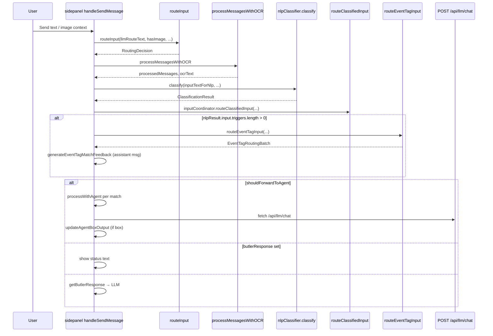

# WR Chat Pipeline: UI, Send Flow, NLP, and Event Tags

## Purpose

Map **WR Chat** (Command Chat in the extension sidepanel/popup) from user send through **routing**, **OCR**, **NLP**, **Event Tag feedback**, and **LLM** calls, with file-level evidence. Pre-implementation only.

## Executive summary

- **Main implementation** is **`SidepanelOrchestrator`** in `apps/extension-chromium/src/sidepanel.tsx` (large file; chat logic ~2468–3173 for agent helper and send).
- **Send pipeline (`handleSendMessage`)** order: **`routeInput`** (decides agent vs butler vs system) → **OCR** (`processMessagesWithOCR`) → **NLP classify** → **`inputCoordinator.routeClassifiedInput`** (allocations; side-effect mainly logging/display) → **if NLP found triggers**, **`routeEventTagInput`** → **match feedback in chat** → then **Path A/B/C** based on **`routingDecision` from `routeInput`**, not from NLP allocations.
- **LLM** calls use **`http://127.0.0.1:51248/api/llm/chat`** with `modelId` + `messages`.
- **Popup WR Chat** uses `popup-chat.tsx` + `CommandChatView.tsx`; patterns align with sidepanel but this scan focused on sidepanel evidence—**popup parity needs spot-check** in a later round.

## Relevant files and modules

| Role | Path |
|------|------|
| WR Chat send + orchestration UI | `apps/extension-chromium/src/sidepanel.tsx` (`SidepanelOrchestrator`, `handleSendMessage`, `processWithAgent`, `processScreenshotWithTrigger`) |
| Command chat presentation | `apps/extension-chromium/src/ui/components/CommandChatView.tsx` |
| Docked page chat | `apps/extension-chromium/src/ui/docked/DockedCommandChat.tsx` |
| Workspace / mode state | `apps/extension-chromium/src/shared/ui/uiState.ts`, `apps/extension-chromium/src/stores/useUIStore.ts` |
| Routing services | `apps/extension-chromium/src/services/processFlow.ts`, `InputCoordinator.ts` |
| NLP | `apps/extension-chromium/src/nlp/NlpClassifier.ts` |
| Content-script flow description (debug/export) | `apps/extension-chromium/src/content-script.tsx` (text mentions Butler → Input Coordinator → Agent) |
| Product docs (may drift) | `docs/nlp-pipeline.md`, `docs/listener-current-architecture.md` |

## Key flows and dependencies

### End-to-end: `handleSendMessage` (sidepanel)

### `processWithAgent` (agent path)

- Reloads agent via **`loadAgentsFromSession()`**.
- Builds system content with **`wrapInputForAgent`** (reasoning sections).
- **`resolveModelForAgent(match.agentBoxProvider, match.agentBoxModel, fallbackModel)`**.
- POST body: `modelId`, `messages`: `[{ role: 'system', content: reasoningContext }, ...processedMessages.slice(-3)]`.

### Screenshot / trigger paths

- **`processScreenshotWithTrigger`** and **`handleSendMessageWithTrigger`**: `routeInput` + optional OCR + in trigger path also **NLP + `routeClassifiedInput`**; then same LLM/update pattern as above.

### BEAP inbox attachment prefix

- When docked workspace is BEAP inbox with selected attachment, **`llmRouteText`** is prefixed with semantic attachment excerpt (`handleSendMessage` ~2817–2836). **Separate** from orchestrator agents; routes assistant output to inbox via **`routeAssistantToInboxIfPending`**.

### Runtime messages

- **`UPDATE_AGENT_BOX_OUTPUT`**, **`UPDATE_SESSION_DATA`**, **`UPDATE_AGENT_BOXES`**, **`GET_SESSION_FROM_SQLITE`**: sidepanel listeners ~1540–1735 in `sidepanel.tsx`.

## State / config sources

| State | Where |
|-------|--------|
| `agentBoxes` React state | `useState` in `sidepanel.tsx`; hydrated from session/SQLite messages, `UPDATE_*` handlers |
| `activeLlmModel` | Sidepanel state + ref `activeLlmModelRef` for async paths |
| `connectionStatus`, `sessionName` | Props/state; used in `routeInput` and butler prompts |
| Chat transcript | `chatMessages` local state |

## Known behavior

- **Dual trigger extraction**: `routeInput` → `routeToAgents` uses **regex `extractTriggerPatterns`** on user text; **NLP** also extracts `#` triggers. They can disagree if NLP normalizes differently—**needs runtime verification** on edge cases.
- **Event Tag routing** runs **only when** `nlpResult.input.triggers.length > 0` (`sidepanel.tsx` ~3019). Feedback is **informational** in chat; **execution** of `processEventTagMatch` is **not** wired in this send handler (grep shows `processEventTagMatch` defined in `processFlow.ts` but not invoked from `handleSendMessage`).

## Ambiguities / gaps

1. **`routeClassifiedInput` result** is unused for branching; purpose today appears **diagnostic / future multi-agent dispatch**. Confirm with stakeholders.
2. **Popup (`popup-chat.tsx`)** may duplicate or differ slightly—**line-level parity not verified** in this scan.
3. **`CommandChatView`** default **`onSend`** behavior: if parent does not pass `onSend`, shows **mock response** (`CommandChatView.tsx` ~106–116). Integration depends on parent wiring.

## Runtime verification checklist

- [ ] Send `#yourTag` with NLP disabled or failed: does `routeInput` still match via regex triggers?
- [ ] Send message with no `#` but **expected_context** match: confirm Path A vs C.
- [ ] Event Tag feedback message: verify it matches **`routeEventTagInput`** batch summary and does not duplicate agent processing.
- [ ] BEAP inbox + attachment prefix: confirm **`routeInput`** still sees full `llmRouteText` and inbox AI routing works.
- [ ] Open **LLM Settings** / model dropdown: `activeLlmModel` updates **`processWithAgent`** fallback.

## Follow-up questions

- Should **NLP allocations** eventually replace or merge with **`routeToAgents`** results to avoid two concepts of “matched agents”?
- Is **Event Tag feedback** meant to stay **non-executing** until `processEventTagMatch` is finished?
- For **popup vs docked sidepanel**, is **one** the canonical behavior reference for the next phase?
