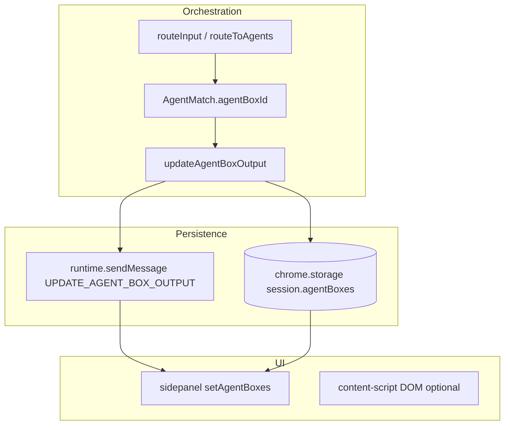
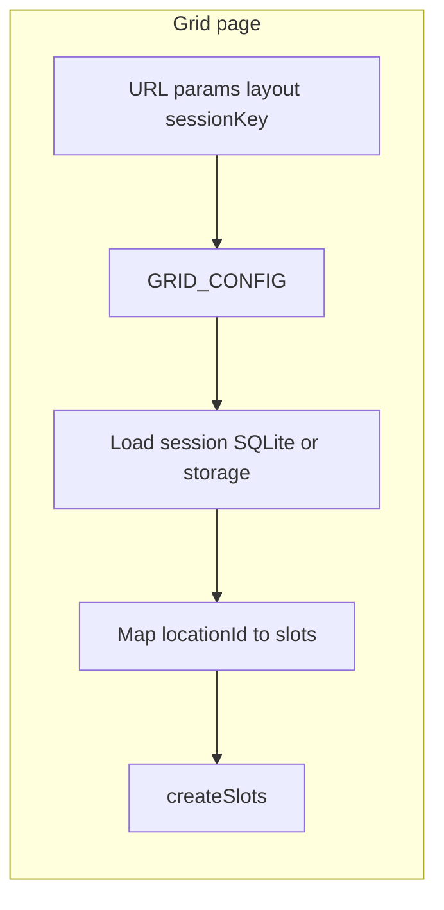

# AgentBoxes and Display Grids

## Purpose

Code-grounded map of **Agent Box** UI, **output routing from WR Chat**, **display grid** pages (`build03`), and how **orchestration state** (session blobs) relates to **display state** (React/DOM). This extends the orchestrator scan docs; it is not an implementation proposal.

**Note:** This folder already contains `03-electron-llm-and-orchestrator-http.md`. This file is **`03-agentboxes-and-display-grids.md`** — renumber if you want unique numeric prefixes per topic.

---

## 1. AgentBox component map

| Surface | Implementation | Tech |
|---------|----------------|------|
| **Extension sidepanel (Admin / agent output strip)** | Inline JSX in `SidepanelOrchestrator` | React `useState` for `agentBoxes`, `agentBoxHeights` |
| **Page grid (master tab)** | `.resizable-agent-box` DOM in `content-script.tsx` | Imperative HTML + `resize: vertical` |
| **Standalone display grid tab** | `build03/grid-display.html` + `grid-display.js` / `grid-display-v2.html` + `grid-script.js` / `grid-script-v2.js` | Vanilla JS, `chrome.storage` / `GET_SESSION_FROM_SQLITE` |

There is **no** shared React component named `AgentBox.tsx` in the paths reviewed; the **canonical type** is documented in `apps/extension-chromium/src/types/CanonicalAgentBoxConfig.ts` and `schemas/agentbox.schema.json`.

**Sources distinguish:**

- `master_tab` — boxes created from the in-page orchestrator UI; shown in **sidepanel** when `masterTabId` matches.
- `display_grid` — boxes tied to a **display grid** layout/slots; **hidden** in sidepanel list (filtered out).

```8671:8690:apps/extension-chromium/src/sidepanel.tsx
      {agentBoxes.filter(box => {
        // Filter out display grid boxes (same logic as content script)
        const isDisplayGrid = box.source === 'display_grid' || box.gridSessionId
        if (isDisplayGrid) return false
        
        // Filter by master tab ID - only show boxes created on this tab
        const boxMasterTabId = box.masterTabId || "01"  // Default to "01" for legacy boxes
        const currentMasterTabId = masterTabId || "01"  // Current tab's ID
        return boxMasterTabId === currentMasterTabId
      }).length > 0 && (
```

---

## 2. Display grid / layout architecture

### 2.1 Session model

- **`session.displayGrids`**: array of grid entries with `layout`, `sessionId`, `config.slots`, and optionally `agentBoxes` (see `background.ts` `GRID_SAVE`).
- **`session.agentBoxes`**: flat list of all boxes (master tab + display grid); **dedupe by `identifier`** on merge in `GRID_SAVE` (~4041–4053).

### 2.2 `GRID_SAVE` (background)

`apps/extension-chromium/src/background.ts` ~3990–4065:

- Ensures `displayGrids` and `agentBoxes` arrays exist.
- Finds or creates `gridEntry` by `payload.sessionId`.
- Merges `payload.agentBoxes` into `session.agentBoxes` by `identifier`.
- Persists with `storageSet({ [sessionKey]: session })`.

### 2.3 Standalone grid page (`build03/grid-display.js`)

- Reads **`window.GRID_CONFIG`** (layout, `sessionId`, `sessionKey`, `nextBoxNumber`) set by `grid-display.js` / `grid-display-v2.html`.
- Loads session via **`chrome.runtime.sendMessage({ type: 'GET_SESSION_FROM_SQLITE', sessionKey })`**.
- Maps boxes to slots using **`locationId`** prefix: `grid_${sessionId}_${layout}` + `_slotN` (~133–155).
- **`createSlots`**: slot index loop with **`SLOT_NUMBER_OFFSET = 5`** (slots numbered from 6 upward — comment: boxes 1–5 reserved for master tabs) (~180–185).
- **Layout tweaks:** e.g. 5-slot and 7-slot first slot can **`grid-row: span 2`** (~210–214).

### 2.4 Grid v2 HTML (`grid-display-v2.html`)

- URL query params: `layout`, `sessionId`, `theme`, `sessionKey`, `nextBoxNumber`.
- Can load **`session.displayGrids`** from **`chrome.storage.local[sessionKey]`** and match `gridEntry.layout === layout` (~155–168).

**Two parallel loaders:** v2 may use storage-only path; `grid-display.js` emphasizes SQLite session — **behavior can diverge** if SQLite and storage differ.

---

## 3. Prop/data flow into AgentBoxes



- **Routing:** `InputCoordinator.routeToAgents` attaches **`agentBoxId`**, **`agentBoxNumber`**, **`agentBoxProvider`**, **`agentBoxModel`** to each `AgentMatch` (`processFlow.ts` / `InputCoordinator.ts` — see prior scan).
- **Write path:** `updateAgentBoxOutput(agentBoxId, output, reasoningContext?)` finds `session.agentBoxes[boxIndex]` by **`b.id === agentBoxId`**, sets **`output`**, **`lastUpdated`**, saves storage, then broadcasts:

```1137:1185:apps/extension-chromium/src/services/processFlow.ts
export async function updateAgentBoxOutput(
  agentBoxId: string,
  output: string,
  reasoningContext?: string
): Promise<boolean> {
  // ...
        session.agentBoxes[boxIndex].output = formattedOutput
        session.agentBoxes[boxIndex].lastUpdated = new Date().toISOString()
        chrome.storage?.local?.set({ [sessionKey]: session }, () => {
          chrome.runtime?.sendMessage({
            type: 'UPDATE_AGENT_BOX_OUTPUT',
            data: {
              agentBoxId,
              output: formattedOutput,
              allBoxes: session.agentBoxes
            }
          })
```

- **Sidepanel:** listens for `UPDATE_AGENT_BOX_OUTPUT` and replaces **`agentBoxes`** from `message.data.allBoxes` or patches one box (~1576–1588 in `sidepanel.tsx`).

**WR Chat association:** Deterministic by **orchestrator match**: the matched agent’s **first connected box** (`firstBox`) sets `agentBoxId` on the `AgentMatch`; WR Chat does **not** use free-text routing to pick a box.

---

## 4. Output rendering lifecycle

### 4.1 Initial / empty

- Sidepanel renders **`box.output`** or a **placeholder**: `Ready for {title}...` (~8836–8838).
- Disabled box: italic “Agent disabled…” (~8839–8841).

### 4.2 Loading / streaming

- **Chat-level** loading: `isLlmLoading` disables send and shows “Thinking” (~3273) — applies to the **composer**, **not** per Agent Box.
- **Agent Box:** There is **no** per-box `loading` flag in the reviewed path. LLM calls in `processWithAgent` use **`fetch` + full JSON body** (`sidepanel.tsx`); **no** SSE/streaming into `box.output`.
- **Conclusion:** Output appears **atomically** when the request completes; **no incremental token streaming** to the box UI in this path.

### 4.3 Final output

- String assigned to **`box.output`**; may include prefixed **Reasoning Context** markdown from `updateAgentBoxOutput`.
- Rendered as plain text inside a `<div>` (~8836) — **no** `dangerouslySetInnerHTML` in the snippet reviewed (markdown not auto-rendered unless content includes markdown-like text as plain text).

### 4.4 Failure / retry

- Failures on LLM error typically surface as **chat assistant messages** (`processWithAgent` error branch); **failed runs do not** clear or set a dedicated `box.error` field in `processFlow.ts`.
- **No retry** UI on the box itself in the reviewed code.

---

## 5. Grid rules and layout decision points

| Rule | Where |
|------|--------|
| Hide grid boxes in sidepanel | `source === 'display_grid'` or `gridSessionId` (`sidepanel.tsx` ~8673–8674) |
| Master tab scope | `box.masterTabId` vs `masterTabId` state (~8677–8679) |
| Slot ↔ box mapping | `locationId` prefix `grid_{sessionId}_{layout}_slot{N}` (`grid-display.js` ~135–151) |
| Slot numbering offset | `SLOT_NUMBER_OFFSET = 5` (`grid-display.js` ~182) |
| Multi-column / span | 5-slot / 7-slot first slot `grid-row: span 2` (~210–214) |
| Ordering in sidepanel | **Array order** of `agentBoxes.filter(...).map(...)` — **no** explicit sort by `boxNumber` in snippet |

---

## 6. State sources and update triggers

| State | Source | Updates |
|-------|--------|---------|
| `agentBoxes` | Initial load from session (`GET_SESSION_FROM_SQLITE` / `UPDATE_SESSION_DATA` / messages) | `UPDATE_AGENT_BOX_OUTPUT`, `UPDATE_AGENT_BOXES`, local toggle/delete |
| `box.output` | `updateAgentBoxOutput` | After each successful agent LLM completion |
| `agentBoxHeights` | React state; **persist** via `storageSet({ agentBoxHeights: { ... } })` on resize end (`sidepanel.tsx` ~2175–2177) | **Note:** `handleMouseUp` reads `agentBoxHeights[boxId]` may be **stale** vs last `mousemove` (closure); **needs runtime verification**. |
| `masterTabId` | Storage (`masterTabId_${tabId}`) ~1431 | Tab identity for filtering |
| Content-script heights | `currentTabData.agentBoxHeights[box.id]` per box (~5432) | Resize on page |

**Orchestration vs display:**

- **Orchestration:** `session.agents`, routing rules, `match.agentBoxId`.
- **Display:** `session.agentBoxes[].output`, `enabled`, `title`, `color`, sidepanel React state.
- **Split risk:** `updateAgentBoxOutput` writes **chrome.storage** only; SQLite sync for full session may lag unless another path calls `SAVE_SESSION_TO_SQLITE` after box output (not shown in `processFlow` snippet).

---

## 7. Coupling to chat, orchestrator, and provider

| Coupling | Nature |
|----------|--------|
| Chat → box | **Only** through `routeInput` → `processWithAgent` → `updateAgentBoxOutput(match.agentBoxId, …)` |
| Orchestrator | **`findAgentBoxesForAgent`** picks **first** connected box(es); `AgentMatch` carries provider/model for LLM |
| Provider | **`resolveModelForAgent`** uses box **provider/model**; **display** of provider/model in box header is **not** prominent in sidepanel snippet (title/color only) |
| Grid page | Same **`session.agentBoxes`**; output updates **should** appear if the same session is loaded and box is keyed by `id`/`identifier` consistently — **verify** grid page listens for `UPDATE_AGENT_BOX_OUTPUT` (likely **not**; grid may only refresh on reload) |

---

## 8. Generic vs specialized boxes; virtualization / perf

- **Generic:** One box UI for all agents — **text `output`** string; no agent-type-specific subcomponents in sidepanel.
- **Image / Image AI:** `AgentBox` type includes `imageProvider` / `imageModel` (`processFlow.ts`); **specialized image rendering** in sidepanel grid was **not** found in the reviewed lines (may exist elsewhere).
- **Virtualization:** No `react-window` / `VirtualList` around agent-box list.
- **Memoization:** No `React.memo` on box rows in the excerpt.
- **Suspense:** Not used for this list.

---

## 9. File-by-file references (core rendering path)

| File | Role |
|------|------|
| `apps/extension-chromium/src/sidepanel.tsx` | Agent box list UI, filters, resize, `UPDATE_AGENT_BOX_OUTPUT` handler |
| `apps/extension-chromium/src/services/processFlow.ts` | `AgentBox` type, `updateAgentBoxOutput`, `findAgentBoxesForAgent` |
| `apps/extension-chromium/src/services/InputCoordinator.ts` | `agentBoxId` on matches |
| `apps/extension-chromium/src/background.ts` | `GRID_SAVE`, session persistence |
| `apps/extension-chromium/build03/grid-display.js` | Slot creation, `locationId`, SQLite load |
| `apps/extension-chromium/build03/grid-display-v2.html` | Params, `displayGrids` from storage |
| `apps/extension-chromium/build03/grid-script.js` | Slot editor, save agent box to storage, `source: 'display_grid'` |
| `apps/extension-chromium/src/content-script.tsx` | `resizable-agent-box`, `agentBoxHeights`, `displayGrids` orchestration |
| `apps/extension-chromium/src/types/CanonicalAgentBoxConfig.ts` | Contract documentation |

---

## 10. Display grid assembly (diagram)



---

## 11. Runtime verification checklist

- [ ] **Multi-box same agent:** Two boxes with same `agentNumber` — which receives output first / both? (`findAgentBoxesForAgent` returns array; match uses `firstBox` only — **verify** duplicate boxes).
- [ ] **Sidepanel vs grid:** Update WR Chat → confirm **display grid** page shows new output **without** full page reload (or document that it does not).
- [ ] **Resize persist:** Reload sidepanel after resize — height restored (may fail if `agentBoxHeights` not loaded into React on mount).
- [ ] **display_grid filter:** Create box on grid page — confirm **absent** from sidepanel list; **present** in SQLite/session JSON.
- [ ] **masterTabId:** Switch master tab — boxes from other tab hidden.
- [ ] **Disabled box:** Toggle off — confirm `pointer-events: none` and no output update UX.
- [ ] **LLM failure:** Confirm no `box.output` change; error only in chat.
- [ ] **SQLite vs storage** after `updateAgentBoxOutput` — session diff in Electron.
- [ ] **Long output:** Scroll inside box (`overflow: auto`) with large model response.

---

## 12. Gaps and follow-ups

- **Grid live updates:** Does **content script** or **grid** subscribe to `UPDATE_AGENT_BOX_OUTPUT`? If not, **display grid** may be **stale** until refresh.
- **Streaming:** Product expectation vs **atomic** `fetch` — document if future work.
- **Height persistence bug:** Resize `mouseup` uses potentially **stale** `agentBoxHeights` in `handleMouseUp` — confirm with DevTools.
