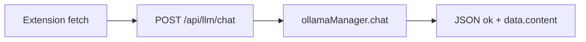

# Electron Backend: LLM HTTP API and Orchestrator SQLite

## Purpose

Describe **HTTP endpoints** the extension uses for **chat**, **OCR**, and **orchestrator session** persistence, as implemented in the Electron app (`electron-vite-project`). Pre-implementation scan.

## Executive summary

- Local HTTP server (default base URL referenced in extension: **`http://127.0.0.1:51248`**) exposes:
  - **`POST /api/llm/chat`**: body `{ modelId?, messages }` → **`ollamaManager.chat(activeModelId, messages)`**; resolves missing `modelId` via **`getEffectiveChatModelName()`** (`main.ts` ~7666–7692).
  - **`GET/POST /api/orchestrator/*`**: session key/value in SQLite via orchestrator adapter (see `main.ts` ~7297+).
- **CORS note**: Renderer sometimes must use IPC for orchestrator connect (`main.ts` comment ~2803); extension uses **background script fetch** for SQLite session to avoid page CORS.
- Extension **`resolveModelForAgent`** only **selects string model id** for Ollama; **no OpenAI/Claude HTTP** in this path from extension chat.

## Relevant files and modules

| Area | Path |
|------|------|
| HTTP routes (LLM + orchestrator + OCR) | `apps/electron-vite-project/electron/main.ts` |
| Ollama manager | `apps/electron-vite-project/electron/main/llm/ollama-manager.ts` |
| LLM IPC registration | `apps/electron-vite-project/electron/main/llm/ipc.ts` |
| Active model broadcast | `apps/electron-vite-project/electron/main/llm/broadcastActiveModel.ts` |
| Extension → HTTP helper types | `apps/extension-chromium/src/rpc/electronRpc.ts` |
| Background bridge | `apps/extension-chromium/src/background.ts` (`GET_SESSION_FROM_SQLITE`, `SAVE_SESSION_TO_SQLITE`, …) |
| LLM from BEAP reply | `apps/extension-chromium/src/beap-messages/services/beapReplyAiProvider.ts` |

## Key flows and dependencies

### Chat request path



Snippet reference (handler shape):

```7666:7692:apps/electron-vite-project/electron/main.ts
    httpApp.post('/api/llm/chat', async (req, res) => {
      try {
        const { modelId, messages } = req.body
        if (!messages || !Array.isArray(messages)) {
          res.status(400).json({ ok: false, error: 'messages array is required' })
          return
        }
        // ...
        const response = await ollamaManager.chat(activeModelId, messages)
        res.json({ ok: true, data: response })
```

### Session load path (agents)

1. Extension: `chrome.runtime.sendMessage({ type: 'GET_SESSION_FROM_SQLITE', sessionKey })`.
2. Background: `fetch('http://127.0.0.1:51248/api/orchestrator/get?key=...')`.
3. On error: fallback `chrome.storage.local.get([sessionKey])`.

### Orchestrator REST surface (representative)

- `POST /api/orchestrator/connect`, `GET /api/orchestrator/status`, `GET /api/orchestrator/sessions`, `GET /api/orchestrator/get`, `POST /api/orchestrator/set`, `GET /api/orchestrator/get-all`, `POST /api/orchestrator/set-all`, `POST /api/orchestrator/remove`, migrate/export/import (`main.ts` ~7297–7447).

## State / config sources

| Source | Role |
|--------|------|
| Ollama persisted active model | Used when `modelId` omitted in `/api/llm/chat` |
| Orchestrator SQLite | Session blobs keyed by session key |
| `chrome.storage.local` | Fallback and agent box updates from extension |

## Known behavior

- **`/api/llm/chat`** requires **`messages`** array; **`modelId`** optional.
- Extension sidepanel stores **`llm-model-installed`** listener to refresh model list (`sidepanel.tsx` ~1100–1104).
- **`beapReplyAiProvider.ts`** documents adapter to same LLM stack—**worth tracing** if BEAP AI replies must stay consistent with WR Chat.

## Ambiguities / gaps

1. **Port 51248**: assumed constant in extension; confirm single source of truth if env-specific.
2. **Full parity** between IPC LLM handlers (`llm/ipc.ts`) and HTTP routes—**not fully diffed** in this scan; handshake code paths may differ (`main.ts` `handshake:chatWithContext` uses vault `getLLMChat`—separate from extension HTTP chat).

## Runtime verification checklist

- [ ] With Ollama stopped: error shape from `/api/llm/chat` and sidepanel user message.
- [ ] With no models installed: `400` from chat route matches extension error handling.
- [ ] `GET /api/orchestrator/get` vs chrome.storage fallback: load same session JSON.
- [ ] Activate model via Admin UI: **`broadcastActiveModel`** reaches open clients if applicable.

## Follow-up questions

- Should extension **ever** call **IPC** for chat instead of HTTP to unify with Electron renderer?
- Is **vault / handshake** chat (`chatWithContextRag`) required to align with **WR Chat** models—single product decision?
