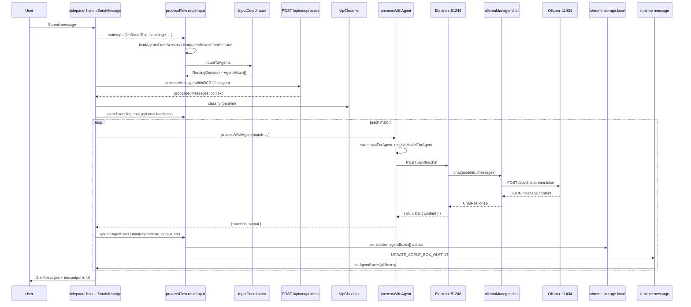

# Internal Wiring End-to-End: WR Chat → Agent → AgentBox

## Purpose

Trace **actual code paths** from WR Chat user input through orchestration to LLM execution and **AgentBox** output. This is the **integration** pre-check: how components connect, not isolated component descriptions.

**Scope:** `handleSendMessage` in **`sidepanel.tsx`**, **`processFlow.ts`**, **`InputCoordinator.ts`**, **`nlp/NlpClassifier`**, Electron **`POST /api/llm/chat`** and **`ollamaManager.chat`**, and **`updateAgentBoxOutput`**. Out of scope: BEAP send pipeline, inbox orchestrator remote queue, Electron handshake IPC chat (`handshake:chatWithContext*`), vault `getLLMChat`.

---

## 1. End-to-end sequence (user input → visible output)

1. **Input:** User submits text in WR Chat (`chatInput`); optional **images** in `chatMessages` (`imageUrl` on user messages). Optional **BEAP inbox** prefix merges into `llmRouteText` (`sidepanel.tsx` ~2813–2836).
2. **Guardrails:** Empty input + no image → help hint; no `activeLlmModel` → warning; `isLlmLoading` blocks duplicate sends.
3. **Routing (orchestrator):** **`routeInput(llmRouteText, hasImage, connectionStatus, sessionName, activeLlmModel, currentUrl)`** (`processFlow.ts`) loads agents (SQLite → fallback storage) and agent boxes (storage), runs **`isSystemQuery`** short-circuit, else **`matchInputToAgents`** → **`InputCoordinator.routeToAgents`** using **regex `#`/`@` triggers** on raw text.
4. **OCR:** **`processMessagesWithOCR`** maps chat messages to `{role, content}`; for messages with **`imageUrl`**, **`POST /api/ocr/process`** augments content with extracted text; aggregates **`ocrText`** for downstream NLP string.
5. **NLP (parallel):** **`nlpClassifier.classify(inputTextForNlp, …)`** produces **`ClassifiedInput`** (triggers, entities). **`inputCoordinator.routeClassifiedInput`** enriches allocations (logging / future use; **dispatch** still uses step 3 routing).
6. **Event Tag feedback (parallel):** If **`nlpResult.input.triggers.length > 0`**, **`routeEventTagInput`** → **`batch`**; **`generateEventTagMatchFeedback`** may append assistant message — **informational**, does not replace step 3 execution.
7. **Branch on `routingDecision`:**
   - **Path A — `shouldForwardToAgent`:** Butler confirmation (`butlerResponse`) → for each **`matchedAgents`**, **`processWithAgent(match, …)`** → **`fetch POST /api/llm/chat`** → on success, if **`match.agentBoxId`**, **`updateAgentBoxOutput(agentBoxId, result.output, reasoningContext)`**; else inline assistant text.
   - **Path B — system status:** `butlerResponse` only (no LLM).
   - **Path C — butler:** **`getButlerResponse`** → **`POST /api/llm/chat`** with butler system prompt.
8. **Backend:** Electron **`httpApp.post('/api/llm/chat')`** (`main.ts`) → **`ollamaManager.chat(modelId, messages)`** → Ollama **`http://127.0.0.1:11434/api/chat`** with **`stream: false`** (`ollama-manager.ts` ~549–556).
9. **AgentBox UI:** **`updateAgentBoxOutput`** writes **`session.agentBoxes[i].output`** in **`chrome.storage.local`**, sends **`UPDATE_AGENT_BOX_OUTPUT`** → sidepanel **`setAgentBoxes`**. **Rendering:** `box.output` in sidepanel JSX (~8836).

---

## 2. Main entry points (frontend and backend)

| Layer | Entry | File |
|-------|--------|------|
| **WR Chat send** | `handleSendMessage` | `apps/extension-chromium/src/sidepanel.tsx` ~2813+ |
| **Screenshot/trigger** | `processScreenshotWithTrigger`, `handleSendMessageWithTrigger` | same — same routing + LLM pattern |
| **Routing** | `routeInput`, `matchInputToAgents` | `apps/extension-chromium/src/services/processFlow.ts` |
| **Decision logic** | `InputCoordinator.routeToAgents`, `evaluateAgentListener` | `apps/extension-chromium/src/services/InputCoordinator.ts` |
| **NLP** | `NlpClassifier.classify` | `apps/extension-chromium/src/nlp/NlpClassifier.ts` |
| **Agent LLM** | `processWithAgent` | `sidepanel.tsx` ~2468–2532 |
| **Butler LLM** | `getButlerResponse` | `sidepanel.tsx` ~2538–2578 |
| **Box persistence** | `updateAgentBoxOutput` | `apps/extension-chromium/src/services/processFlow.ts` ~1137–1194 |
| **HTTP LLM** | `POST /api/llm/chat` | `apps/electron-vite-project/electron/main.ts` ~7666–7696 |
| **Ollama** | `ollamaManager.chat` | `apps/electron-vite-project/electron/main/llm/ollama-manager.ts` ~536 |

---

## 3. Important data transformations

| Step | Transformation |
|------|----------------|
| **Chat → route** | `llmRouteText` may prepend BEAP attachment excerpt; **`routeInput`** uses this string + `hasImage` + tab **URL** for website filter. |
| **Chat → OCR** | User/assistant messages with images become **`{ role, content }`**; image messages get **OCR text** inlined into `content`; **`ocrText`** = last OCR result for NLP string. |
| **Route → match** | **`AgentMatch`** includes **`agentBoxId`**, **`agentBoxNumber`**, **`agentBoxProvider`**, **`agentBoxModel`** from **first** connected **`AgentBox`** (`findAgentBoxesForAgent`). |
| **Agent LLM** | **`wrapInputForAgent(inputText, agent, ocrText)`** builds **system** string (Goals/Role/Rules + user input + optional image text). |
| **Model** | **`resolveModelForAgent(provider, model, fallback)`** — local Ollama-style names vs fallback; non-local provider → fallback (`processFlow.ts` ~1210–1244). |
| **Box write** | **`updateAgentBoxOutput`** optionally prefixes **Reasoning Context** markdown before **Response** body. |
| **Backend** | Request body `{ modelId, messages }` → Ollama **`/api/chat`** JSON `{ model, messages, stream: false }`. |

---

## 4. How orchestration state is represented and updated

| Artifact | Role |
|----------|------|
| **`session.agents[]`** | Loaded via **`loadAgentsFromSession`** (SQLite preferred); **`config.instructions`** JSON merged in **`parseAgentsFromSession`**. |
| **`session.agentBoxes[]`** | Loaded via **`loadAgentBoxesFromSession`** (storage); **provider/model** on boxes. |
| **`optimando-active-session-key`** | Current session key for storage/SQLite. |
| **Runtime match** | **`RoutingDecision`** / **`AgentMatch[]`** — **ephemeral** per send; not persisted as a queue. |
| **Output** | **`agentBoxes[i].output`**, **`lastUpdated`** updated only in **`updateAgentBoxOutput`** (and sidepanel toggles). |

**Note:** Full session **SQLite sync** happens on **`ensureSessionInHistory`** from content-script saves; **`updateAgentBoxOutput`** updates **storage** and messages sidepanel but **does not** call **`SAVE_SESSION_TO_SQLITE`** in the reviewed `processFlow` snippet — **SQLite may lag** until next full session save.

---

## 5. Queues, jobs, background tasks, async boundaries

| Mechanism | Present on this path? |
|-----------|-------------------------|
| **Job queue** for WR Chat agent runs | **No** — sequential **`for`** over **`matchedAgents`**. |
| **Background worker** | **No** for LLM; work runs in **sidepanel** (extension page) as async/await. |
| **Async boundaries** | (1) **`fetch`** to Electron **:51248** (cross from extension page to host). (2) **`chrome.runtime.sendMessage`** for **`UPDATE_AGENT_BOX_OUTPUT`** (extension internal). (3) **`chrome.storage.local`** get/set. |
| **Email `inboxOrchestratorRemoteQueue` / sync** | **Out of scope** — different subsystem. |
| **Ollama** | **`ollamaManager.chat`** uses **`fetch`** with **120s timeout**; **`stream: false`** — **no** streaming response processing. |

---

## 6. How agent outputs attach to the correct UI container

1. **Routing** selects **`agentBoxId`** on **`AgentMatch`** when **`findAgentBoxesForAgent`** returns at least one box; **`firstBox`** wins (`InputCoordinator.ts` ~551–552).
2. **`processWithAgent`** returns **`output`** string; caller passes **`match.agentBoxId`** to **`updateAgentBoxOutput`**.
3. **`updateAgentBoxOutput`** finds **`session.agentBoxes.findIndex(b => b.id === agentBoxId)`** — **id must match** persisted box.
4. **Sidepanel** receives **`allBoxes`** and replaces **`agentBoxes`** state — **React `key={box.id}`** keeps row identity.

**Multi-agent:** Multiple matches → **multiple** `processWithAgent` calls and **multiple** `updateAgentBoxOutput` calls if each match has a box.

---

## 7. Error propagation path

| Stage | Behavior |
|-------|----------|
| **`routeInput` / agents load** | Empty agents → no matches → Path C or empty butler. |
| **`processWithAgent`** | **`response.ok`** false → parse JSON **`error`**; catch → **`error.message`**. |
| **UI** | **`result.error`** → assistant message **`⚠️ … Agent … error:`** (`sidepanel.tsx` ~3108–3113). |
| **`updateAgentBoxOutput`** | Returns false on missing session/box; **no** user-visible box-specific error string in reviewed path — **errors surface in chat**, not in box. |
| **Electron `/api/llm/chat`** | **500** + **`error` message** in JSON. |

**No** global error boundary specific to agent path beyond try/catch in **`handleSendMessage`**.

---

## 8. Retry / fallback logic

| Situation | Code behavior |
|-----------|----------------|
| **LLM failure** | **No** automatic retry in **`processWithAgent`** or **`handleSendMessage`**. |
| **Model resolution** | **`resolveModelForAgent`** falls back to **`activeLlmModel`** when cloud/unknown provider. |
| **Missing agent** | **`processWithAgent`** returns **`Agent not found`**. |
| **OCR failure** | Message content falls back to **`[Image attached - OCR unavailable]`** (`processMessagesWithOCR` ~2402–2404). |
| **SQLite load agents** | **`loadAgentsFromSession`** falls back to **`loadAgentsFromChromeStorage`** (`processFlow.ts`). |

---

## 9. Provider abstraction layers

| Layer | Description |
|-------|-------------|
| **Extension** | **`resolveModelForAgent`** — thin branch: local vs non-local string; **no** OpenAI SDK. |
| **Electron HTTP** | Single **`POST /api/llm/chat`** → **always** **`ollamaManager.chat`** — **Ollama only** on this path. |
| **Ollama** | **`OllamaManager`** talks to local Ollama HTTP API. |

**Implication:** “Cloud” provider strings on **AgentBox** do **not** route to cloud APIs through this WR Chat path; they **fall back** to local **`fallbackModel`** per `resolveModelForAgent`.

---

## 10. Mermaid sequence diagram (full path — Path A with box)

---

## 11. Proven by code vs needs runtime verification

### Proven by code (static)

- **Single-threaded sequential** agent processing in **`handleSendMessage`** (loop over matches).
- **`/api/llm/chat`** → **`ollamaManager.chat`** with **`stream: false`** (`ollama-manager.ts` ~554–556).
- **`AgentMatch.agentBoxId`** drives **`updateAgentBoxOutput`**.
- **`routeInput`** does **not** use **`ListenerManager.processWithAutomation`** or **`processWorkflow`** in the **`handleSendMessage`** path (those are separate APIs).
- **NLP + `routeClassifiedInput`** does **not** replace **`routingDecision`** for choosing Path A/B/C.
- **`processEventTagMatch`** in `processFlow.ts` is **not** invoked from **`handleSendMessage`** (Event Tag LLM execution not wired there).

### Needs runtime verification

- **SQLite vs storage** after **`updateAgentBoxOutput`** — whether Electron “single source of truth” shows the same box output after reload.
- **First box wins:** Two boxes with same **`agentNumber`** — only **first** in **`findAgentBoxesForAgent`** array gets **`agentBoxId`** on match — confirm order and product intent.
- **Race:** Rapid double-send + **`isLlmLoading`** — **UI** prevents double-submit; **edge cases** with slow **`fetch`**.
- **Port / Electron down:** Error messages and partial **`chatMessages`** state.
- **Tab URL** for **`routeInput`** — **`chrome.tabs.query`** may fail silently; routing without URL filter behavior.
- **Long `matchedAgents` list** — total time = **sum** of LLM calls; **no** cancellation token passed to **`fetch`** in **`processWithAgent`** (abort not wired).

---

## 12. File-by-file wiring summary

| File | Wiring role |
|------|-------------|
| `sidepanel.tsx` | Orchestrates send, OCR, NLP side paths, `processWithAgent`, `getButlerResponse`, `setChatMessages`, listens `UPDATE_AGENT_BOX_OUTPUT` |
| `processFlow.ts` | `routeInput`, `loadAgentsFromSession`, `loadAgentBoxesFromSession`, `wrapInputForAgent`, `resolveModelForAgent`, `updateAgentBoxOutput` |
| `InputCoordinator.ts` | `routeToAgents`, `evaluateAgentListener`, `findAgentBoxesForAgent` |
| `NlpClassifier.ts` | Trigger/entity extraction for parallel paths |
| `main.ts` (Electron) | HTTP `/api/llm/chat`, `/api/ocr/process` |
| `ollama-manager.ts` | Non-streaming Ollama chat |

---

## 13. Related but distinct: “workflow engine”

- **`ListenerManager` / `processWithAutomation`** (`processFlow.ts` ~115–146) — **`initializeAutomationsFromSession`** + **`ChatTrigger`** emits events; **not** shown as the driver for **`handleSendMessage`**.
- **`processEventTagMatch`** — placeholder LLM; **not** wired into the main WR Chat send loop.

Treating these as **alternate** orchestration hooks avoids overstating integration with WR Chat.

---

## 14. Runtime verification checklist (focused)

- [ ] One match: confirm **`agentBoxId`** in DevTools matches box id in storage.
- [ ] Two matches: two LLM calls, two **`updateAgentBoxOutput`** (or inline if no box).
- [ ] Network tab: **`/api/llm/chat`** payload **`modelId`** equals **`resolveModelForAgent`** result.
- [ ] Ollama: request body **no** `stream: true` in Electron→Ollama hop.
- [ ] Kill Electron mid-request: extension error path and **`isLlmLoading`** reset in **`finally`**.
- [ ] After output: **`chrome.storage`** session key contains updated **`output`**; optional SQLite compare.
