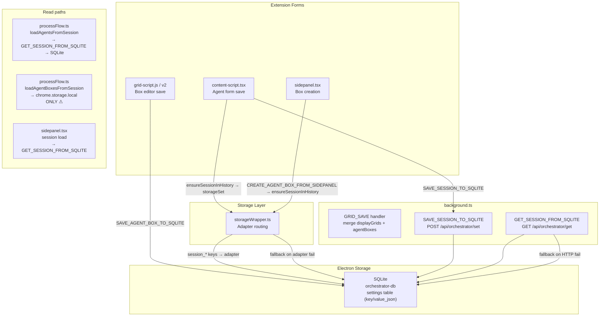
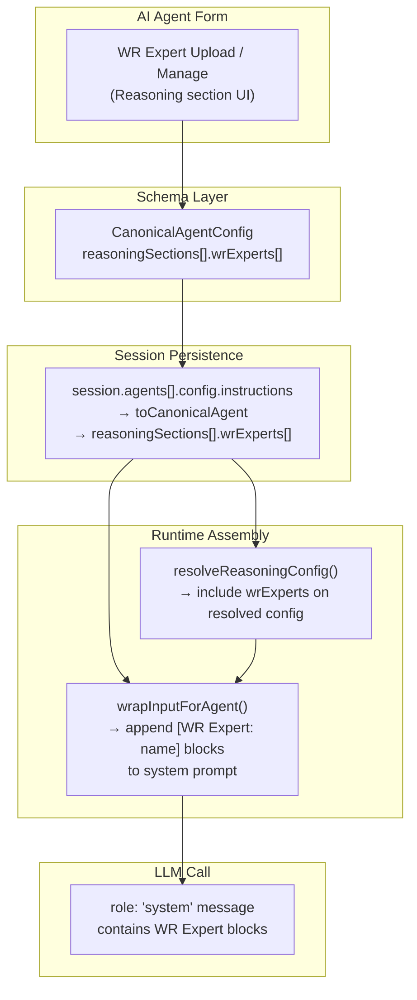

# Orchestrator Architecture — Deep Contract Analysis: Agents, Boxes, Sessions, and WR Experts

**Status:** Analysis-only. No implementation changes proposed.  
**Date:** 2026-04-01  
**Covers:** AI Agent form contract · Listener / Reasoning / Execution runtime usage · Agent Box brain binding · Session JSON schema and persistence flow · WR Experts extension point

---

## Table of Contents

1. [AI Agent Form Contract](#1-ai-agent-form-contract)
2. [Listener, Reasoning, and Execution: Runtime Usage](#2-listener-reasoning-and-execution-runtime-usage)
3. [Agent Box Contract and Brain Binding](#3-agent-box-contract-and-brain-binding)
4. [Session JSON Schema and Configuration Flow](#4-session-json-schema-and-configuration-flow)
5. [WR Experts Extension Point Analysis](#5-wr-experts-extension-point-analysis)
6. [Most Important Questions for Prompt 3](#6-most-important-questions-for-prompt-3)

---

## 1. AI Agent Form Contract

### Purpose

Full contract analysis of the AI Agent UI, schema, and config model. Every section, tab, field, and toggle is mapped against the canonical schema, the TypeScript types, and confirmed runtime consumption.

---

### Agent Creation Flow

**Entry points:**
1. **`openAddNewAgentDialog(parentOverlay)`** (`content-script.tsx` ~25639): simple "Add New Agent" sheet. Collects name, icon, creates the agent record in the session, then opens `openAgentConfigDialog`.
2. **`openAgentConfigDialog(agentName, type, parentOverlay, agentScope, agentNumber)`** (~12082): full multi-tab config dialog. `agentScope` defaults to `'session'`.

**Agent identity fields collected at creation:**

| Field | UI element | Persisted | Schema field |
|---|---|---|---|
| Name | text input | Yes → `agent.key` / `agent.name` | `name` (required) |
| Icon | icon grid picker | Yes → `agent.icon` | `icon` |
| Number | derived from `localStorage['optimando-agent-number-map']` fallback | Yes → `agent.number` | `number` |
| Scope | toggle on agent card (session / account) | Yes → `agent.scope` | Not in CanonicalAgentConfig |
| Platform | Desktop / Mobile checkboxes on card | Yes → `agent.platforms.desktop/mobile` | Not in schema |
| Enabled | defaults to `true` on save | Yes → `agent.enabled` | `enabled` (required) |

---

### Major Tabs and Sections

The config dialog is multi-tab. Each tab stores its data as a raw JSON string under `agent.config['tabname']`. The primary tab is `type === 'instructions'`.

**Tab: Instructions**
All Listener / Reasoning / Execution content lives here. The capability checkboxes (`#cap-listening`, `#cap-reasoning`, `#cap-execution`) map to `capabilities[]` on `CanonicalAgentConfig`.

**Tab: Context**

| Field | UI | Schema field | Runtime consumed |
|---|---|---|---|
| Agent Context enabled | `#AC-agent` checkbox | `contextSettings.agentContext` | No |
| Session Context enabled | `#AC-session` (hidden, default true) | `contextSettings.sessionContext` | No |
| Account Context enabled | `#AC-account` (hidden, default true) | `contextSettings.accountContext` | No |
| Agent Context Files | File upload list | `agentContextFiles[]` | **No** — persisted, not injected into LLM prompt |

Note: `contextSettings.accountContext` has a default conflict — TypeScript `toCanonicalAgent` defaults it to `true`; the JSON schema defaults it to `false`. Neither is consumed at runtime, so the conflict is dormant.

**Tab: Memory**

| Field | UI | Schema field | Runtime consumed |
|---|---|---|---|
| Session memory enabled | `R-MEM-session` | `memorySettings.sessionEnabled` | No |
| Session memory read/write | `R-MEM-session-read/write` | Extra fields (NOT in `CanonicalMemorySettings`) | No |
| Account memory enabled | `R-MEM-account` | `memorySettings.accountEnabled` | No |
| Account memory read/write | `R-MEM-account-read/write` | Extra fields | No |
| Agent memory enabled | `R-MEM-agent` (always on, disabled) | `memorySettings.agentEnabled` | No |

The form persists `sessionRead`, `sessionWrite`, `accountRead`, `accountWrite` fields that are **not** in `CanonicalMemorySettings` or the JSON schema. These are form-only extensions.

---

### Global vs Session Scope

| Concept | Mechanism | Stored where |
|---|---|---|
| Session-scoped agent | Default. `agent.scope = 'session'`. In `session.agents[]`. | Session blob (chrome.storage / SQLite) |
| Account-scoped agent | `toggleAgentScope` → `scope = 'account'`. Stripped from `session.agents` by `normalizeSessionAgents`. | Separate `accountAgents` storage |

Account-scoped agents do **not** travel with session exports.

---

### Desktop vs Mobile Platform Flags

Platform checkboxes appear on agent cards (not inside the config dialog). Stored as `agent.platforms.desktop / mobile`. Not in `CanonicalAgentConfig`. Not consumed by routing. **UI-only fields.**

---

### Auto-Save vs Commit Save

A debounced auto-save writes a `draft` JSON blob to `chrome.storage.local`. The final committed save:
1. Collects `dataToSave` from DOM.
2. Calls `saveAgentConfig` → `ensureActiveSession` → finds/creates `session.agents[]` entry → sets `agent.config[configType] = configData` (raw string) → `ensureSessionInHistory` → `storageSet` + `SAVE_SESSION_TO_SQLITE`.

**Agent config is stored as raw stringified JSON** per tab, not as typed `CanonicalAgentConfig` at the storage level. Normalization to the canonical type happens only at export/routing boundaries.

---

### `agentContextFiles`

Typed as `agentContextFiles?: any[]` on `CanonicalAgentConfig`. Upload UI is present and persists files. **`wrapInputForAgent` does not read `agentContextFiles`.** This is a persistence-only placeholder for future RAG-style context injection.

---

### Field-by-Field Reality Check: Runtime-Backed vs UI-Only vs Unclear

| Field / Concept | Persisted | Runtime-Backed | Status |
|---|---|---|---|
| `name` | Yes | Yes — agent identification, routing display | **Runtime-backed** |
| `description` | Likely | No confirmed consumption | **UI-only / future** |
| `icon` | Yes | Display only | **UI-only** |
| `number` | Yes | Yes — agent/box link via `agentNumber` | **Runtime-backed** |
| `enabled` | Yes | Yes — `InputCoordinator` skips disabled agents | **Runtime-backed** |
| `capabilities[]` | Yes | Partially — `listening` gates `evaluateAgentListener` | **Partially runtime-backed** |
| `listening.tags` | Yes | Yes — trigger extraction and matching | **Runtime-backed** |
| `listening.expectedContext` | Yes | Yes — substring match in `evaluateAgentListener` | **Runtime-backed** |
| `listening.sources[]` | Yes | **No** — 14 source types not evaluated in routing | **UI-only / future** |
| `listening.website` | Yes | Yes — website filter in `evaluateAgentListener` | **Runtime-backed** |
| `listening.unifiedTriggers[]` | Yes | Yes — matched in `InputCoordinator` | **Runtime-backed** |
| `listening.exampleFiles` | Yes (schema) | No consumption found | **UI-only / future** |
| `listening.reportTo` | Yes | Yes — parsed to box number in `findAgentBoxesForAgent` | **Runtime-backed** |
| `reasoningSections[].goals` | Yes | Yes — `[Goals]` in system prompt via `wrapInputForAgent` (top-level only) | **Runtime-backed (top-level only)** |
| `reasoningSections[].role` | Yes | Yes — `[Role: …]` in system prompt | **Runtime-backed (top-level only)** |
| `reasoningSections[].rules` | Yes | Yes — `[Rules]` block | **Runtime-backed (top-level only)** |
| `reasoningSections[].custom[]` | Yes | Yes — `[Context]` block | **Runtime-backed (top-level only)** |
| `reasoningSections[].applyFor` | Yes | Yes — input-type gating via `matchesApplyFor` (top-level `reasoning.applyFor`) | **Partially runtime-backed** |
| `reasoningSections[].applyForList` | Yes | Yes — event-tag path only via `resolveReasoningConfig` | **Runtime-backed (event-tag only)** |
| `reasoningSections[].acceptFrom` | Yes | **No** — never evaluated | **UI-only / schema gap** |
| `reasoningSections[].memoryContext` | Yes | No confirmed consumption | **Unclear / future** |
| `reasoningSections[].reasoningWorkflows` | Yes | No confirmed consumption | **UI-only / future** |
| `executionSections[].executionMode` | Yes | **No** — not branched on in `processWithAgent` | **UI-only / future** |
| `executionSections[].destinations[]` | Yes | Partially — event-tag path via `resolveExecutionConfig` | **Partially runtime-backed** |
| `executionSections[].executionWorkflows` | Yes | No confirmed consumption | **UI-only / future** |
| `contextSettings.*` | Yes | No consumption | **UI-only** |
| `memorySettings.*` | Yes | No confirmed consumption | **Unclear / future** |
| `agentContextFiles[]` | Yes | No — not injected into prompt | **Persistence placeholder** |
| `agent.scope` | Yes | Partially — gates account vs session storage | **Partially runtime-backed** |
| `agent.platforms.desktop/mobile` | Yes | No — not in schema or routing | **UI-only** |

---

## 2. Listener, Reasoning, and Execution: Runtime Usage

### Overview

The AI Agent config model defines three orthogonal sections. In the intended product:
- **Listener**: when and why the agent wakes up
- **Reasoning**: how the agent thinks — what context, goals, and rules it uses
- **Execution**: where and how the agent's response goes

---

### Listener

**What the UI suggests:** Tags/triggers, trigger types, conditions, expected context, listening sources (14 types), website filter, report-to destinations.

**What the code does — `InputCoordinator.evaluateAgentListener` (lines 210–426):**

Evaluation order:
1. **Capability check** (210–248): no `listening` capability → `matchType: 'no_listener'`. Still returns `matchesApplyFor: true` — agent is forwarded to reasoning anyway.
2. **Website filter** (251–264): `listening.website` vs `currentUrl` → fail = `matchType: 'none'`.
3. **Trigger matching** (266–381): `#word`/`@word` tokens extracted from NLP output matched against `listening.unifiedTriggers`. Supports legacy passive/active branches for old-format agents.
4. **Expected context** (383–396): substring match in raw input → `expected_context`.
5. **`applyFor` input type** (398–413): if `reasoning.applyFor` is set, checks text/image/mixed → `apply_for`.
6. **Default no-match** (415–425): `matchType: 'none'`.

**Listener wake-up flow (confirmed):**
```
Input → nlpClassifier.classify(rawText) → ClassifiedInput
  → inputCoordinator.routeClassifiedInput(classifiedInput)
    → per agent: evaluateAgentListener
      → website filter → trigger name match → keyword check → expected context → applyFor
```

**What is missing:**
- `listening.sources` (14 types) — not evaluated anywhere in the routing path
- `listening.exampleFiles` — schema only
- DOM trigger types (`dom_event`, `dom_parser`) — no confirmed runtime handler in WR Chat path
- Re-routing after OCR — OCR text appended after `routeClassifiedInput` has already run

---

### Reasoning

**What the UI suggests:** Multi-section configuration with `applyFor` / `applyForList`, goals, role, rules, custom fields, memory toggles, reasoning workflows, `acceptFrom`.

**What the code does — `wrapInputForAgent` (`processFlow.ts` lines 1089–1132):**

Reads **top-level `agent.reasoning` only** (flat object, NOT `reasoningSections[]`):

```
[Role: {role}]
[Goals]
  {goals}
[Rules]
  {rules}
[Context]
  {key}: {value}  (from custom[])
[User Input]
  {input}
[Extracted Image Text]  (if ocrText)
  {ocrText}
```

This assembled string becomes `role: 'system'` content in `processWithAgent` (sidepanel.tsx ~2505–2514):

```javascript
messages: [
  { role: 'system', content: reasoningContext },
  ...processedMessages.slice(-3)
]
```

**Reasoning field consumption:**

| Field | Consumed where | How |
|---|---|---|
| `reasoning.role` | `wrapInputForAgent` | `[Role: …]` in system message |
| `reasoning.goals` | `wrapInputForAgent` | `[Goals]` block |
| `reasoning.rules` | `wrapInputForAgent` | `[Rules]` block |
| `reasoning.custom[]` | `wrapInputForAgent` | `[Context]` block |
| `reasoning.applyFor` | `evaluateAgentListener` | Input-type gating |
| `reasoningSections[].applyForList` | `resolveReasoningConfig` (event-tag only) | Section selection by trigger ID |
| `reasoningSections[].memoryContext` | None confirmed | — |
| `reasoningSections[].reasoningWorkflows` | None confirmed | — |
| `reasoning.acceptFrom` | **Never** | Not in `evaluateAgentListener` or `processWithAgent` |

**What is missing for reliable reasoning:**
1. Multi-section reasoning is not wired into WR Chat path — `reasoningSections[]` ignored
2. `acceptFrom` is completely unimplemented
3. `memoryContext` toggles have no runtime effect
4. `agentContextFiles` not injected into system prompt
5. `reasoningWorkflows` not consumed

---

### Execution

**What the UI suggests:** `executionMode` (4 modes), `destinations[]` (6 kinds), `executionWorkflows`, `applyFor/applyForList`.

**What the code does:**

The execution section's runtime role is almost entirely determined by which Agent Box was resolved during listener matching:
1. `findAgentBoxesForAgent` → target box (by agentNumber / specialDestinations / reportTo)
2. `updateAgentBoxOutput` writes LLM output to DOM and chrome.storage for that box

**`executionMode` is not evaluated.** `processWithAgent` does not branch on `agent_workflow` vs `direct_response` vs `workflow_only` vs `hybrid`.

**WR Chat destination logic** (routeClassifiedInput ~705–712):
```javascript
destination: primaryBox 
  ? `Agent Box ${String(primaryBox.boxNumber).padStart(2, '0')}`
  : agent.listening?.reportTo?.[0] || 'Inline Chat'
```

**What is missing:**
1. `executionMode` is ignored in WR Chat path
2. Non-box destinations (`email`, `webhook`, `storage`, `notification`) are not implemented
3. `executionWorkflows` not consumed
4. WR Chat path does not call `resolveExecutionConfig` (the richer typed resolution runs only on event-tag path)

---

### Does the Current Orchestrator Honor the Conceptual Separation?

**Short answer: partially, and inconsistently across routing paths.**

**What IS honored:**
- Listener gates activation: `evaluateAgentListener` uses only `listening.*`
- Reasoning provides LLM system prompt: `wrapInputForAgent` uses only `reasoning.*`
- Execution routes output to Agent Box: box routing works

**What is NOT honored:**

1. **Multi-section reasoning is flattened in WR Chat path.** `reasoningSections[]` exist in schema and UI; the WR Chat path reads only flat `agent.reasoning`.

2. **Execution mode is never used.** No behavioral difference between any of the four modes.

3. **The two routing paths are not equivalent:**
   - WR Chat path: flat `agent.reasoning`, simple destination resolution
   - Event-tag path: honors `reasoningSections[].applyForList`, calls `resolveReasoningConfig` + `resolveExecutionConfig`, supports typed destinations

4. **`acceptFrom` creates a phantom contract.** Defined in schema, UI, and types; zero runtime enforcement.

```
INTENDED:
Input → Listener → Reasoning (section selection by applyFor) → Execution (mode + typed destination)

ACTUAL (WR Chat path):
Input → Listener (partial — sources not checked)
      → Reasoning (flat top-level only)
      → Execution (box number only — no mode, no typed destinations)

ACTUAL (Event-tag path):
Input → Listener (tag match)
      → Reasoning (resolveReasoningConfig — honors sections + applyForList)
      → Execution (resolveExecutionConfig — typed destinations)
```

The event-tag path is architecturally closer to the intended design. The WR Chat path is a simpler earlier implementation not updated as the schema evolved.

---

### Memory and Context Toggles — Runtime Meaning

All memory and context toggles (`memorySettings.*`, `contextSettings.*`, `reasoningSections[].memoryContext`) are persisted but have **zero confirmed runtime wiring**. They represent the intended architecture for a memory/RAG layer that does not yet exist in the runtime.

---

## 3. Agent Box Contract and Brain Binding

### Current Agent Box Abstraction

An Agent Box is the "brain" assigned to an agent for a given run. It defines provider, model, placement, and (future) tools.

**`CanonicalAgentBoxConfig` (v1.0.0) — key fields:**

| Field | Type | Purpose |
|---|---|---|
| `identifier` | string | `ABxxyy` — public dedup key |
| `boxNumber` | number | Display number |
| `agentNumber` | number | Links to `agent.number` |
| `provider` | `AgentBoxProvider` enum | `''`, OpenAI, Claude, Gemini, Grok, Local AI, Image AI |
| `model` | string | Model identifier string |
| `tools` | string[] | Placeholder for future tool IDs (defaults `[]`) |
| `source` | `AgentBoxSource` | `master_tab` or `display_grid` |
| `outputId` | string | DOM element ID for output rendering |
| Placement | `side`, `tabIndex`, `masterTabId`, `tabUrl`, `slotId`, `gridSessionId` | Surface-specific placement |

---

### Add/Edit Box Dialog

Provider `<select id="agent-provider">` offers: OpenAI, Claude, Gemini, Grok, Local AI, Image AI. Model dropdown disabled until provider is chosen.

**`refreshModels` behavior (post-stabilization pass):**
```
provider = 'Local AI' →
  fetchInstalledLocalModelNames() → electronRpc('llm.status') → real installed models

provider = cloud →
  getPlaceholderModels(provider) → static hardcoded model list (not key-gated)
```

---

### Brain Binding: How an Agent Gets a Model

```
Listener match → AgentMatch.agentBoxProvider + AgentMatch.agentBoxModel
  → processWithAgent(match, ...)
    → resolveModelForAgent(provider, model, fallbackModel)
      → LLM call with resolved model
```

**`resolveModelForAgent` (processFlow.ts lines 1210–1245):**

| Case | Result |
|---|---|
| Missing provider or model | `{ model: fallbackModel, isLocal: true, note: 'Using default local model' }` |
| `'ollama'`, `'local'`, `''` (lowercased) | Uses `agentBoxModel`, local |
| **`'local ai'`** (UI string, lowercased) | **NOT matched** — treated as cloud, falls back to `fallbackModel` with "API not yet connected" note |
| Cloud providers (OpenAI, Claude, etc.) | Fallback model + "not yet connected" note |

**Confirmed bug:** `"Local AI"` stored by the UI → lowercased to `"local ai"` → not in `localProviders = ['ollama', 'local', '']` → treated as unsupported cloud provider → configured model is discarded.

---

### Sidepanel vs Display Grid Equivalence

Both use `CanonicalAgentBoxConfig`. The `source` field distinguishes them (`master_tab` vs `display_grid`).

**Key equivalence gap:**

| Aspect | Sidepanel | Display Grid |
|---|---|---|
| Save message | `SAVE_SESSION_TO_SQLITE` (via `ensureSessionInHistory`) | `SAVE_AGENT_BOX_TO_SQLITE` |
| Write target | SQLite (via adapter) | SQLite (direct) |
| Read in routing | `loadAgentBoxesFromSession` → chrome.storage.local | Not read by routing |
| Output rendering | Sidepanel DOM | Grid page slot DOM |

**Grid boxes are invisible to the sidepanel routing engine** (SB-1). The schema type is unified; the persistence paths are not.

---

### How Box Output Is Stored and Rendered

`updateAgentBoxOutput` (processFlow.ts ~1137–1195):
1. Loads session from `chrome.storage.local`
2. Finds box by `agentBoxId`
3. Sets `box.output = outputText` and `box.lastUpdated`
4. Optionally prepends short "Reasoning Context" display label
5. Writes back to `chrome.storage.local`
6. Sends `UPDATE_AGENT_BOX_OUTPUT` runtime message for live DOM update

Box output is **ephemeral** — plain text string, overwritten on each run, cleared on page reload. No history, no streaming, no structured output.

---

### Is the Current Agent Box Abstraction Strong Enough to Become the Runtime Brain Container?

**What it gets right:** Provider/model schema field, agent linking via `agentNumber`, `identifier` for deduplication, placement metadata, `tools` placeholder.

**What is too weak:**

1. **Provider string mismatch**: `"Local AI"` (UI) ≠ `"local"` (runtime). Cloud providers entirely unimplemented.
2. **`executionMode` not consumed**: One behavior regardless of declared mode.
3. **Output is ephemeral and unstructured**: No structured JSON output, no streaming, no history.
4. **No tools wiring**: `tools: []` is a placeholder only.
5. **Non-box destinations unimplemented**: Email, webhook, storage, notification defined but not wired.

**What the schema enables for the future:**

| Future capability | Schema hook |
|---|---|
| Tool use | `tools: string[]` |
| Structured output | `executionMode: 'direct_response'`, `destination.kind: 'storage'` |
| Multi-step workflows | `executionWorkflows` |
| External delivery | `destination.kind: 'email' \| 'webhook'` |
| Deterministic execution | `executionMode: 'workflow_only'` |
| Image/vision mode | `provider: 'Image AI'` |

**Three blocking issues for near-term use:**
1. Provider string normalization (`'Local AI'` → recognized as local)
2. `loadAgentBoxesFromSession` SQLite parity (grid boxes must reach routing engine)
3. Cloud provider execution (API key integration into `resolveModelForAgent`)

---

## 4. Session JSON Schema and Configuration Flow

### Session Structure

Sessions are JSON blobs stored under `session_<timestamp>_<suffix>` keys.

**Top-level fields on a new session (`ensureActiveSession`, content-script.tsx ~2942–2960):**

| Field | Type | Notes |
|---|---|---|
| `tabName` | string | From `currentTabData.tabName` or `document.title` |
| `url` | string | `window.location.href` |
| `timestamp` | string (ISO) | Creation time |
| `isLocked` | boolean | `false` |
| `displayGrids` | array | `[]` on creation |
| `agentBoxes` | array | `[]` on creation |
| `customAgents` | array | `[]` |
| `hiddenBuiltins` | array | `[]` |
| `agents` | array | **Not present on creation** — added by `ensureSessionInHistory` |

**Agent storage format in `session.agents[]`:**

Each agent record has: `key`, `name`, `icon`, `number`, `enabled`, `scope`, `platforms`, and `config: { instructions?: string, context?: string, settings?: string, memory?: string }` — each config value is a **raw JSON string per tab**.

Agent config is stored as raw strings, not as typed `CanonicalAgentConfig`. Normalization to the canonical type happens only at export/routing boundaries via `toCanonicalAgent()`.

---

### Persistence Flow



**Highlighted asymmetry (SB-1):** `loadAgentBoxesFromSession` reads chrome.storage.local directly. Grid scripts write boxes to SQLite via `SAVE_AGENT_BOX_TO_SQLITE`. These writes never reach chrome.storage on the happy path.

---

### `storageWrapper.ts` Adapter Routing

Active adapter priority (from `getActiveAdapter.ts`):
1. Electron reachable at `:51248` + SQLite enabled → `OrchestratorSQLiteAdapter`
2. Postgres configured → HTTP proxy adapter
3. Else → `ChromeStorageAdapter`

For `session_*` keys: writes go to adapter (SQLite) **only** — not duplicated to chrome.storage. On adapter failure, fallback to `chrome.storage.local.set`. On read failure, fallback to `chrome.storage.local.get`.

When Electron is running (normal operation): session writes go to SQLite only. When Electron unavailable: data goes to chrome.storage. This creates a silent migration scenario.

---

### `orchestrator-db/service.ts` — SQLite KV Store

- Table: `settings (key TEXT PRIMARY KEY, value_json TEXT, updated_at INTEGER)`
- No TTL, no versioning beyond `updated_at`
- `get(key)`: SELECT + JSON.parse
- `set(key, value)`: INSERT OR REPLACE + JSON.stringify

A separate `sessions` table exists for structured Session entity operations — distinct from the generic KV used for session blob storage. Their relationship is unclear.

---

### Where Current Writes Happen

| Data | Write path | Storage target |
|---|---|---|
| Agent config (session-scoped) | `saveAgentConfig` → `ensureSessionInHistory` → `storageSet` + `SAVE_SESSION_TO_SQLITE` | SQLite (adapter) + SQLite (direct) |
| Agent config (account-scoped) | `saveAccountAgents` | Separate key (location unconfirmed) |
| Agent box (sidepanel-created) | `CREATE_AGENT_BOX_FROM_SIDEPANEL` → `ensureSessionInHistory` | SQLite (adapter) |
| Agent box (grid-created) | `SAVE_AGENT_BOX_TO_SQLITE` | SQLite (background handler, unconfirmed) |
| Display grid layout | `GRID_SAVE` → background → `storageSet` | SQLite (adapter) |

---

### Where Current Reads Happen

| Data | Read path | Storage source |
|---|---|---|
| Agents for routing | `loadAgentsFromSession` → `GET_SESSION_FROM_SQLITE` | SQLite |
| Agent boxes for routing | `loadAgentBoxesFromSession` → `chrome.storage.local.get` | **chrome.storage.local only** |
| Session for agent form | `ensureActiveSession` → `storageGet` | SQLite → fallback chrome.storage |
| Grid session | grid-script-v2 direct HTTP GET | SQLite |
| Session list for picker | popup-chat → `chrome.storage.local.get(null)` scan | chrome.storage.local |

---

### Schema Drift Risks

| Risk | Severity | Description |
|---|---|---|
| `agent.config.*` as raw strings | High | Config tabs are raw JSON strings. Schema changes require all existing data to be re-saved to take effect. |
| `memorySettings` extra fields | Medium | `sessionRead`, `sessionWrite` etc. saved by form; not in `CanonicalMemorySettings`; silently dropped on normalization. |
| `accountContext` default mismatch | Medium | TS defaults `true`; JSON schema defaults `false`. |
| Agent number via `localStorage` | Medium | Number map in `localStorage` — not in session blob. Import on new machine can cause number conflicts. |
| No session version field | Medium | Session blob has no `_schemaVersion`. Future changes cannot be automatically detected or migrated. |
| `GRID_SAVE` two-table structure | Medium | Grid data stored both in `displayGrids[].agentBoxes` (local) and `session.agentBoxes` (global). Must be consistent on import. |

### Schema Stability Assessment

| Component | Stability |
|---|---|
| `CanonicalAgentConfig` v2.1.0 | **Stable** — versioned, normalization helpers, JSON schema |
| `CanonicalAgentBoxConfig` v1.0.0 | **Stable** — versioned, `toCanonicalAgentBox`, `identifier` dedup |
| Session blob top-level structure | **Medium** — informal; no schema version on session |
| `agent.config.*` raw string tabs | **Fragile** — breaking change in any form tab affects all existing sessions |
| SQLite `settings` KV store | **Stable as storage** — generic KV, no constraints on values |
| `storageWrapper.ts` adapter routing | **Medium risk** — failure scenarios handled but divergence possible |

---

## 5. WR Experts Extension Point Analysis

### What WR Experts Are (Product Intent)

WR Experts are uploadable markdown files that act as **domain knowledge skill overlays** for an agent's reasoning. Comparable in spirit to Anthropic's skills but user-authored. They provide structured domain knowledge injected into the LLM system prompt alongside goals, rules, and role.

---

### What Exists Today

**Current "WR Expert" in the codebase:** A single-purpose feature in the Electron email inbox, completely separate from the orchestrator:

| Location | What it does |
|---|---|
| `EmailInboxBulkView.tsx` (~586–661) | UI modal "WR Expert — Your AI Inbox Rules" for editing `WRExpert.md` used by the email AI inbox classifier |
| `electron/main/email/ipc.ts` | IPC handler to read/write `WRExpert.md` on disk |
| `electron/WRExpert.default.md` | Default rules template |

This is **not** per-agent, not structured for orchestrator injection, not accessible from the AI Agent form, not wired into `wrapInputForAgent` or `InputCoordinator`.

**Orchestrator placeholders:**

| Placeholder | File | Description |
|---|---|---|
| `agentContextFiles?: any[]` | `CanonicalAgentConfig.ts` line 391–392 | Generic any array — deliberate future hook for file-based context injection |
| `listening.exampleFiles` | `CanonicalListener` | Unclear purpose |
| Context file upload UI | `content-script.tsx` (~15180+) | Upload surface; persists files; not injected into prompt |
| `tools: string[]` | `CanonicalAgentBoxConfig` | Placeholder for future tool/capability IDs |

**`agentContextFiles` is persisted but not consumed.** The most natural extension point for WR Experts.

---

### Best Location in the AI Agent Form

WR Experts belong in the **Reasoning section**, as a named subsection alongside Goals, Role, and Rules:

```
Reasoning Section
  ├── Apply For
  ├── Goals
  ├── Role
  ├── Rules
  ├── Custom fields
  ├── WR Experts: [file list + upload]   ← HERE
  └── Memory & Context toggles
```

---

### Best Schema Location

Natural schema location: `CanonicalReasoning.wrExperts` — an array per reasoning section.

Proposed type (illustrative):
```typescript
wrExperts?: WRExpertRef[]

type WRExpertRef = {
  id: string
  name: string
  fileUrl?: string
  content?: string  // inlined markdown for export
  enabled: boolean
}
```

The `agentContextFiles?: any[]` field on root `CanonicalAgentConfig` is a weaker candidate — per-agent rather than per-section, typed as `any[]`. WR Experts with per-section applicability belong on `reasoningSections[].wrExperts`.

---

### Best Runtime Consumption Point

`wrapInputForAgent` in `processFlow.ts` — add a `[WR Expert: {name}]` block after Rules/Custom:

```
[Rules]
  {rules}
[WR Expert: {name}]
  {markdownContent}
[Context]
  {custom fields}
[User Input]
  {input}
```

For the event-tag path: `resolveReasoningConfig` should include `wrExperts` on `ResolvedReasoningConfig`.

No other module needs to change for MVP injection. The entire change is:
1. `wrapInputForAgent` reads `reasoning.wrExperts`
2. Appends `[WR Expert: name]\n{content}` blocks
3. Expert content is either inlined or loaded from storage at inject time

---

### Relation to Reasoning

WR Experts are additive within Reasoning — not an alternative. They extend the system prompt with reusable structured domain knowledge:

| Reasoning component | WR Expert analog |
|---|---|
| Role | — |
| Goals | — |
| Rules | Partial — WR Experts are structured and reusable, not ad-hoc |
| Custom fields | Partial — WR Experts are file-based, not per-run |
| **WR Experts** | **Direct analog: domain knowledge layer** |

---

### How WR Experts Differ from Mini Apps

| Dimension | WR Experts | Mini Apps |
|---|---|---|
| Format | Markdown files | Structured UI components or automation flows |
| Scope | Reasoning context injection | Trigger-driven interactive execution |
| Runtime role | Passive — enriches LLM system prompt | Active — execute, display, interact |
| Product intent | Domain knowledge layer | Functional application modules |
| Current existence | Email-specific `WRExpert.md` only | Not found in extension orchestrator |

WR Experts are **reasoning helpers** (static, injected, passive). Mini Apps are **execution actors** (dynamic, active). They must not be conflated.

---

### How WR Experts Should Influence Deterministic Behavior (Future)

1. **Structured rules → deterministic routing**: A WR Expert file could contain structured trigger rules parsed to augment `InputCoordinator` trigger matching.
2. **Execution guardrails**: Policy documents constraining what execution is allowed to do — enforced in `resolveExecutionConfig`.
3. **Tool call guidance**: When tool use is added to Agent Boxes, WR Expert content could specify preferred tools per input type.
4. **Output validation**: Rules for structured output modes when `executionMode: 'direct_response'` is wired.

---

### Modules That Would Need to Read WR Experts

| Module | Change needed |
|---|---|
| `wrapInputForAgent` (`processFlow.ts`) | Add WR Expert blocks to system prompt assembly |
| `resolveReasoningConfig` (`InputCoordinator.ts`) | Include `wrExperts[]` in `ResolvedReasoningConfig` |
| Agent form UI (`content-script.tsx`) | Add WR Expert upload/manage UI to Reasoning section |
| `CanonicalReasoning` / `CanonicalAgentConfig` | Add `wrExperts?: WRExpertRef[]` to reasoning section type |
| `agent.schema.json` | Add `wrExperts` to `reasoningSection` definition |
| `toCanonicalReasoningSection` | Default `wrExperts: []` if missing |
| `AgentWithBoxesExport` / import path | Include expert content or references in export blob |

**What does NOT need to change for MVP WR Expert injection:** `evaluateAgentListener`, `loadAgentsFromSession`, `updateAgentBoxOutput`, `resolveModelForAgent`, grid scripts.

---

### Extension Point Diagram



---

## 6. Most Important Questions for Prompt 3

These questions are prioritized by their blocking effect on near-term implementation work.

### Routing and Execution

1. **What does `processWithAgent` do beyond `wrapInputForAgent` + LLM call + `updateAgentBoxOutput`?** Is there session state, error handling, or memory write logic inside it that has not been traced? What happens when no agent box is found?

2. **Is there any code path where the multi-section `reasoningSections[]` is used in the WR Chat send flow?** Or is it definitively only in the event-tag path? If so, what would it take to unify them?

3. **Does `InputCoordinator.routeEventTagTrigger` ever fire during a normal WR Chat send?** Or does it require a separate trigger mechanism? What initiates it?

4. **What are the passive/active trigger legacy branches in `InputCoordinator` actually handling?** Are there saved agents in production using the legacy format that would break if those branches were removed?

### Agent Boxes and Models

5. **Is the `'Local AI'` vs `'local'`/`'ollama'`/`''` mismatch in `resolveModelForAgent` a known bug or intentional?** Is there any normalization step between the box dialog save and the routing match that converts `'Local AI'` to a recognized local identifier?

6. **Does the `SAVE_AGENT_BOX_TO_SQLITE` message actually have a handler in `background.ts`?** If so, what does it do — does it write to chrome.storage as well, or only to SQLite? This is the critical missing link for SB-1.

7. **Is there an actual API call path for cloud providers (OpenAI, Claude, Gemini, Grok) anywhere in the current codebase?** Or is `resolveModelForAgent`'s "API not yet connected" fallback the complete state of cloud support?

### Session and Persistence

8. **What is the relationship between the SQLite `settings` table and the `sessions` table in `orchestrator-db`?** Are they ever used for the same data? Could they diverge?

9. **Where are account-scoped agents stored?** What is the actual storage key and adapter path for `saveAccountAgents` / `getAccountAgents`? Do they follow the same SQLite adapter routing?

10. **Is there a session import UI or API surface anywhere in the current codebase?** Or is session import only possible via direct SQLite writes?

### Memory, Context, and WR Experts

11. **Is `agentContextFiles` used anywhere in the runtime, even experimentally?** Any file loading, blob URL creation, or content extraction in the context tab handling?

12. **Should WR Experts be stored inline in the session blob (content embedded) or as file references resolved at runtime?** What storage mechanism would be most consistent with the existing `agentContextFiles` pattern?

13. **Is the email `WRExpert.md` concept intended to converge with per-agent WR Experts, or are they permanently separate product features?**

### Architecture Readiness

14. **What is the minimum change set to make the Agent Box abstraction functionally correct?** Specifically: fixing `'Local AI'` provider string, fixing `loadAgentBoxesFromSession` to read SQLite, and at least one cloud provider API call integration — is that the right three-item list?

15. **Is there a planned migration path for the `agent.config.*` raw string tab format?** What would it take to transition to a single fully-typed `CanonicalAgentConfig` at the storage level?
