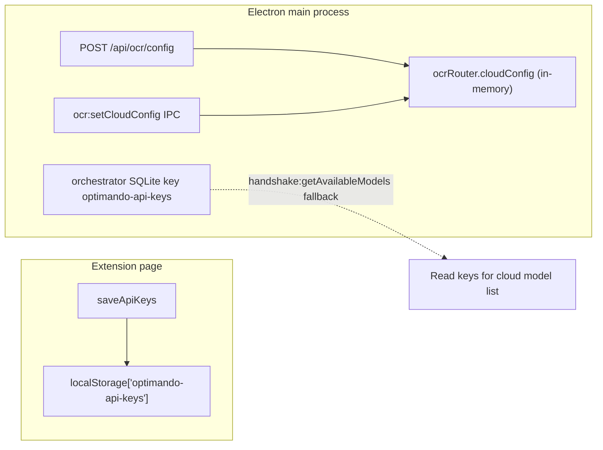

# API Key Management and Model Provider Wiring

## Purpose

Document **where API keys live**, how **Electron** exposes **local vs cloud** models, and how **WR Chat** and **other surfaces** consume them. Evidence is from concrete code paths; security notes are observational.

---

## 1. Settings / UI map for API keys

| Location | File / entry | What it shows |
|----------|----------------|---------------|
| **Extension — Extension Settings lightbox** | `apps/extension-chromium/src/content-script.tsx` `openSettingsLightbox` (~31495+) | **Account & Billing**, **API Keys** (OpenAI, Claude, Gemini, Grok + custom rows), **Local LLMs** panel, **Finetuned** (Pro-gated), theme, etc. |
| **Key inputs** | Same — `id="key-OpenAI"`, `key-Claude`, `key-Gemini`, `key-Grok"` | `type="password"` with **toggle visibility** buttons |
| **Save** | `id="save-api-keys"` | Calls `saveApiKeys()` → **`localStorage.setItem('optimando-api-keys', JSON.stringify(data))`** (~32075–32113) |
| **Subscription gate** | `save-api-keys` click handler (~32197–32213) | If **`(window as any).optimandoHasActiveSubscription !== true`**, shows `#byok-requirement` and **returns without saving** |
| **Electron WR Desk — not the extension** | N/A in extension tree for the same HTML | Keys for **in-process** OCR/cloud are set via **`POST /api/ocr/config`** or IPC **`ocr:setCloudConfig`** (`main.ts` ~7782–7787, `electron/main/ocr/ipc.ts`) |

There is **no** separate “API Keys” React route in `extension-chromium/src` beyond the **content-script lightbox** pattern above.

---

## 2. Persistence and retrieval flow for provider credentials

| Store | Format | Who writes | Who reads |
|-------|--------|------------|-----------|
| **`localStorage['optimando-api-keys']`** | JSON `Record<string,string>` (OpenAI, Claude, Gemini, Grok, custom names) | Extension **`saveApiKeys`** (if subscription allows) | Extension **`loadApiKeys`** on lightbox open; **not** read by WR Chat model loader in `sidepanel.tsx` |
| **`ocrRouter` cloud config** | `CloudAIConfig` with **`apiKeys`** map | **`POST /api/ocr/config`** body, or **`ocr:setCloudConfig`** | **`ocrRouter.getAvailableProviders`**, **`getApiKey`**, **`shouldUseCloud`**, cloud vision paths, **`inboxLlmChat`** (via `getApiKey`) |
| **Orchestrator SQLite** | KV under key **`optimando-api-keys`** | Session/orchestrator flows (not traced in full here) | **`handshake:getAvailableModels`** fallback (`main.ts` ~2760–2777) |

**Critical wiring gap (code search):** **`grep` for `api/ocr/config` in `apps/extension-chromium` returns no matches.** The extension **does not** call **`POST /api/ocr/config`** when the user saves API keys in the lightbox. Keys stay in **`localStorage`** on the **extension origin** unless another mechanism copies them to Electron (not found in this scan).

**Validation / masking:** Keys are **not** validated against provider APIs on save in the extension snippet; **masking** is password fields + optional toggle. **Server-side validation** is **not** a dedicated “test key” endpoint in the paths reviewed—failures surface when a **real request** runs (e.g. OCR cloud, inbox LLM).

---

## 3. How provider “activation” status is computed

| Consumer | Logic |
|----------|--------|
| **OCR cloud routing** | **`ocrRouter.shouldUseCloud`** — needs **`cloudConfig`**, **`useCloudForImages`**, **`preference`**, and **`isProviderAvailable`** (non-empty trimmed key + vision-capable provider) (`router.ts` ~53–96, ~124–131). |
| **`getAvailableProviders()`** | Returns providers where **`isProviderAvailable`** (`router.ts` ~428–433). **Empty** if **`cloudConfig` is null**. |
| **`handshake:getAvailableModels` (Electron IPC)** | (1) **Local:** `ollamaManager.listModels()`. (2) **Cloud:** for each **`ocrRouter.getAvailableProviders()`**, map to fixed **`CLOUD_MODEL_MAP`**. (3) **If no cloud from router:** read **`optimando-api-keys`** from **orchestrator SQLite** and add cloud entries for non-empty keys (`main.ts` ~2721–2786). |
| **WR Chat (`sidepanel`)** | **Does not** use “active provider” flags — only **`llm.status`** → **`modelsInstalled`** (Ollama). |

---

## 4. Model discovery / listing logic

### 4.1 Local models

- **Source:** Ollama **`GET http://127.0.0.1:11434/api/tags`** (via **`ollamaManager.listModels`**, cache + dedup — `ollama-manager.ts` ~316+).
- **HTTP exposure:** **`GET /api/llm/models`** → `listModels()` (`main.ts` ~7508+).
- **Extension WR Chat:** **`electronRpc('llm.status')`** unwraps status including **`modelsInstalled`** (`sidepanel.tsx` ~1000–1070, ~1033–1083).
- **Catalog (install UI):** **`GET /api/llm/catalog`** — used by **`LlmSettings.tsx`** for recommended models (`electronRpc.ts` ~115–119); **fallback** **`FALLBACK_CATALOG`** hardcoded in component (~110+).

### 4.2 Cloud providers (for surfaces that use handshake bridge)

- **Fixed registry** in **`handshake:getAvailableModels`**: `CLOUD_MODEL_MAP` per OpenAI / Anthropic / Gemini / xAI (`main.ts` ~2747–2752). **Not** a live “list models” API from providers.
- **Gating:** Cloud entries appear only if **OCR router** reports a provider **or** orchestrator has a **non-empty** key string for that provider.

### 4.3 Mixed environments

- **Electron `HybridSearch.tsx`:** **`window.handshakeView?.getAvailableModels?.()`** loads **`availableModels`** with **`type: 'local' | 'cloud'`** (~635, ~463, ~68). UI groups local vs cloud in the selector (~1533–1552).
- **Extension WR Chat:** **Ollama-only** list — **no** cloud branch in **`refreshAvailableModels`**.

### 4.4 Agent Box dialogs (extension)

- **`getPlaceholderModels(provider)`** in **`content-script.tsx`** (~6009–6027) — **static** string arrays per provider label. **Independent** of keys and of Ollama **`/api/tags`**.

---

## 5. How model selectors consume this information

| Surface | Data source | Cloud when key set? |
|---------|-------------|---------------------|
| **WR Chat Command Chat** (`sidepanel.tsx`) | **`electronRpc('llm.status')`** → **`modelsInstalled`** | **No** — selector only lists **Ollama** models |
| **`LlmSettings.tsx` (Admin LLM tab)** | HTTP/IPCs: status, hardware, **catalog**, install/delete/activate | **Install** flow is **Ollama-centric**; catalog is **recommendations** |
| **`HybridSearch.tsx` (Electron)** | **`getAvailableModels`** IPC | **Yes** — local ∪ fixed cloud rows when keys/router/orchestrator say so |
| **Agent Box add/edit** | **`getPlaceholderModels`** | **No dynamic discovery**; static lists |

---

## 6. Edge cases

| Scenario | Behavior (code-evidenced) |
|----------|---------------------------|
| **No key set** | **`ocrRouter.getAvailableProviders()`** → `[]` if no **`setCloudConfig`**. Cloud models in **`handshake:getAvailableModels`** may still appear if **orchestrator SQLite** has **`optimando-api-keys`** entries. Extension **localStorage** keys **do not** feed **`ocrRouter`** without **`/api/ocr/config`**. |
| **Invalid key** | No preflight validation in extension save. **Runtime** failure on first cloud API call (e.g. OCR vision, **`CloudAIProvider.generateChat`**, inbox LLM). |
| **Multiple providers** | **`ocrRouter`** picks **preferred** or **first available** in order OpenAI → Claude → Gemini → Grok (`router.ts` ~111–116). **`handshake:getAvailableModels`** can return **multiple** cloud rows (one per available provider). |
| **Local backend unavailable** | **`ollamaManager.listModels`** throws → handshake local list empty; **`sidepanel`** sets **`llmError`** “Ollama not running…” (~1048–1050). |
| **Extension saves keys but subscription false** | **Save blocked** — keys may **not** persist (~32201–32213). |

---

## 7. Backend routes, clients, registries

| Artifact | Role |
|----------|------|
| **`GET /api/llm/status`**, **`GET /api/llm/models`**, **`GET /api/llm/catalog`**, **`POST /api/llm/models/activate`** | Ollama + catalog + active model (`main.ts`) |
| **`POST /api/ocr/config`** | **`ocrRouter.setCloudConfig`** — **authoritative for in-process cloud keys** used by OCR + **`getApiKey`** consumers |
| **`handshake:getAvailableModels`** IPC | Merges **Ollama** + **cloud** (router + orchestrator fallback) |
| **`electron/main/handshake/aiProviders.ts`** | **`OllamaProvider`**, **`CloudAIProvider`** — RAG / handshake chat; **`CloudAIProvider`** uses injected **`getApiKey`** |
| **`electron/main/email/inboxLlmChat.ts`** | Uses **`ocrRouter.getApiKey`** for cloud paths (~102, ~155, ~188) |
| **`electron/main/llm/ipc.ts`** | **`llm:listModels`** etc. → **`ollamaManager`** |
| **`apps/extension-chromium/src/rpc/electronRpc.ts`** | Typed proxy to fixed HTTP routes (includes **`llm.status`**, not `getAvailableModels` — that is **IPC-only** on Electron renderer for HybridSearch) |

---

## 8. Security observations and risks

1. **Extension `localStorage` keys** — **Plaintext** JSON; any script with access to the extension origin could read them; **not** encrypted at rest in code reviewed.
2. **Subscription gate** — If **`optimandoHasActiveSubscription`** is false, **Save** does nothing; users might think keys are stored when they are not.
3. **Split brain** — Keys in **extension `localStorage`** vs **Electron `ocrRouter`** vs **orchestrator SQLite** — easy to assume one “save” updates all; **only SQLite/orchestrator path** feeds **`handshake:getAvailableModels`** fallback, and **only `setCloudConfig`** feeds **`ocrRouter`**.
4. **`POST /api/ocr/config`** — Accepts **`req.body`** without authentication in snippet; mitigated by **localhost + launch secret** for extension HTTP (see `main.ts` comments on `X-Launch-Secret`).
5. **No key rotation / audit** — Not observed in these modules.

---

## 9. “If an API key is set, where exactly does the cloud AI become visible in the model selectors?”

**Answer, grounded in code:**

1. **WR Chat (extension sidepanel) — Command Chat model dropdown**  
   **It does not.** **`refreshAvailableModels`** / mount effect use **`electronRpc('llm.status')`** and only populate **`availableModels`** from **`status.modelsInstalled`** (Ollama) (`sidepanel.tsx` ~1000–1070). There is **no** branch that merges cloud models when **`optimando-api-keys`** exists.

2. **Electron Hybrid Search (WR Desk renderer)**  
   **Yes, when the handshake bridge returns them.** **`HybridSearch.tsx`** calls **`window.handshakeView?.getAvailableModels?.()`**, which is wired to **`ipcMain.handle('handshake:getAvailableModels')`** in **`main.ts`** (~2721–2786). That handler adds **cloud** rows when **`ocrRouter.getAvailableProviders()`** is non-empty **or** orchestrator SQLite has **`optimando-api-keys`** with trimmed values.

3. **Agent Box add/edit (extension content script)**  
   **No live cloud discovery.** Provider dropdown is static; model list is **`getPlaceholderModels(provider)`** — **unchanged** by API keys.

4. **OCR / vision**  
   Cloud routing uses **`ocrRouter`** keys from **`setCloudConfig`** — **not** extension `localStorage` unless something copies keys into **`POST /api/ocr/config`** (no extension caller found).

**Bottom line:** Setting a key in the **extension Extension Settings** lightbox **only** updates **`localStorage`** (if save succeeds). It **does not** by itself add cloud models to **WR Chat’s** selector or populate **Electron’s OCR router**. **HybridSearch** can show cloud models only after **Electron-side** key material exists in **`ocrRouter`** and/or **orchestrator SQLite** per **`handshake:getAvailableModels`**.

---

## 10. Provider abstraction layers (summary)

| Layer | Location | Notes |
|-------|----------|--------|
| **RAG / handshake** | `handshake/aiProviders.ts` | **`AIProvider`** interface; **Ollama** vs **CloudAIProvider** |
| **WR Chat HTTP** | `POST /api/llm/chat` | **Ollama only** (`ollamaManager.chat`) — not `CloudAIProvider` |
| **Inbox LLM** | `inboxLlmChat.ts` | Chooses local vs cloud using **`ocrRouter.getApiKey`** |
| **OCR** | `ocr/router.ts` | Vision cloud vs local Tesseract |

---

## 11. Runtime verification checklist

- [ ] Save API keys in extension with subscription **on** — confirm **`localStorage`** JSON.
- [ ] Save with subscription **off** — confirm **no** write.
- [ ] After save, open WR Chat dropdown — confirm **only Ollama** models (if Ollama running).
- [ ] **`POST /api/ocr/config`** with test body — confirm **`ocrRouter.getAvailableProviders()`** non-empty, then **`handshake:getAvailableModels`** returns cloud rows.
- [ ] HybridSearch model menu — local + cloud groups when both configured.
- [ ] Cloud OCR path — image in WR Chat message → **`/api/ocr/process`** uses cloud only if **`shouldUseCloud`** and keys in **`ocrRouter`**.
- [ ] Invalid key — run a cloud OCR or inbox cloud chat — expect **HTTP error** / user message, not silent success.

---

## 12. Proven vs needs verification

| Proven in code | Needs runtime / product check |
|----------------|-------------------------------|
| WR Chat uses **`llm.status`** only for dropdown | Whether any **other** build injects cloud into sidepanel |
| Extension **does not** call **`/api/ocr/config`** | Whether **manual** or **migration** scripts sync keys to Electron |
| **`handshake:getAvailableModels`** merges Ollama + cloud map + orchestrator fallback | Exact **orchestrator** write path for **`optimando-api-keys`** from extension |
| **`save-api-keys`** gated by **`optimandoHasActiveSubscription`** | How **`optimandoHasActiveSubscription`** is set in production |
