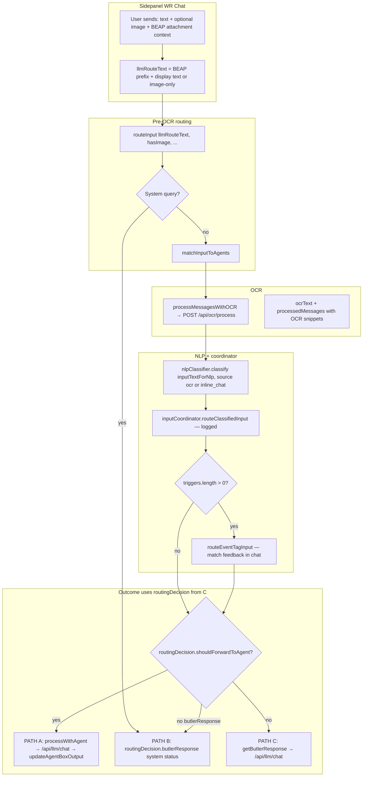

# WR Chat pipeline — pre-implementation pre-check

**Purpose:** Map the WR Chat send path (extension), parsing/preprocessing, OCR touchpoints, routing decision order, and handoff to agents/LLM — before end-to-end screenshot validation.

**Scope:** Code paths in `apps/extension-chromium` (primarily `sidepanel.tsx`) and Electron HTTP OCR/LLM endpoints in `apps/electron-vite-project/electron/main.ts` and `electron/main/ocr/*`.

**Note on evidence:** Behaviors **proven in code** are cited. Anything about UI-only UX, cloud OCR key injection at runtime, or multi-image edge cases in production is marked **inferred** where not fully traced.

---

## Executive summary

- The **full WR Chat pipeline** (routing + OCR + NLP + agent/butler LLM) lives in **`sidepanel.tsx`** → `handleSendMessage` (and a parallel **`handleSendMessageWithTrigger`** for screenshot/trigger flows).
- **`CommandChatView`** (e.g. popup `popup-chat.tsx` submode `command`) is **not wired** with `onSend`; without `onSend` it **mock-responds** in the component. **Do not treat popup Command Chat as the production WR pipeline** unless a parent later passes `onSend`.
- **Order of operations is critical:** `routeInput()` runs **before** `processMessagesWithOCR()`. Therefore **`routingDecision` (matchInputToAgents / system queries) does not use OCR-extracted text** — only the typed `llmRouteText`, `hasImage`, and `currentUrl` (and other `routeInput` args). NLP **after** OCR **can** see `#tags` in OCR text for classification and event-tag feedback, but **PATH A/B/C (agent vs butler) still follows the earlier `routingDecision`**, not NLP allocations.
- **OCR** is invoked per user message with `imageUrl` via `POST http://127.0.0.1:51248/api/ocr/process`; Electron **`ocrRouter`** chooses local vs cloud vision when configured.
- **`inputCoordinator.routeClassifiedInput`** runs after NLP and returns allocations; in **`handleSendMessage`** the result is **only logged** — **not** used to branch between agent path and butler. **Inferred:** intended orchestration hook; **proven:** no branching on `classifiedWithAllocations` in this handler.

---

## 1. WR Chat pipeline map

**Parallel entry:** `handleSendMessageWithTrigger(triggerText, imageUrl?)` — calls `routeInput` **before** OCR (same ordering), then OCR, NLP, `routeClassifiedInput`; agent path uses `wrapInputForAgent(triggerText, agent, ocrText)` and a simpler message list than `processWithAgent`.

---

## 2. Parsing and preprocessing stages

| Stage | Location | What happens |
|--------|----------|--------------|
| **BEAP attachment prefix** | `sidepanel.tsx` `handleSendMessage` | If BEAP inbox + selected attachment with `semanticContent`, builds `beapAttachmentLlmPrefix` (filename + trimmed text, cap 4000 chars) and prepends to `llmRouteText` and last user message content for LLM. **Proven in code.** |
| **Display vs LLM text** | Same | User bubble shows `displayText`; LLM path uses `llmRouteText` and `processedMessagesForLlm` (with BEAP prefix merged into last user). **Proven.** |
| **Pre-OCR routing** | `processFlow.ts` `routeInput` | `inputType`: text / image / mixed from `hasImage` + `input`; `isSystemQuery` short-circuits; else `matchInputToAgents(input, inputType, hasImage, agents, agentBoxes, currentUrl)`. **Uses `input` before OCR.** **Proven.** |
| **OCR augmentation** | `processMessagesWithOCR` | For each user message with `imageUrl`, POST OCR; on success, user `content` becomes `text` + `[Local OCR \| Cloud Vision extracted text]:` + text. **Proven.** |
| **NLP classification** | `nlp/NlpClassifier.ts` `classify` | `wink-nlp` token scan for `#` triggers + entities, or regex fallback; `normalizedText`; `ClassifiedInput` with `source` `inline_chat` \| `ocr` \| `other`. **Proven.** |
| **NLP input string** | `handleSendMessage` | `inputTextForNlp = llmRouteText + "\n\n[Image Text]:\n" + ocrText` when OCR present; else `llmRouteText`. **Proven.** |
| **Event tag routing** | `processFlow.ts` `routeEventTagInput` | Re-classifies via NLP, then `inputCoordinator.routeEventTagTrigger` with agents/boxes; **chat feedback** when `nlpResult.input.triggers.length > 0`. **Proven.** |
| **NLP allocations** | `InputCoordinator.routeClassifiedInput` | Called with `nlpResult.input`; result **logged** in sidepanel, **not** used to select PATH A/B/C in this handler. **Proven (grep: no branch on allocations).** |

**Inferred:** Whether `#tags` appearing **only** in OCR (not typed) should drive `routeInput` is a product question — **code does not** merge OCR into `routeInput`’s input string.

---

## 3. OCR-related components, services, routes

| Layer | Artifact | Role |
|----------|----------------|------|
| **Extension** | `sidepanel.tsx` `processMessagesWithOCR` | For each user message with `imageUrl`, `fetch` `POST` `{ image: msg.imageUrl }` (data URL or base64). **Proven.** |
| **Extension** | `handleSendMessageWithTrigger` | Inline OCR fetch for `imageUrl` (no shared helper with `processMessagesWithOCR` for message building). **Proven.** |
| **Electron HTTP** | `main.ts` `POST /api/ocr/process` | Body: `{ image, options }`; `ocrRouter.processImage(input, options)`. **Proven.** |
| **Electron HTTP** | `GET /api/ocr/status`, `GET /api/ocr/languages`, `POST /api/ocr/config` | Status, languages, cloud config for router. **Proven.** |
| **Electron** | `ocr/router.ts` `OCRRouter` | `shouldUseCloud` / `processImage` — local vs cloud vision from `CloudAIConfig` (API keys, `useCloudForImages`, `preference`). **Proven.** |
| **Electron** | `ocr/ocr-service` | Local path (imported by router/status). **Proven (imports in main).** |

**Inferred:** Exact cloud vision provider call paths and failure modes — follow `ocrRouter.processImage` and `ocr-service` for full detail.

**Multi-image behavior (proven):** `processMessagesWithOCR` assigns `ocrText = ocrResult.data.text` in a loop over messages — **the last processed user image overwrites `ocrText`**; only one string is passed forward.

---

## 4. Routing logic and decision points

| Decision | Driver | Affects |
|----------|--------|--------|
| **Empty input** | No text and no `hasImage` | Hint message; no LLM. **Proven.** |
| **No active model** | `!activeLlmModel` | Warning; no send. **Proven.** |
| **System query** | `isSystemQuery(input)` inside `routeInput` | PATH B-style fixed butler response; no agent match. **Proven.** |
| **Agent match (primary)** | `matchInputToAgents(llmRouteText, …)` **before OCR** | `routingDecision.shouldForwardToAgent` → PATH A vs C (and PATH B if `butlerResponse` from system branch). **Proven.** |
| **NLP triggers** | `nlpClassifier` after OCR | `routeEventTagInput` + UI feedback if triggers length > 0. **Does not replace** `routingDecision` for PATH A. **Proven.** |
| **PATH A** | `routingDecision.shouldForwardToAgent && matchedAgents.length` | `processWithAgent` per match; `updateAgentBoxOutput` if box. **Proven.** |
| **PATH B** | `routingDecision.butlerResponse` set (system path) | Assistant message from status response. **Proven.** |
| **PATH C** | No forward, no system butler string | `getButlerResponse(processedMessagesForLlm, …)`. **Proven.** |

**Inferred:** “Orchestrated agent flow” as a **separate** branch from `routeInput` is **not** selected by `routeClassifiedInput` in this handler — **orchestrator-style allocations are informational only** here unless another code path consumes them (not found in `handleSendMessage`).

---

## 5. Integration with orchestrator / internal agent wiring

**Proven wiring:**

- **`routeInput`** → **`processWithAgent`** → `POST /api/llm/chat` with `system: wrapInputForAgent(...)` and `messages: [...processedMessages.slice(-3)]` (agent path).
- **`wrapInputForAgent`** appends **`[Extracted Image Text]`** when `ocrText` is set. **Proven in `processFlow.ts`.**
- **`inputCoordinator.routeClassifiedInput`** and **`routeEventTagInput`** use the same NLP + `InputCoordinator` as the orchestrator docs describe; **WR Chat’s main send path does not gate execution on `routeClassifiedInput` output.**
- **`processEventTagMatch`** exists in `processFlow.ts` for executing event-tag matches; **WR Chat `handleSendMessage` does not call it** after `routeEventTagInput` — it only adds **match feedback** text. **Proven (grep: no `processEventTagMatch` in sidepanel from this flow).** **Inferred:** Event-tag execution may be incomplete or wired elsewhere.

---

## 6. Data objects passed after parsing/OCR

| Object | Produced by | Consumed by |
|--------|-------------|-------------|
| **`RoutingDecision`** | `routeInput` | PATH A/B/C branching, `processWithAgent` loop. |
| **`processedMessages` / `processedMessagesForLlm`** | `processMessagesWithOCR` + optional BEAP merge | `getButlerResponse`, `processWithAgent` (last 3 messages for agent). |
| **`ocrText`** | `processMessagesWithOCR` (last image wins) | `nlpClassifier.classify`, `inputTextForNlp`, `wrapInputForAgent`, `processWithAgent`. |
| **`ClassificationResult` / `ClassifiedInput`** | `nlpClassifier.classify` | `routeClassifiedInput` (log), `routeEventTagInput` (when triggers present). |
| **`EventTagRoutingBatch`** | `routeEventTagInput` | `generateEventTagMatchFeedback` only in chat. |

---

## 7. Known limitations and unclear areas (screenshot / follow-up)

1. **Routing vs OCR ordering:** `routeInput` **cannot** see text that exists only in OCR. **Proven.** Product impact: **inferred** — needs UX/screenshot validation (e.g. `#summarize` only in screenshot).
2. **`classifiedWithAllocations` unused** for branching — **proven.** Risk: **inferred** — duplicate or divergent “orchestrator” behavior vs product spec.
3. **Event tag path** shows feedback but **does not** call `processEventTagMatch` in `handleSendMessage` — **proven in code**; **inferred** gap vs full orchestrator execution.
4. **Multiple images:** last `ocrText` only — **proven.** May lose earlier images’ text in NLP and `wrapInputForAgent`.
5. **Popup `CommandChatView`:** mock without `onSend` — **proven**; users may confuse popup with sidepanel behavior.
6. **OCR failure:** falls back to `msg.text` or `[Image attached - OCR unavailable]` — **proven**; cloud vs local labeling in content uses `ocrResult.data.method === 'cloud_vision'` — **proven** in sidepanel.

---

## 8. What to validate in the next round with end-to-end screenshots

Use the **sidepanel** WR Chat (not popup mock) with Electron on `127.0.0.1:51248`:

1. **Typed `#tag` only** — confirm PATH A and agent box update match `routeInput` + triggers in typed text.
2. **`#tag` only inside OCR** (no typed hashtag) — confirm whether agents fire vs butler-only; **code suggests** `routeInput` may not match; NLP may still list triggers and event-tag feedback.
3. **Image-only message** — confirm OCR block appears in assistant/butler path and `wrapInputForAgent` content.
4. **Two images in one send** — confirm whether only last OCR is visible in replies (expected from code).
5. **BEAP attachment + WR Chat** — confirm prefix in LLM behavior vs UI display.
6. **OCR config** — after `POST /api/ocr/config`, confirm cloud vs local path in chat content labels (`[Cloud Vision]` vs `[Local OCR]`).
7. **Event tag feedback** — when triggers detected, confirm match panel text vs whether agent execution matches expectations (given `processEventTagMatch` may not run here).

---

## File index (primary)

| File | Role |
|------|------|
| `apps/extension-chromium/src/sidepanel.tsx` | `handleSendMessage`, `processMessagesWithOCR`, `processWithAgent`, `getButlerResponse`, `handleSendMessageWithTrigger` |
| `apps/extension-chromium/src/services/processFlow.ts` | `routeInput`, `routeEventTagInput`, `wrapInputForAgent`, `processEventTagMatch` |
| `apps/extension-chromium/src/nlp/NlpClassifier.ts` | `classify`, wink vs regex |
| `apps/extension-chromium/src/services/InputCoordinator.ts` | `routeClassifiedInput`, `routeEventTagTrigger` |
| `apps/electron-vite-project/electron/main.ts` | `/api/ocr/*`, `/api/llm/chat` |
| `apps/electron-vite-project/electron/main/ocr/router.ts` | Cloud vs local OCR routing |
| `apps/extension-chromium/src/ui/components/CommandChatView.tsx` | Mock if no `onSend` |
| `apps/extension-chromium/src/popup-chat.tsx` | Embeds `CommandChatView` without `onSend` in shown snippets |

---

*End of report.*
