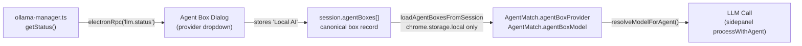

# 07 — Agent Box Contract and Brain Binding

**Status:** Analysis-only.  
**Date:** 2026-04-01  
**Scope:** Deep contract analysis of the Agent Box abstraction, how agents are bound to models, and the path toward a full runtime brain container.

---

## Current Agent Box Abstraction

### What an Agent Box is (intended)

An Agent Box is the "brain" assigned to an agent for a given run. It defines:
- Which provider to use (OpenAI, Claude, Gemini, Grok, Local AI, Image AI)
- Which model within that provider
- Where and how the output should be displayed (placement: sidepanel vs display grid)
- Future: which tools, output behaviors, and special modes are available

### Schema: `CanonicalAgentBoxConfig` (v1.0.0)

Key fields:

| Field | Type | Purpose |
|---|---|---|
| `id` | string | Internal UUID |
| `identifier` | string | `ABxxyy` — public dedup key, used for merge and matching |
| `boxNumber` | number | Display number for the box (e.g. 1, 2, 3) |
| `agentNumber` | number | Links to `agent.number` — the agent this box serves |
| `agentId` | string | Direct agent ID reference (secondary) |
| `title` | string | Display name |
| `color` | string | Hex color for card display |
| `enabled` | boolean | Whether this box is active |
| `provider` | `AgentBoxProvider` enum | `''`, OpenAI, Claude, Gemini, Grok, Local AI, Image AI |
| `model` | string | Model identifier string (e.g. `llama3:8b`, `gpt-4o`) |
| `tools` | string[] | Placeholder for future tool IDs (defaults to `[]`) |
| `source` | `AgentBoxSource` | `master_tab` or `display_grid` |
| `masterTabId` | string | Which tab/sidepanel instance this box belongs to |
| `tabIndex` | number | Tab position |
| `side` | `'left' \| 'right'` | Placement side in sidepanel |
| `tabUrl` | string | URL of the page where box lives |
| `slotId` | string | Display grid slot identifier |
| `gridSessionId` | string | Grid session this box belongs to |
| `locationId` | string | Grid location identifier |
| `locationLabel` | string | Human-readable grid location |
| `outputId` | string | DOM element ID for output rendering |

### `toCanonicalAgentBox` defaults

Notable defaults from `CanonicalAgentBoxConfig.ts` lines 236–271:
- `model: 'auto'` — the fallback when no model is explicitly chosen
- `tools: []`
- `source: 'master_tab'`
- `masterTabId: '01'`, `tabIndex: 1`
- `color: '#4CAF50'`
- `enabled: true` unless explicitly `false`

---

## Add/Edit Box Dialog

### Provider and model dropdowns

The add Agent Box dialog (content-script.tsx ~5943–5977) renders:

**Provider `<select id="agent-provider">`** options:
- (disabled placeholder) Select LLM
- OpenAI
- Claude
- Gemini
- Grok
- Local AI
- ☁️ Image AI

**Model `<select id="agent-model">`**: disabled until provider is selected. On provider change, `refreshModels()` is called asynchronously.

### `refreshModels` behavior (post-stabilization pass)

```
provider = 'Local AI' →
  show "Loading…"
  fetchInstalledLocalModelNames() → electronRpc('llm.status')
  if ok and running and names exist → populate with real model names
  if not running or empty → "No local models installed (use LLM Settings in the app)" + 'auto'

provider = cloud (OpenAI / Claude / Gemini / Grok / Image AI) →
  getPlaceholderModels(provider) → static list of known model names
  (NOT key-gated — all cloud models shown regardless of API key state)
```

**Static model lists** for cloud providers are hardcoded in `getPlaceholderModels`. This is the SB-5 split-brain risk: a user with no OpenAI key can still select GPT-4o in a box.

### `resolveModelForAgent` — provider/model mismatch

A critical bug in `processFlow.ts` `resolveModelForAgent` (lines 1210–1245):

The UI stores provider as the string `"Local AI"` (from the dropdown option). `resolveModelForAgent` tests `localProviders = ['ollama', 'local', '']`. The string `"Local AI"` lowercased is `"local ai"` — **not in `localProviders`**. So a box configured as "Local AI" in the UI is treated by the runtime as a **cloud provider**, falls into the "not yet connected" fallback, and returns `fallbackModel || ''` instead of the configured model.

This means:
- A box correctly configured as "Local AI / llama3:8b" in the UI
- Will at runtime return `{ model: fallbackModel, isLocal: true, note: '... API not yet connected - using local model' }`
- The actual model is **not used**; the fallback model (whatever was passed by sidepanel) is used instead

This is a confirmed divergence between the UI provider string and the runtime provider matching logic.

---

## Box Numbering and Agent Number Mapping

### The link

`agent.number === agentBox.agentNumber` is the primary connection mechanism.

Boxes are found for an agent via `findAgentBoxesForAgent` (InputCoordinator ~436–498):
1. First checks `execution.specialDestinations` (kind: `'agentBox'`) — explicit destination override
2. Then `listening.reportTo` strings — parses "Agent Box 01" → box number 1
3. Then `agentBoxes.find(b => b.agentNumber === agent.number && b.enabled !== false)`

This means the clean implicit path is: agent number 5 → all boxes with `agentNumber === 5`.

### Number constraints

- JSON schema says agent numbers are 1–12 (description on line 59 of agent.schema.json)
- `CanonicalAgentBoxConfig` documents `agentNumber` as linking to agent's `number`
- Numbers are padded to 2 digits in display (`01`, `02`)
- Number allocation via `localStorage['optimando-agent-number-map']` is separate from session storage — a drift risk on import

### `identifier` (`ABxxyy`)

The `identifier` field (format `ABxxyy` where `xx` = agent number, `yy` = box number) is:
- Used for **deduplication** in `GRID_SAVE` merge (background.ts ~4037–4054): `b.identifier === newBox.identifier`
- Used for **DOM output targeting** — `outputId` is derived from identifier
- Not used for agent-box linking (that uses `agentNumber`)

---

## Sidepanel vs Display Grid Equivalence

The conceptual intent is that Agent Boxes in sidepanel and in display grids are the same type. This is partially true in the schema but has implementation gaps.

| Aspect | Sidepanel | Display Grid |
|---|---|---|
| Schema type | `CanonicalAgentBoxConfig` | `CanonicalAgentBoxConfig` |
| `source` field | `'master_tab'` | `'display_grid'` |
| Placement fields | `side`, `tabIndex`, `masterTabId`, `tabUrl` | `slotId`, `gridSessionId`, `locationId`, `locationLabel` |
| Add/edit UI | content-script.tsx dialogs | `window.openGridSlotEditor` / `showV2Dialog` |
| Save message | `SAVE_SESSION_TO_SQLITE` (via `ensureSessionInHistory`) | `SAVE_AGENT_BOX_TO_SQLITE` (directly to background) |
| Read path | `processFlow.loadAgentBoxesFromSession` → chrome.storage.local | Grid page reads own session |
| Output rendering | DOM element in sidepanel tab | DOM element in grid page slot |

**Key equivalence gap**: The save paths diverge. Sidepanel-created boxes go through `ensureSessionInHistory` which writes both chrome.storage and SQLite. Grid-created boxes go through `SAVE_AGENT_BOX_TO_SQLITE` which writes SQLite only. `loadAgentBoxesFromSession` reads chrome.storage only. This means **grid boxes are invisible to the sidepanel routing engine** (SB-1 from document 00).

Both box types share the same schema and `identifier` format, so the conceptual type is unified — but the persistence paths make them operationally isolated at runtime.

---

## Provider / Model Binding Summary



**Confirmed issues in this chain:**
1. `provider: 'Local AI'` stored but not matched by `resolveModelForAgent` (`'local ai'` ≠ `'ollama'` / `'local'` / `''`)
2. `loadAgentBoxesFromSession` reads only chrome.storage — grid boxes never enter this chain
3. Cloud providers fall back to local model silently ("API not yet connected")

---

## How Box Output Is Stored and Rendered

### Write path: `updateAgentBoxOutput` (processFlow.ts ~1137–1195)

1. Loads session by `sessionKey` from `chrome.storage.local`
2. Finds the agent box in `session.agentBoxes` by `agentBoxId`
3. Sets `box.output = outputText` and `box.lastUpdated = Date.now()`
4. Optionally prepends a "Reasoning Context" markdown block (short label, not the full system prompt)
5. Writes back with `chrome.storage.local.set`
6. Sends `UPDATE_AGENT_BOX_OUTPUT` message to runtime (for live DOM update)

### Display

The DOM element targeted by `outputId` (derived from `identifier`) displays the output. Each page reload starts with empty box output — no persistence to SQLite, no history.

**Box output is ephemeral**: it lives in the DOM and in the chrome.storage session record but is overwritten on each run and cleared on page reload. There is no output history, versioning, or streaming display currently wired.

---

## Is the Current Agent Box Abstraction Strong Enough to Become the Runtime Brain Container?

### What it gets right

- **Provider/model selection**: schema field exists and is populated by the UI
- **Agent linking**: `agentNumber` linking is clean and consistent
- **Identifier**: `ABxxyy` format enables reliable deduplication across save paths
- **Placement metadata**: clear separation of sidepanel vs grid placement fields
- **`tools` field placeholder**: `tools: string[]` exists on the schema — an explicit hook for future tool binding

### What is currently too weak

**1. Provider string mismatch with runtime.**
`"Local AI"` (UI) ≠ `"local"` or `"ollama"` (runtime). This must be resolved before any cloud/local routing works correctly.

**2. Cloud provider execution is entirely unimplemented.**
`resolveModelForAgent` returns the fallback local model for all cloud providers with a note "API not yet connected." There is no API call path for OpenAI, Claude, Gemini, or Grok from the current agent run path.

**3. `executionMode` is not consumed.**
The schema supports four execution modes; the runtime has one behavior.

**4. Output is ephemeral and not structured.**
Box output is a plain text string. There is no support for structured JSON output, streaming, multi-turn, or output history.

**5. No tools wiring.**
`tools: []` is the default. There is no mechanism for a box to declare which tools it can use, no tool call routing, no tool result injection.

**6. Output destination is binary: box or inline chat.**
The schema supports `email`, `webhook`, `storage`, `notification` destinations. None are implemented.

### What the schema enables for the future

The current schema is deliberately extensible:

| Future capability | Schema hook |
|---|---|
| Tool use | `tools: string[]` on `CanonicalAgentBoxConfig` |
| Structured output | `executionMode: 'direct_response'` / destination `kind: 'storage'` |
| Multi-step workflows | `executionWorkflows` in `CanonicalExecution` |
| Output to external systems | `destination.kind: 'email' \| 'webhook'` |
| Non-text modes | `provider: 'Image AI'` — placeholder in enum |
| Deterministic execution | `executionMode: 'workflow_only'` — no LLM, workflows only |

### Assessment

The Agent Box abstraction is **structurally ready** to become a full runtime brain container. The schema has the right hooks. The implementation is well behind the schema. The three blocking issues for near-term use are:

1. **Provider string normalization** (`'Local AI'` → recognized as local)
2. **`loadAgentBoxesFromSession` SQLite parity** (grid boxes must be readable by routing engine)
3. **Cloud provider execution** (API key integration into `resolveModelForAgent`)

Once these three are resolved, the Agent Box can function reliably as the declared model/provider binding for agent runs.
