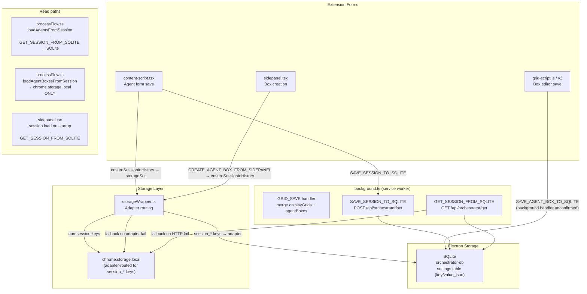

# 08 — Session JSON Schema and Configuration Flow

**Status:** Analysis-only.  
**Date:** 2026-04-01  
**Scope:** Full analysis of session structure, persistence flow, import/export, and schema stability.

---

## Session Structure

### What a session is

A session is the primary container for all orchestrator state tied to a particular workspace instance. Each session is stored as a JSON blob under a key of the form `session_<timestamp>_<suffix>`.

### Top-level fields on a new session (`ensureActiveSession`, content-script.tsx ~2942–2960)

| Field | Type | Set on creation | Notes |
|---|---|---|---|
| `tabName` | string | Yes — from `currentTabData.tabName` or `document.title` | Human-readable label |
| `url` | string | Yes — `window.location.href` | Page URL at session creation |
| `timestamp` | string (ISO) | Yes | Creation time |
| `isLocked` | boolean | `false` | Manual lock toggle |
| `displayGrids` | array | `[]` | Grid configs added later |
| `agentBoxes` | array | `[]` | Agent boxes added later |
| `customAgents` | array | `[]` | Custom agent additions |
| `hiddenBuiltins` | array | `[]` | Which built-in agents are hidden |
| `agents` | array | **Not present on creation** | Added by `ensureSessionInHistory` → `normalizeSessionAgents` |

### Fields added by `ensureSessionInHistory` (~2976–3039)

When any agent config is saved, the session blob is rebuilt by `ensureSessionInHistory`. The `completeSessionData` object includes at minimum:

```
{
  tabName, url, timestamp, isLocked,
  displayGrids: sessionData.displayGrids || [],
  agentBoxes: sessionData.agentBoxes || [],
  agents: transformedAgents  ← normalized agent array
}
```

Plus any other fields already on the session blob (custom fields are preserved via spread).

### Agent storage format inside the session

Agents are stored in `session.agents[]` as runtime agent records. Each agent record has:

| Field | Description |
|---|---|
| `key` | Agent name used as identifier (e.g. `"My Agent"`) |
| `name` | Display name |
| `icon` | Emoji icon |
| `number` | Numeric agent number (for box linking) |
| `enabled` | Boolean |
| `scope` | `'session'` or `'account'` |
| `platforms` | `{ desktop: boolean, mobile: boolean }` |
| `config` | Object: `{ instructions?: string, context?: string, settings?: string, memory?: string }` — each value is a raw **JSON string** |

**Critical**: agent config is stored as raw stringified JSON per tab, not as a single normalized `CanonicalAgentConfig` object. The canonical type is used at export/import boundaries, not as the session storage format.

### `agentBoxes[]` format inside the session

Each entry is a `CanonicalAgentBoxConfig` object with all fields. Boxes from sidepanel dialogs and from grid scripts share the same format. Deduplication key is `identifier`.

### `displayGrids[]` format inside the session

Each entry (from `GRID_SAVE` handler in background.ts ~4024–4035):

```json
{
  "layout": "...",
  "sessionId": "...",
  "config": { "slots": {} },
  "agentBoxes": []
}
```

Grid-level `agentBoxes` here is the per-grid array of boxes in that grid's slots. The top-level `session.agentBoxes` is the flat union of all boxes across all grids (merged by `identifier`).

---

## Persistence Flow Diagram



**Highlighted asymmetry (SB-1):** `loadAgentBoxesFromSession` (processFlow.ts line 566–574) reads chrome.storage.local directly. Grid scripts write boxes to SQLite via `SAVE_AGENT_BOX_TO_SQLITE`. These never meet unless `storageWrapper` adapter routing also mirrors writes to chrome.storage — which it does not on the happy path (chrome.storage is only used as fallback on adapter failure).

---

## `storageWrapper.ts` Adapter Routing

**Active adapter selection** (from `getActiveAdapter.ts`):

1. If Electron is reachable at `:51248` and SQLite is enabled → `OrchestratorSQLiteAdapter`
2. Else Postgres (if configured)
3. Else ChromeStorageAdapter (pure chrome.storage fallback)

**For `session_*` keys:**
- `storageSet`: `chromeItems` (non-session keys) go to `chrome.storage.local`; `adapterItems` (session keys) go to `adapter.setAll()`. On adapter failure, falls back to `chrome.storage.local.set(adapterItems)`.
- `storageGet`: `adapter.get()` per session key; on failure, falls back to `chrome.storage.local.get`.

**Implication:** When Electron is running (normal operation), session writes go to SQLite **only** via the adapter — not duplicated to chrome.storage. When Electron is unavailable, session data falls back to chrome.storage. This creates a divergence scenario: a session created without Electron is in chrome.storage; later when Electron starts, `storageGet` reads from SQLite (empty) and falls back to chrome.storage — but new writes go to SQLite. The session effectively migrates across stores silently.

---

## `orchestrator-db/service.ts` — SQLite KV Store

Structure:
- Table: `settings (key TEXT PRIMARY KEY, value_json TEXT, updated_at INTEGER)`
- No TTL, no versioning beyond `updated_at`
- `get(key)`: SELECT + JSON.parse → raw JS value (the full session object)
- `set(key, value)`: INSERT OR REPLACE + JSON.stringify

A separate `sessions` table exists for structured `Session` entity operations (listSessions, saveSession, etc.) — distinct from the generic `settings` KV used for session blob storage. The relationship between these two tables is not fully clear from this analysis.

---

## Import / Export Flow

### Agent export

`AgentWithBoxesExport` type (`CanonicalAgentBoxConfig.ts` ~189–227):
```typescript
{
  agent: CanonicalAgentConfig,
  connectedAgentBoxes: CanonicalAgentBoxConfig[],
  connectionInfo: { ... }
}
```

The canonical agent config is assembled at export time via `toCanonicalAgent()`, which normalizes the raw `agent.config.instructions` JSON string into the full typed `CanonicalAgentConfig` structure.

### Session import/export

No dedicated session import/export service was found in this analysis. Session data can be read from SQLite (`GET /api/orchestrator/get`) and written (`POST /api/orchestrator/set`). A user importing a session JSON would need to write it to the correct key — there is no confirmed UI surface for this in the current extension.

### Account agents

Account-scoped agents are separated from session agents by `normalizeSessionAgents`. They are stored via `saveAccountAgents` / `getAccountAgents` — likely in a separate storage key. Account agents do **not** travel with session export blobs.

---

## Where Current Writes Happen

| Data | Write path | Storage target |
|---|---|---|
| Agent config (session-scoped) | `saveAgentConfig` → `ensureSessionInHistory` → `storageSet` + `SAVE_SESSION_TO_SQLITE` | SQLite (adapter) + SQLite (direct POST) |
| Agent config (account-scoped) | `saveAccountAgents` | Separate storage key (location unconfirmed) |
| Agent box (sidepanel-created) | `CREATE_AGENT_BOX_FROM_SIDEPANEL` → `ensureSessionInHistory` | SQLite (adapter) |
| Agent box (grid-created) | `SAVE_AGENT_BOX_TO_SQLITE` → background handler | SQLite (direct, handler unconfirmed) |
| Display grid layout | `GRID_SAVE` → background → `storageSet` | SQLite (adapter) |
| Session on page load | `ensureActiveSession` → `storageSet` (new session only) | SQLite (adapter) |

---

## Where Current Reads Happen

| Data | Read path | Storage source |
|---|---|---|
| Agents for routing | `loadAgentsFromSession` → `GET_SESSION_FROM_SQLITE` | SQLite |
| Agent boxes for routing | `loadAgentBoxesFromSession` → `chrome.storage.local.get` | chrome.storage.local **only** |
| Session for agent form | `ensureActiveSession` → `storageGet` | SQLite (adapter) → fallback chrome.storage |
| Grid session | grid-script-v2 direct HTTP GET | SQLite |
| Session list for picker | popup-chat `loadAvailableSessions` → `chrome.storage.local.get(null)` scan | chrome.storage.local |

---

## What the Structured JSON Appears to Guarantee

Based on schema versions and normalization helpers:

1. **Schema version** (`_schemaVersion: '2.1.0'` on agents, `'1.0.0'` on boxes) — enables future migration detection
2. **`toCanonicalAgent`** normalizes missing fields and defaults — safe to consume even from older saves
3. **`identifier` on boxes** — enables reliable deduplication across merge operations
4. **`agent.number` + `agentBox.agentNumber` linking** — stable contract for agent/box association
5. **`capabilities[]` on agent** — explicit opt-in for each capability; absent = disabled

What is **not** guaranteed:
- Agent config consistency between session-stored format (raw JSON strings per tab) and canonical `CanonicalAgentConfig` — deserialization is on-demand at export/routing time
- Session blob will not have stale or missing `agentBoxes` entries if grid writes went only to SQLite
- `memorySettings` extra fields (`sessionRead`, `sessionWrite`) saved by the form will round-trip through `CanonicalMemorySettings` losing those fields

---

## Schema Drift Risks and Migration Concerns

| Risk | Severity | Description |
|---|---|---|
| `agent.config.*` as raw strings | High | Config tabs are stored as raw JSON strings. If the form schema changes, old strings remain unparsed and potentially incompatible until re-opened. |
| `memorySettings` extra fields | Medium | Form saves `sessionRead`, `sessionWrite` etc. not in `CanonicalMemorySettings`. These are silently dropped on canonical normalization. |
| `accountContext` default mismatch | Medium | TS `toCanonicalAgent` defaults `true`; JSON schema defaults `false`. Imported agents and newly created agents will have inconsistent defaults. |
| Agent number via `localStorage` map | Medium | Agent number allocation is partially in `localStorage`, not in the session blob. On import to a new machine, number conflicts can arise if multiple agents share numbers. |
| No session version field | Medium | The session blob has no `_schemaVersion`. Future schema changes cannot be detected or migrated automatically at the session level. |
| `GRID_SAVE` two-table structure | Medium | Grid data is stored both in `session.displayGrids[].agentBoxes` (grid-local) and `session.agentBoxes` (session-global). On import, both arrays must be consistent. |
| `settings` table vs `sessions` table | Low (currently) | SQLite has both a generic KV `settings` table and a structured `sessions` table. Their relationship is unclear and could cause confusion in future development. |

---

## Schema Stability Assessment

| Component | Stability |
|---|---|
| `CanonicalAgentConfig` v2.1.0 | **Stable** — versioned, normalization helpers, JSON schema |
| `CanonicalAgentBoxConfig` v1.0.0 | **Stable** — versioned, `toCanonicalAgentBox` helper, `identifier` dedup |
| Session blob top-level structure | **Medium** — field set is informal; no schema version on session |
| `agent.config.*` raw string tabs | **Fragile** — breaking change in any form tab requires all existing session data to be re-saved |
| SQLite `settings` KV store | **Stable as storage** — generic KV with no schema constraints on values |
| `storageWrapper.ts` adapter routing | **Medium risk** — failure scenarios are handled but divergence between stores is possible |
