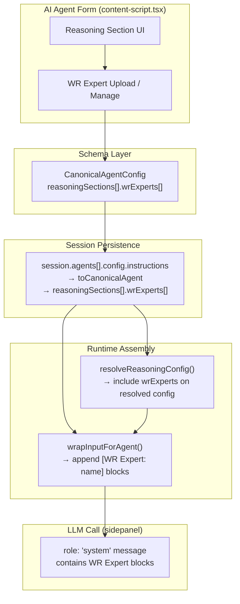

# 09 — WR Experts Extension Point Analysis

**Status:** Analysis-only.  
**Date:** 2026-04-01  
**Scope:** Where WR Experts should fit in the architecture, what already exists, what contracts are required, and how they differ from Mini Apps.

---

## What WR Experts Are (Product Intent)

WR Experts are uploadable markdown files that act as **domain knowledge skill overlays** for an AI agent's reasoning. In spirit, they are comparable to Anthropic's skills or system-level knowledge modules — but user-authored. A WR Expert file might contain:

- Domain-specific rules and heuristics for a particular task or industry
- Structured reference material (pricing tables, process descriptions, compliance rules)
- Role persona extensions ("when handling X type of email, apply these principles")
- WR-specific automation guidance ("when this #tag fires, follow these deterministic steps")

The intent is that WR Experts are **per-agent overlays** applied to the Reasoning section, injected into the LLM system prompt alongside goals, rules, and role — providing a modular, reusable, and operator-editable knowledge layer.

---

## What Exists Today

### Current implementation of "WR Expert" in the codebase

WR Experts currently exist as a **single-purpose, domain-specific feature in the Electron email inbox** — not in the orchestrator extension:

| Location | What it does |
|---|---|
| `EmailInboxBulkView.tsx` (~586–661, ~1991–2000, ~5001) | UI modal titled "WR Expert — Your AI Inbox Rules" for editing a `WRExpert.md` file used by the email AI inbox classifier |
| `electron/main/email/ipc.ts` (~31–35, ~148+) | IPC handler to read/write `WRExpert.md` on disk |
| `electron/WRExpert.default.md` | Default rules template for the email inbox classifier |

This is a **completely separate system** from the orchestrator agent architecture. The email `WRExpert.md` is a monolithic rules file for one specific feature. It is not:
- Per-agent
- Structured for injection into the LLM reasoning harness
- Accessible from the extension's AI Agent form
- Wired into `wrapInputForAgent` or `InputCoordinator`

### What the orchestrator has as placeholders

| Placeholder | File | Description |
|---|---|---|
| `agentContextFiles?: any[]` | `CanonicalAgentConfig.ts` line 391–392 | Generic "any" array — a deliberate future hook for file-based context injection on agents |
| `listening.exampleFiles` | `CanonicalAgentConfig` `CanonicalListener` ~282–283 | Example files for listener context — purpose unclear |
| Context file upload UI | `content-script.tsx` (~15180+) | Upload surface for agent context files; files staged and persisted |
| `tools: string[]` | `CanonicalAgentBoxConfig` | Placeholder for tool/capability IDs on Agent Boxes |

**`agentContextFiles` is persisted but not consumed.** The upload UI stores files on `agent.agentContextFiles[]` but `wrapInputForAgent` does not read them. This is the most natural extension point for WR Experts.

---

## Best Location in the AI Agent Form

WR Experts belong in the **Reasoning section** of the AI Agent form, as a named subsection alongside Goals, Role, and Rules.

Rationale:
- Reasoning is the harness for the LLM system prompt
- Goals and Rules are already the "what to do" and "constraints" layers
- WR Experts are the "domain knowledge" layer — a structured, file-based addition to the same harness
- They should be per-reasoning-section (or per-agent) — not global — to allow different agents to have different expert overlays

**Proposed UI location:**

```
Reasoning Section
  ├── Apply For: [text / image / mixed / any]
  ├── Goals: [textarea]
  ├── Role: [textarea]
  ├── Rules: [textarea]
  ├── Custom fields: [key/value pairs]
  ├── WR Experts: [file list with upload + name]   ← ADD HERE
  └── Memory & Context: [toggles]
```

Alternatively, WR Experts could be a dedicated tab alongside the existing Listener / Reasoning / Execution tabs — especially if they become shareable/global across agents. But for MVP, embedding within Reasoning is the lower-risk integration point.

---

## Best Schema Location

The natural schema location is `CanonicalReasoning.wrExperts` — an array of WR Expert file references within each reasoning section.

Proposed schema extension (illustrative, not implementation):

```typescript
// In CanonicalReasoning (reasoningSections[])
wrExperts?: WRExpertRef[]

type WRExpertRef = {
  id: string           // Unique ID for dedup
  name: string         // Human-readable label
  fileUrl?: string     // If hosted or attached as blob URL
  content?: string     // Inlined markdown content (for smaller files / export)
  enabled: boolean     // Toggle per expert
}
```

The `agentContextFiles?: any[]` field on `CanonicalAgentConfig` is a weaker candidate — it is per-agent (not per-reasoning-section) and is typed as `any[]`. WR Experts with per-section applicability belong on `reasoningSections[].wrExperts`.

For global/shared WR Experts (reusable across agents), a separate top-level registry (outside the agent config) would be appropriate — analogous to a "skills library." But that is a later concern.

---

## Best Runtime Consumption Point

WR Expert content must be injected into the LLM system prompt. The correct injection point is **`wrapInputForAgent`** in `processFlow.ts`.

Current `wrapInputForAgent` output structure:
```
[Role: ...]
[Goals]
  {goals}
[Rules]
  {rules}
[Context]
  {key}: {value}
  ...
[User Input]
  {input}
```

WR Expert injection should add a new block:
```
[WR Expert: {name}]
  {markdownContent}
```

This block would appear between Rules and Custom Context, or after Custom Context. Multiple experts would each get their own block.

For the event-tag path, WR Expert injection should happen in `resolveReasoningConfig` — the resolved section's `wrExperts` would be available on `ResolvedReasoningConfig` and then injected when the LLM prompt is assembled.

**No other module needs to change for the injection to work.** The entire change is:
1. `wrapInputForAgent` reads `reasoning.wrExperts` (or `resolvedReasoning.wrExperts`)
2. Appends `[WR Expert: name]\n{content}` blocks
3. Expert content is either inlined in the schema or loaded from storage at inject time

---

## Relation to Reasoning

WR Experts are **not** an alternative to Reasoning — they are an **additive layer within Reasoning**. They extend the system prompt with reusable structured domain knowledge that would otherwise need to be repeated across multiple agents' Goals or Rules fields.

| Reasoning component | Type | Per-agent? | WR Expert analog? |
|---|---|---|---|
| Role | System persona | Yes | — |
| Goals | Task objectives | Yes | — |
| Rules | Behavioral constraints | Yes | — |
| Custom fields | Arbitrary context | Yes | Partial — WR Experts are structured, not ad-hoc |
| WR Experts | Domain knowledge overlay | Yes (and shareable) | **Direct analog** |

The key distinction: Rules are agent-authored constraints. WR Experts are operator-uploaded knowledge modules — more structured, more reusable, and potentially versioned independently of the agent config.

---

## How WR Experts Differ from Mini Apps

| Dimension | WR Experts | Mini Apps |
|---|---|---|
| Format | Markdown files | (unclear — likely structured UI components or automation flows) |
| Scope | Reasoning harness context injection | Trigger-driven interactive UI or workflow execution |
| Runtime role | Passive — enriches LLM system prompt | Active — execute, display, interact |
| Editability | User-authored text | Likely developer-authored or structured JSON/YAML |
| Product intent | Domain knowledge layer | Functional application modules |
| Current existence | Email-specific `WRExpert.md` only | Not found in extension orchestrator |

WR Experts are **reasoning helpers** (static, injected, passive). Mini Apps are **execution actors** (dynamic, interactive, active). They should not be confused or merged.

---

## How WR Experts Should Influence Deterministic Tool-Use and Automation Behavior

Beyond LLM context injection, WR Experts could serve as the **behavioral specification** for deterministic automation:

1. **Structured rules → deterministic routing**: A WR Expert file could contain structured trigger rules that map to specific `#tags` or workflow conditions. The `InputCoordinator` could parse these to augment trigger matching.

2. **Execution guardrails**: A WR Expert could specify constraints on what the agent's execution is allowed to do — analogous to a policy document. The `resolveExecutionConfig` path could enforce these.

3. **Tool call guidance**: When tool use is added to Agent Boxes, a WR Expert could describe which tools to prefer for which types of input, providing a soft layer of deterministic guidance over LLM tool selection.

4. **Domain-specific validation**: Output validation rules for structured output modes (when `executionMode: 'direct_response'` is fully wired) could be sourced from WR Expert content.

For MVP, these are future concerns. The primary MVP role is context injection into the LLM system prompt.

---

## Existing Modules That Would Need to Read WR Experts

| Module | Change needed |
|---|---|
| `wrapInputForAgent` (`processFlow.ts`) | Add WR Expert blocks to system prompt assembly |
| `resolveReasoningConfig` (`InputCoordinator.ts`) | Include `wrExperts[]` in `ResolvedReasoningConfig` return |
| Agent form UI (`content-script.tsx`) | Add WR Expert upload/manage UI to Reasoning section |
| `CanonicalReasoning` / `CanonicalAgentConfig` | Add `wrExperts?: WRExpertRef[]` to reasoning section type |
| `agent.schema.json` | Add `wrExperts` to `reasoningSection` definition |
| `toCanonicalReasoningSection` (normalization) | Default `wrExperts: []` if missing |
| `AgentWithBoxesExport` / import path | Include expert content or references in export blob |
| Session persistence | No change needed — WR Expert refs live in agent config which is already persisted |

**What does NOT need to change for MVP WR Expert injection:**
- `InputCoordinator.evaluateAgentListener` — listener is not affected
- `loadAgentsFromSession` — agents are already loaded; experts travel with the agent config
- `updateAgentBoxOutput` — output path is not affected
- `resolveModelForAgent` — model selection is not affected
- Grid scripts — box-level concern only; experts are on agents not boxes

---

## Extension Point Summary



The extension point is clean and well-bounded. WR Experts travel with agent config, are injected at the single `wrapInputForAgent` call site, and require no changes to the routing, session persistence, or model resolution layers.

---

## Questions for Prompt 2 (WR Experts specific)

1. Is `agentContextFiles` already used anywhere in the runtime — even experimentally? Or is it purely storage?
2. Are there any structured trigger rules or policy files elsewhere in the codebase that could serve as WR Expert predecessors?
3. Is the email `WRExpert.md` concept intended to be unified with per-agent WR Experts, or are they permanently separate?
4. Should WR Experts be stored inline (content in session blob) or as file references (loaded at runtime from disk/blob storage)?
