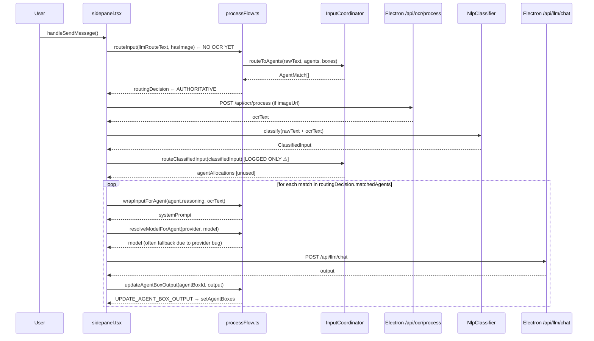
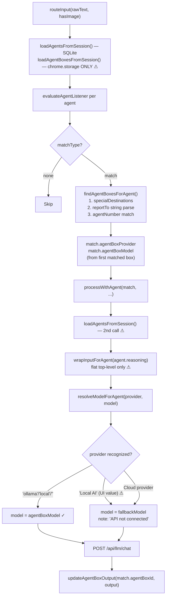

# Orchestrator Architecture — Runtime Pipeline Analysis

**Status:** Analysis-only. No implementation changes proposed.  
**Date:** 2026-04-01  
**Covers:** WR Chat send pipeline · OCR/NLP/routing/input coordination · Agent selection, reasoning, and brain resolution · Output routing to Agent Boxes and grids · Current vs intended runtime sequence

---

## Table of Contents

1. [WR Chat Send Pipeline: Current State](#1-wr-chat-send-pipeline-current-state)
2. [OCR, NLP, Routing, and Input Coordinator](#2-ocr-nlp-routing-and-input-coordinator)
3. [Agent Selection, Reasoning, and Brain Resolution](#3-agent-selection-reasoning-and-brain-resolution)
4. [Output Routing to Agent Boxes and Grids](#4-output-routing-to-agent-boxes-and-grids)
5. [Current vs Intended Runtime Sequence](#5-current-vs-intended-runtime-sequence)
6. [Most Important Questions for Prompt 4](#6-most-important-questions-for-prompt-4)

---

## 1. WR Chat Send Pipeline: Current State

### Entry Points

There are **three** distinct send paths in `sidepanel.tsx`:

| Handler | Lines | Trigger |
|---|---|---|
| `handleSendMessage` | 2813+ | Main WR Chat send — **canonical path** |
| `handleSendMessageWithTrigger` | ~2600+ | Tag-prefixed trigger input |
| `processScreenshotWithTrigger` | ~1156+ | Screenshot event (`hasImage = true` always) |

All analysis below traces `handleSendMessage`.

---

### Message Assembly

```javascript
// sidepanel.tsx line 2814
text = (pendingInboxAiRef.current?.query ?? chatInput).trim()
```

Optional BEAP attachment prefix is prepended if BEAP inbox mode is active (lines 2817–2832). Final `llmRouteText` is `prefix + "\n\n" + displayText` or just `displayText`.

**Image detection** (line 2839): `hasImage = chatMessages.some(msg => msg.imageUrl)` — checks the **entire prior message history**, not just the current turn. A session with any prior image message sets `hasImage = true` for all subsequent sends.

---

### Exact Execution Order: Step by Step

| Step | Lines | Operation | OCR text available? |
|---|---|---|---|
| 1 | 2925–2932 | **`routeInput(llmRouteText, hasImage)`** | **No — pre-OCR routing** |
| 2 | 2943 | **`processMessagesWithOCR(newMessages)`** | OCR runs here |
| 3 | 2945–2957 | Build `processedMessagesForLlm` (optional BEAP prefix) | Yes |
| 4 | 2964–2966 | Build `inputTextForNlp = llmRouteText + ocrText` | Yes |
| 5 | 2967–2971 | **`nlpClassifier.classify(inputTextForNlp)`** | Yes |
| 6 | 2983–2989 | **`routeClassifiedInput(classifiedInput)`** | Yes — **LOGGED ONLY** |
| 7 | 3015–3027 | **`routeEventTagInput(inputTextForNlp)`** (if triggers found) | Yes — **LOGGED ONLY** |
| 8 | 3058–3082 | **Loop: `processWithAgent` for each `routingDecision.matchedAgents`** | N/A |

**`routeInput` (step 1) is the authoritative routing path.** It runs before OCR. The `routingDecision.matchedAgents` it produces is the only result that drives agent execution. Steps 6 and 7 produce routing results that are logged to console and discarded.

---

### Sequence Diagram



---

### Decision Tree

```
handleSendMessage()
│
├── hasImage = chatMessages.some(msg => msg.imageUrl) [full history!]
│
├── STEP 1: routeInput(rawText, hasImage)
│   ├── shouldForwardToAgent = false → butler response (no agents run)
│   └── matchedAgents[] → agent execution path
│
├── STEP 2: processMessagesWithOCR
│   ├── each user message with imageUrl → POST /api/ocr/process
│   └── ocrText = last successful OCR result
│
├── STEP 3–5: NLP + routeClassifiedInput [LOGGED ONLY]
│
├── STEP 6: routeEventTagInput [LOGGED ONLY, only if triggers in NLP]
│
└── STEP 7: for each match in routingDecision.matchedAgents
    ├── [agent not found?] → continue
    ├── wrapInputForAgent → system prompt
    ├── resolveModelForAgent → model
    ├── POST /api/llm/chat
    └── [match.agentBoxId?] → updateAgentBoxOutput
```

---

### Which Runtime Path Is Actually Authoritative?

**`routeInput` (step 1) is the authoritative path.** Confirmed: the execution loop at lines 3058–3082 iterates `routingDecision.matchedAgents` — the output of `routeInput`. The `routeClassifiedInput` and `routeEventTagInput` results are never used to call `processWithAgent`.

There are three parallel routing computations per WR Chat send. Only the first (pre-OCR, pre-NLP) has execution consequences.

---

### `ocrText` Race Condition

`processMessagesWithOCR` maps over messages with `Promise.all`. The `ocrText` variable is reassigned inside each callback: `ocrText = ocrResult.data.text`. If multiple messages have `imageUrl`, only the **last successful OCR result** in the array is captured due to parallel execution with sequential variable reassignment.

---

## 2. OCR, NLP, Routing, and Input Coordinator

### Current Routing Order

```
1. routeInput(rawText, hasImage)       ← NO OCR, NO NLP — authoritative
2. processMessagesWithOCR(messages)    ← OCR runs here
3. inputTextForNlp = rawText + ocrText
4. nlpClassifier.classify(inputTextForNlp) ← NLP on OCR-enriched text
5. routeClassifiedInput(classifiedInput)   ← LOGGED ONLY
6. routeEventTagInput(inputTextForNlp)     ← LOGGED ONLY (if triggers found)
7. processWithAgent loops routingDecision from step 1
```

---

### Where OCR Is Triggered

**Extension side (sidepanel.tsx `processMessagesWithOCR` lines 2373–2414):**
- `POST ${baseUrl}/api/ocr/process` with body `{ image: msg.imageUrl }`
- Called for each user message with `imageUrl` in parallel
- Response: `{ ok: boolean, data: OCRResult }`
- `OCRResult.data.text` appended to message content
- `ocrText` = last successful extraction

**Electron side (`OCRRouter.processImage`):**
- `shouldUseCloud()` decision: `forceLocal/Cloud` → preference → `useCloudForImages` → key availability
- Cloud: OpenAI/Claude/Gemini/Grok vision → `OCRResult { text, confidence, language, method: 'cloud_vision', provider, processingTimeMs }`
- Local: Tesseract → `OCRResult { text, confidence, language, method: 'local_tesseract' }`
- Cloud failure → local fallback

---

### Whether OCR Currently Influences Routing

**OCR does not influence the authoritative routing decision.**

OCR text does influence:
- NLP classification (`inputTextForNlp` includes OCR text) ✓
- `routeClassifiedInput` input (sees OCR-enriched text) ✓ — but result unused
- `routeEventTagInput` input ✓ — but result unused
- LLM system prompt (`wrapInputForAgent` receives `ocrText`) ✓
- LLM message content (OCR text in message array) ✓

OCR does NOT influence:
- Which agents are activated (decided in `routeInput` before OCR)
- Listener evaluation (runs on pre-OCR text)

---

### What `routeClassifiedInput` Actually Does

`InputCoordinator.routeClassifiedInput` (lines 646–758):

1. Strips `#` from trigger names for matching
2. Infers `inputType`/`hasImage` from `source === 'ocr'` or image URL entities
3. Loops enabled agents → `evaluateAgentListener` per agent
4. Skips if `matchType === 'none'`
5. `findAgentBoxesForAgent` → output box
6. Reads flat `agent.reasoning` → builds `AgentReasoning`
7. Resolves `outputSlot.destination`
8. Builds `AgentAllocation` with box LLM fields
9. Returns `{ ...classifiedInput, agentAllocations }`

**The result is never used for execution in the WR Chat path.** It is logged at sidepanel.tsx lines 2992–2993.

---

### How Event-Tag Routing Works

`routeEventTagInput` in `processFlow.ts` (lines 928–990):

1. **Second** `nlpClassifier.classify` call on `inputTextForNlp`
2. Loads agents and boxes
3. `inputCoordinator.routeEventTagTrigger` → matches `#tags` against agent unified triggers
4. Evaluates `evaluateEventTagConditions` per match
5. Calls `resolveReasoningConfig` and `resolveExecutionConfig` — the **more complete** routing path
6. Returns `EventTagRoutingBatch`

This is the architecturally richer path. It honors `reasoningSections[].applyForList`, typed destination arrays, and event-tag conditions. **But its results are also only logged in the current WR Chat path** (sidepanel.tsx line 3033–3043).

---

### Why OCR-Aware Routing Is Not Yet Truly Canonical

1. **Authoritative routing call precedes OCR.** `routeInput` at line 2925; `processMessagesWithOCR` at line 2943. No re-routing after OCR.

2. **OCR-enriched routing path wired to logging, not execution.** `routeClassifiedInput` sees OCR-enriched text and produces correct allocations — but these are never used.

3. **`hasImage` detection is session-history based.** `chatMessages.some(msg => msg.imageUrl)` — looks at entire prior history, not the current turn.

4. **OCR is image-only.** Text-only sends have `ocrText = ''` — routing concepts 1 and 2 would be identical anyway.

---

### Minimum Clean Redesign to Make OCR Part of Routing

1. **Move `processMessagesWithOCR` before `routeInput`** (swap steps 1 and 2).
2. **Pass `ocrText` into `routeInput`** as an optional argument; merge with `input` in `matchInputToAgents`.
3. **Unify the execution path onto `routeClassifiedInput`**: after OCR+NLP, call `routeClassifiedInput` once, use its `agentAllocations` to drive the execution loop.
4. **Fix `hasImage` to check current turn only**, not full chat history.

Changes confined to `handleSendMessage` and minor parameter additions to `routeInput` / `matchInputToAgents`. No changes to `processWithAgent`, `updateAgentBoxOutput`, Electron OCR, or NlpClassifier.

---

## 3. Agent Selection, Reasoning, and Brain Resolution

### How Agents Are Matched

`routeInput` → `matchInputToAgents` → `inputCoordinator.routeToAgents`:

For each enabled agent, `evaluateAgentListener` evaluates in order:
1. Capability + listener active check (no listener → forward anyway)
2. Website filter (`listening.website`)
3. Trigger matching (unified triggers, legacy branches for old agent formats)
4. Expected context (substring in raw text)
5. `applyFor` input type (text/image/mixed vs `reasoning.applyFor`)
6. Default no-match

**Not evaluated:** `listening.sources[]` (14 source types), `listening.exampleFiles`.

---

### How Reasoning/System Content Is Built

`wrapInputForAgent` (processFlow.ts lines 1089–1132) reads **top-level `agent.reasoning` only**:

```
[Role: {role}]
[Goals]
  {goals}
[Rules]
  {rules}
[Context]
  {custom[key]: value}
[User Input]
  {input}
[Extracted Image Text]  (if ocrText)
  {ocrText}
```

This string becomes `role: 'system'` content. `reasoningSections[]`, `agentContextFiles`, memory toggles, WR Experts — none are injected.

---

### How Context and Memory Enter the Prompt Path

**Currently: they don't.** No memory retrieval, no context file loading, no RAG injection in the current WR Chat pipeline. The only external text enrichment is `ocrText`.

---

### From Matched Agent to Selected Brain: Actual Runtime Chain



---

### Key Issues in the Chain

1. **Agents loaded twice**: `loadAgentsFromSession` called in `routeInput` and again in `processWithAgent`. Double SQLite round trip per send per matched agent.
2. **Boxes from chrome.storage only**: Grid-configured boxes (saved to SQLite) are invisible; `findAgentBoxesForAgent` cannot find them.
3. **`'Local AI'` not recognized**: Provider string mismatch → configured model silently discarded → fallback model used.
4. **Flat reasoning only**: `reasoningSections[]` ignored; `agentContextFiles` not read.
5. **Cloud providers not implemented**: All cloud provider boxes fall back to local model with no error.

---

## 4. Output Routing to Agent Boxes and Grids

### How Output Is Written to Boxes

`updateAgentBoxOutput` (processFlow.ts lines 1137–1195):

1. Get session key via `getCurrentSessionKeyAsync()`
2. Read `chrome.storage.local` for session key
3. `findIndex(b => b.id === agentBoxId)` — if `-1` → return `false` silently
4. Format output (optional reasoning context prefix)
5. Set `box.output` and `box.lastUpdated`
6. `chrome.storage.local.set(session)`
7. `chrome.runtime.sendMessage({ type: 'UPDATE_AGENT_BOX_OUTPUT', data: { agentBoxId, output, allBoxes } })`

Guarded at call site: `if (match.agentBoxId) { await updateAgentBoxOutput(...) }`. If no box ID → output is silently dropped.

---

### Sidepanel vs Display Grid: Live Update Behavior

**Sidepanel:** `chrome.runtime.onMessage` listener at line 1576 → `setAgentBoxes(allBoxes)` → React state update → re-render. **Live and immediate.**

**Display grid:** No `UPDATE_AGENT_BOX_OUTPUT` handler in `grid-script.js`, `grid-script-v2.js`, or `grid-display.js`. `chrome.storage.onChanged` in `grid-display.js` only reacts to `optimando-ui-theme`. **No live update — must reload page.**

---

### Persistence of Output

`box.output` and `box.lastUpdated` are written to the session blob in `chrome.storage.local`. Not synced to SQLite as part of the output write. Output is ephemeral: overwritten on each run, cleared on page reload, no history.

---

### Failure Scenarios

| Failure | Effect |
|---|---|
| LLM call fails | `processWithAgent` returns `{ success: false }`; `updateAgentBoxOutput` not called; box retains previous output; no user indication |
| Box not found in session | `updateAgentBoxOutput` returns `false`; silently skipped |
| `agentBoxId` undefined | Guard at call site skips `updateAgentBoxOutput`; output never written |
| chrome.storage write fails | Silent — `resolve(true)` is unconditional after `set` call |
| Electron not running | `fetch` throws; caught in `processWithAgent`; box not updated |

---

### Multiple Matched Agents and Multiple Boxes

- Multiple matched agents: processed **sequentially** (not in parallel) via `for...of` + `await`
- Each writes to its own box independently
- Multiple boxes per agent: only the **first** matched box gets output (`AgentMatch.agentBoxId` = first box only)
- No fan-out to multiple boxes for one agent

---

### Are Sidepanel Boxes and Display-Grid Boxes Truly the Same Runtime Target?

**No — not at runtime.** Same schema; different operational reality.

| Dimension | Sidepanel | Display Grid |
|---|---|---|
| Written by | Content-script → `ensureSessionInHistory` → chrome.storage (adapter → SQLite) | Grid script → `SAVE_AGENT_BOX_TO_SQLITE` → SQLite |
| Read for routing | `loadAgentBoxesFromSession` → chrome.storage.local ✓ | **Never read by routing engine** ✗ |
| Receives `UPDATE_AGENT_BOX_OUTPUT` | Yes → React state update → live | **No** → no handler → no live update |
| Can be found by routing | Yes (if created via content-script) | **No** (SQLite write not in chrome.storage) |

**Path to true equivalence (all three required):**
1. `loadAgentBoxesFromSession` must read SQLite (same path as `loadAgentsFromSession`)
2. Grid boxes must be visible in chrome.storage (or storageWrapper must mirror SQLite writes)
3. Grid pages must handle `UPDATE_AGENT_BOX_OUTPUT` and update slot DOM live

---

## 5. Current vs Intended Runtime Sequence

### Intended Sequence

```
1. Input received
2. OCR enriches input (if image present) — BEFORE routing
3. NLP classifies enriched input
4. One canonical routing decision → matched agents
5. For each matched agent:
   a. Select reasoning section by trigger/applyFor
   b. Build system prompt: role + goals + rules + WR Experts + contextFiles + memory
   c. Execution mode determines output behavior
   d. Box provides provider + model (functional, no fallback needed)
   e. LLM called with provider-aware API
   f. Output delivered live to correct box (sidepanel or grid equivalently)
```

### Current Sequence

```
1. Input received
2. routeInput(rawText) — BEFORE OCR ← misordered
3. processMessagesWithOCR — OCR after routing decision
4. NLP on OCR-enriched text
5. routeClassifiedInput — LOGGED ONLY (not used)
6. routeEventTagInput — LOGGED ONLY (not used)
7. For each match in routeInput result:
   a. reasoning: flat top-level only (sections ignored, no files/memory/WR Experts)
   b. executionMode: ignored
   c. Box provider: 'Local AI' not recognized → fallback; cloud → fallback
   d. LLM called (local Ollama only in practice)
   e. Output written to box (sidepanel: live; grid: not live, box often not found)
```

---

### Stage-by-Stage Delta Table

| Stage | Intended | Current | Alignment |
|---|---|---|---|
| Input collection | Text + image, current turn | Text; `hasImage` from full history | **Partially aligned** |
| OCR | Before routing | After `routeInput` | **Misordered** |
| NLP | After OCR, feeds routing | After OCR; feeds unused routing paths | **Misordered** |
| Routing | One canonical decision after OCR+NLP | Three routing computations; only pre-OCR one drives execution | **Split / misordered** |
| Listener evaluation | Correct logic; fires after full enrichment | Correct logic; fires before OCR | **Logic aligned; timing wrong** |
| Reasoning sections | Per-trigger section selected | Flat top-level only | **Partially aligned** |
| System prompt content | Goals + rules + WR Experts + context + memory | Goals + rules + custom + ocrText only | **Partially aligned** |
| Execution mode | 4 modes behavioral | Not evaluated | **Not aligned** |
| Brain/model resolution | Box provider+model (all providers functional) | `'Local AI'` mismatch; cloud providers unimplemented | **Not aligned** |
| Output delivery (sidepanel) | Live | Live (React state) | **Aligned** |
| Output delivery (grid) | Live, equivalent target | Not live; box often invisible to routing | **Not aligned** |

---

### Ranked Mismatches

| # | Mismatch | Impact | Confirmed |
|---|---|---|---|
| M1 | OCR order — routing before OCR | Image-triggered agents never activate on image content | Yes |
| M2 | Routing fragmentation — 3 computations, 1 used | Correct OCR-aware routing discarded every send | Yes |
| M3 | Grid boxes invisible to routing | All grid-configured boxes unreachable for output | Yes |
| M4 | Grid boxes not live | Output never shown in grid without page reload | Yes |
| M5 | `'Local AI'` provider string mismatch | All Local AI boxes use fallback model silently | Yes |
| M6 | Cloud providers unimplemented | Cloud-configured boxes always use local model | Yes |
| M7 | Multi-section reasoning not used in WR Chat | Per-trigger reasoning configurations have no effect | Yes |
| M8 | Context/memory/WR Experts not injected | Full configured harness not reflected in LLM prompts | Yes |
| M9 | Double agent load per send | Latency; stale-data risk | Yes |
| M10 | `executionMode` not consumed | 4 modes, 1 behavior | Yes |

---

### Likely Hidden Failure Modes

| Mode | Where | Symptoms |
|---|---|---|
| Agent runs but output dropped | `agentBoxId` undefined; box not in chrome.storage | LLM ran, console shows result, no box update, no error |
| Grid box never receives output | Box in SQLite, not chrome.storage | Agent appears functional; grid shows nothing |
| Wrong model used silently | `resolveModelForAgent` fallback | Box configured with model X; model Y used; no indicator |
| `hasImage` false positive | `chatMessages.some()` checks full history | Text-only send activates image-only agents from prior turns |
| OCR race condition | `Promise.all` with `ocrText` reassignment | Multiple images → only last OCR in `ocrText` |
| `routeClassifiedInput` ignored | sidepanel.tsx after line 2989 | Correct agent allocations produced but never executed |
| Session divergence under Electron outage | `storageWrapper` fallback | Session in chrome.storage; `loadAgentsFromSession` reads SQLite (empty) |
| Chrome.storage write failure silent | `updateAgentBoxOutput` resolve(true) unconditionally | Storage write failed; UI shows update; data not actually saved |

---

## 6. Most Important Questions for Prompt 4

### Execution and Model Resolution

1. **Is there an actual POST path to OpenAI/Claude/Gemini/Grok from the current Electron backend?** Is `/api/llm/chat` Ollama-only? Is there a separate cloud chat endpoint, or is cloud execution genuinely absent from the codebase?

2. **What does `/api/llm/chat` in Electron `main.ts` actually do?** What is its request/response format? Does it accept a `modelId` that maps to a specific provider, or is it always Ollama?

3. **Is the `'Local AI'` provider string normalization the only change needed to fix local model execution?** Or is there additional mapping between the UI provider string and the Ollama model ID format?

### Routing Unification

4. **What would break if `routeInput` were replaced by `routeClassifiedInput` as the authoritative routing path?** Are there any agents currently using raw-text matching behavior that depends specifically on the `routeToAgents` path rather than the NLP-classified path?

5. **Is `routeEventTagInput` result currently consumed anywhere in the codebase other than the console log in `handleSendMessage`?** Is there any sidepanel state or agent execution that uses event-tag results?

6. **Does `processScreenshotWithTrigger` (the screenshot path) have the same OCR/routing ordering problem?** Or does it handle OCR differently because it starts with an image?

### Session and Box Persistence

7. **Is there a `SAVE_AGENT_BOX_TO_SQLITE` handler in `background.ts`?** What exactly does it do? Does it write to chrome.storage as well, or only to SQLite? This determines whether grid boxes could ever be found by `loadAgentBoxesFromSession`.

8. **Does `loadAgentBoxesFromSession` have any code path that falls through to SQLite?** The analysis shows chrome.storage only at lines 566–574 — is that the complete function, or is there a SQLite branch that was missed?

9. **What is `getCurrentSessionKeyAsync()` doing in `updateAgentBoxOutput`?** Does it read from the same session key that was used for routing, or could it return a different session key if the user switched sessions mid-send?

### Output and Grid

10. **Is there a `grid-display.js` or similar script that listens for messages and updates grid slot output?** The `grid-script.js` and `grid-script-v2.js` handle editing — is there a separate runtime display script that handles live output?

11. **What is the `outputId` field on `CanonicalAgentBoxConfig` used for?** Is it referenced by any DOM update path? Could it be used to add direct DOM output injection to grid pages?

### Memory and Context (looking ahead)

12. **Is there any existing memory-read mechanism anywhere in the codebase** — even experimental — that retrieves past session content or conversation history into an agent's prompt?

13. **Is the SQLite `sessions` table separate from the `settings` KV table ever used for anything in the current runtime?** Could it serve as the canonical session read source to replace the `settings` KV blob approach?

14. **What is the minimum viable path to make `agentContextFiles` injectable into the LLM prompt?** Are the files stored as blob URLs, base64, or plain text? Would `wrapInputForAgent` need to be async to load them?
