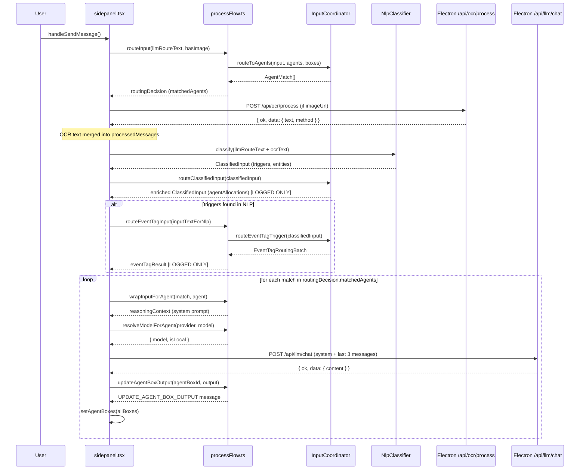

# 10 — WR Chat Send Pipeline: Current State

**Status:** Analysis-only.  
**Date:** 2026-04-01  
**Evidence basis:** Code-proven from `sidepanel.tsx` lines 2813–3115, `processFlow.ts`, `InputCoordinator.ts`.

---

## Entry Points

There are **three** distinct send paths in `sidepanel.tsx`, not one:

| Handler | Lines | Trigger | Description |
|---|---|---|---|
| `handleSendMessage` | 2813+ | Main WR Chat send button / Enter key | Primary path — analyzed in full below |
| `handleSendMessageWithTrigger` | ~2600+ | Tag-prefixed trigger input | Direct trigger routing, calls `routeInput` with `triggerText` |
| `processScreenshotWithTrigger` | ~1156+ | Screenshot event | Image-first path, `hasImage = true` always |

**The canonical WR Chat send handler is `handleSendMessage` (line 2813).** All analysis below traces this function unless noted.

---

## Message Assembly

```javascript
// line 2814
text = (pendingInboxAiRef.current?.query ?? chatInput).trim()
displayText = text
```

If BEAP inbox mode is active and an attachment is selected (lines 2817–2832), a `beapAttachmentLlmPrefix` is prepended from the attachment's `semanticContent`. The final `llmRouteText` is `prefix + "\n\n" + displayText` or just `displayText`.

**Image detection** (line 2839): `hasImage = chatMessages.some(msg => msg.imageUrl)` — checks the entire prior message array for any `imageUrl`, not just the current turn. This means if any prior message in the session had an image, `hasImage` will be `true` even if the current message has no image.

---

## Exact Execution Order: Step by Step

The most important finding in this document is the **confirmed order of operations**:

| Step | Lines | Operation | Has OCR text yet? |
|---|---|---|---|
| 1 | 2910–2932 | **`routeInput(llmRouteText, hasImage, …)`** | **No** — pre-OCR routing |
| 2 | 2943 | **`processMessagesWithOCR(newMessages, baseUrl)`** | OCR runs here |
| 3 | 2945–2957 | Optional BEAP prefix → `processedMessagesForLlm` | OCR result available |
| 4 | 2964–2966 | Build `inputTextForNlp` (`llmRouteText` + OCR text if available) | Yes |
| 5 | 2967–2971 | **`nlpClassifier.classify(inputTextForNlp, …)`** | Yes |
| 6 | 2983–2989 | **`inputCoordinator.routeClassifiedInput(nlpResult.input, …)`** | Yes |
| 7 | 3015–3027 | Optional **`routeEventTagInput(inputTextForNlp, …)`** if triggers found | Yes |
| 8 | 3058–3082 | Branch on `routingDecision` (from step 1); **`processWithAgent`** per matched agent | N/A |

**`routeInput` (step 1) runs before OCR.** The `routingDecision` object that actually drives agent execution (step 8 branches on `routingDecision.matchedAgents`) was computed from pre-OCR text.

`routeClassifiedInput` (step 6) runs on OCR-enriched `inputTextForNlp` — but its result (`nlpResult.input.agentAllocations`) is logged but **not used to drive the execution loop at step 8**. The execution loop at step 8 iterates `routingDecision.matchedAgents` — the result of step 1.

---

## Sequence Diagram



---

## Decision Tree

```
handleSendMessage()
│
├── [BEAP attachment mode?] → build beapAttachmentLlmPrefix → llmRouteText
│
├── hasImage = chatMessages.some(msg => msg.imageUrl)
│
├── STEP 1: routeInput(llmRouteText, hasImage)
│   ├── routingDecision.shouldForwardToAgent = false → [Butler response path, no agents]
│   └── routingDecision.matchedAgents.length > 0 → [agent execution path]
│
├── STEP 2: processMessagesWithOCR(newMessages)
│   ├── each user message with imageUrl → POST /api/ocr/process
│   │   ├── success → ocrText = result.text; merge into message content
│   │   └── failure → fallback text '[Image attached - OCR unavailable]'
│   └── returns processedMessages + ocrText
│
├── STEP 3: build inputTextForNlp = llmRouteText + "\n[Image Text]: " + ocrText
│
├── STEP 4: nlpClassifier.classify(inputTextForNlp)
│   └── returns ClassifiedInput (triggers, entities, intents)
│
├── STEP 5: routeClassifiedInput(classifiedInput)  [result LOGGED ONLY]
│
├── STEP 6: [triggers.length > 0?] → routeEventTagInput(inputTextForNlp)  [result LOGGED ONLY]
│
└── STEP 7: for each match in routingDecision.matchedAgents (from STEP 1)
    ├── loadAgentsFromSession() → find agent by id
    ├── [agent not found?] → continue
    ├── wrapInputForAgent → reasoningContext
    ├── resolveModelForAgent(match.agentBoxProvider, match.agentBoxModel)
    ├── POST /api/llm/chat
    └── [success?] → updateAgentBoxOutput(match.agentBoxId, output)
```

---

## Branch Points

### Branch 1: Butler vs Agent
`routingDecision.shouldForwardToAgent` (from `routeInput`). If false, the butler response is shown inline in chat. Agents are not run.

### Branch 2: OCR availability
If no `imageUrl` in any message, `processMessagesWithOCR` processes no images and returns `ocrText = ''`. The `inputTextForNlp` is identical to `llmRouteText`.

### Branch 3: Event-tag routing
Only triggered when `nlpResult.input.triggers.length > 0`. This is an additive side path — `routeEventTagInput` is called but its result is **only logged**. It does not affect which agents run.

### Branch 4: `agentBoxId` present
`updateAgentBoxOutput` is only called if `match.agentBoxId` is set (guarded at call site ~3087–3095). If the matched agent has no associated box, output is not written to any box.

---

## Which Runtime Path Is Actually Authoritative?

**`routeInput` (step 1) is the authoritative routing path for agent execution.**

This is confirmed by lines 3058–3082: the execution loop iterates `routingDecision.matchedAgents`, which is the output of `routeInput`. The `routeInput` function calls `matchInputToAgents` → `inputCoordinator.routeToAgents` → `evaluateAgentListener` per agent.

`routeClassifiedInput` (step 6) and `routeEventTagInput` (step 7) both produce routing results that are logged to the console but **do not drive the execution loop**. Their allocations and event-tag batch results are not used to call `processWithAgent` or to write any box output.

This creates three parallel routing computations in every WR Chat send, only one of which (the first, pre-OCR one) actually executes agents.

---

## Sidepanel vs Popup Differences

`sidepanel.tsx` has no `isPopup` branching. The send behavior is uniform. `popup-chat.tsx` uses `CommandChatView` without an `onSend` handler — popup chat never reaches `handleSendMessage`. The popup is UI-only for WR Chat.

---

## `ocrText` Race Condition

`processMessagesWithOCR` maps over all messages in parallel (`Promise.all`). The `ocrText` variable is reassigned for each message that has a successful OCR result:

```javascript
ocrText = ocrResult.data.text  // line 2391 — inside a .map callback
```

If multiple messages have `imageUrl`, only the **last successful OCR result** in the array will be in `ocrText` due to parallel execution with sequential reassignment. This is a minor race condition — only the last OCR result is passed to `wrapInputForAgent` and NLP.
