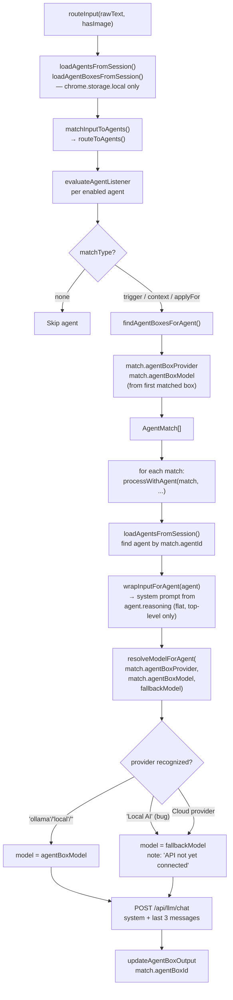

# 12 — Agent Selection, Reasoning, and Brain Resolution

**Status:** Analysis-only.  
**Date:** 2026-04-01  
**Evidence basis:** `processFlow.ts`, `InputCoordinator.ts`, `sidepanel.tsx`, `CanonicalAgentConfig.ts`.

---

## How Agents Are Matched

### Primary path: `routeInput` → `matchInputToAgents` → `routeToAgents`

`routeInput` in `processFlow.ts` (lines 826–907):

1. Computes `inputType` from `hasImage` and `input` (lines 834–837)
2. Calls `loadAgentsFromSession()` → `loadAgentBoxesFromSession()` (lines 840–841)
3. If input matches a system query pattern → butler response (lines 850–866)
4. Else calls `matchInputToAgents(input, inputType, hasImage, connectionStatus, sessionKey, currentUrl)` (lines 869–877)
5. Returns `RoutingDecision { shouldForwardToAgent, matchedAgents, butlerResponse, originalInput, inputType, targetAgentBoxes }`

`matchInputToAgents` delegates entirely to `inputCoordinator.routeToAgents(input, inputType, hasImage, agents, agentBoxes, currentUrl)`.

### `routeToAgents` (InputCoordinator lines 512–600)

Loops all enabled agents. For each:
1. Calls `evaluateAgentListener(agent, extractedTriggers, rawText, inputType, hasImage, currentUrl)` (lines 677–684 in `routeClassifiedInput`; same method used in `routeToAgents`)
2. If `matchType === 'none'` → skip
3. Calls `findAgentBoxesForAgent(agent, agentBoxes)` → first matched box
4. Builds `AgentMatch` with: `agentId`, `agentName`, `agentIcon`, `agentNumber`, `matchReason`, `matchDetails`, `outputLocation`, `agentBoxId`, `agentBoxNumber`, `agentBoxProvider`, `agentBoxModel`
5. Deduplicates by `agentId`
6. Returns `AgentMatch[]`

---

## How Listener Logic Is Evaluated

`evaluateAgentListener` in `InputCoordinator.ts` (lines 210–426) — evaluation in order:

### Guard: capability + listener active check (lines 210–248)
If agent lacks `listening` capability OR listener is inactive:
- Returns `matchType: 'no_listener'`, **`matchesApplyFor: true`**
- This means agents without a listener still get forwarded into the reasoning path

### Website filter (lines 251–264)
`listening.website` present and does not match `currentUrl` → `matchType: 'none'` (stop).

### Trigger matching (lines 266–381)
Extracts `#word` / `@word` tokens from input. For each token, checks against:
- Unified triggers (`listening.unifiedTriggers[]`) — canonical v2.1.0 format
- Legacy active triggers (with keyword conditions via `checkTriggerKeywords`)
- Legacy passive triggers
- Legacy `listening.triggers` array

Match → `matchType: 'passive_trigger'` or `'active_trigger'`

### Expected context (lines 383–396)
Substring match of `listening.expectedContext` in `rawText` → `matchType: 'expected_context'`

### `applyFor` input type (lines 398–413)
`reasoning.applyFor` set to `'text'`, `'image'`, or `'mixed'` (not `'__any__'`) → `matchesApplyFor` evaluation:
- `'text'` matches only `inputType === 'text'`
- `'image'` matches if `inputType === 'image'` or `hasImage`
- `'mixed'` matches only `inputType === 'mixed'`

→ `matchType: 'apply_for'`

### Default no-match (lines 415–425)
`matchType: 'none'`

**Not evaluated:** `listening.sources[]` (14 source types), `listening.exampleFiles`.

---

## How Reasoning/System Content Is Built

`wrapInputForAgent` in `processFlow.ts` (lines 1089–1132):

Reads **top-level `agent.reasoning`** only (NOT `agent.reasoningSections[]`):

```javascript
let context = ''
if (agent.reasoning?.role) context += `[Role: ${role}]\n\n`
if (agent.reasoning?.goals) context += `[Goals]\n${goals}\n\n`
if (agent.reasoning?.rules) context += `[Rules]\n${rules}\n\n`
if (agent.reasoning?.custom?.length) {
  context += '[Context]\n'
  for (const c of agent.reasoning.custom) context += `${c.key}: ${c.value}\n`
  context += '\n'
}
context += `[User Input]\n${input}\n\n`
if (ocrText) context += `[Extracted Image Text]\n${ocrText}\n`
return context || input
```

This string becomes the `role: 'system'` message in `processWithAgent`.

### What is NOT included in the reasoning context

- `reasoningSections[]` (multi-section) — ignored in WR Chat path
- `agentContextFiles[]` — not read by `wrapInputForAgent`
- `memoryContext` toggles — not read
- Any session/account memory content — no retrieval mechanism exists
- WR Expert files — no field exists yet

---

## How Context and Memory Enter the Prompt Path

**Currently: they don't.**

`memorySettings`, `contextSettings`, and `agentContextFiles` are all persisted on agents but are not read by `wrapInputForAgent` or any step in `processWithAgent`. There is no memory retrieval, no context file loading, and no RAG-style injection in the current WR Chat pipeline.

The only external text that enters the system prompt beyond the agent's own reasoning fields is `ocrText` — if an image was processed.

---

## How Agent Box Provider/Model Is Resolved

### Step 1: Box association on `AgentMatch`

`findAgentBoxesForAgent` (InputCoordinator lines 436–498) finds the target box:

1. Check `agent.execution.specialDestinations` (kind: `'agentBox'`) — explicit override
2. Parse `agent.listening.reportTo[]` strings like "Agent Box 01" → box number
3. Match by `agentBox.agentNumber === agent.number && agentBox.enabled !== false`

Returns `AgentBox[]`. First match is used for `AgentMatch.agentBoxProvider` and `AgentMatch.agentBoxModel`.

### Step 2: `AgentMatch` carries provider and model

`routeToAgents` and `routeClassifiedInput` both build `AgentMatch` with:
```javascript
agentBoxProvider: firstBox?.provider || ''
agentBoxModel: firstBox?.model || ''
```

These are the values from the box configuration (`CanonicalAgentBoxConfig.provider`, `.model`).

### Step 3: `resolveModelForAgent` (processFlow.ts lines 1210–1245)

```
inputs: agentBoxProvider, agentBoxModel, fallbackModel
```

| Case | Behavior |
|---|---|
| `!agentBoxProvider \|\| !agentBoxModel` | `{ model: fallbackModel \|\| '', isLocal: true, note: 'Using default local model' }` |
| provider ∈ `['ollama', 'local', '']` (lowercased) | `{ model: agentBoxModel, isLocal: true }` |
| **`'local ai'`** (UI value lowercased) | **NOT recognized** → falls through to cloud fallback |
| Cloud (OpenAI, Claude, etc.) | `{ model: fallbackModel \|\| '', isLocal: true, note: '${provider} API not yet connected - using local model' }` |

**Critical bug confirmed:** The UI stores `provider: 'Local AI'`. Lowercased: `'local ai'`. Not in `localProviders = ['ollama', 'local', '']`. Treated as unrecognized cloud → configured model discarded → fallback model used.

### Step 4: LLM call with resolved model

`processWithAgent` (sidepanel.tsx lines 2505–2516):
```javascript
body: JSON.stringify({
  modelId: modelResolution.model || fallbackModel,
  messages: [
    { role: 'system', content: reasoningContext },
    ...processedMessages.slice(-3)
  ]
})
```

Posts to `${baseUrl}/api/llm/chat`. `fallbackModel` is `activeLlmModel` from sidepanel state — the currently active Ollama model (from `electronRpc('llm.status')` on startup).

---

## How Fallbacks Are Chosen

In order of priority:

1. **Configured box model** — `match.agentBoxModel` — only used if provider is `'ollama'`, `'local'`, or `''` (not `'Local AI'`)
2. **`fallbackModel`** — `activeLlmModel` from sidepanel state — the active Ollama model
3. **Empty string** — if `fallbackModel` is also empty, `modelId: ''` is sent to `/api/llm/chat`

There is no user-visible error when the fallback is used silently. The system proceeds with `modelResolution.note` in the console log only.

---

## From Matched Agent to Selected Brain: Actual Runtime Chain



### Key observations from this chain

1. **Agents are loaded twice**: once in `routeInput` (via `loadAgentsFromSession`) and once in `processWithAgent` (another `loadAgentsFromSession` call). Double I/O on every send.

2. **`loadAgentBoxesFromSession` reads chrome.storage.local only**: Grid-configured boxes are invisible. If an agent's box was created from a grid editor, `findAgentBoxesForAgent` will not find it.

3. **Provider string is not normalized**: `'Local AI'` from the UI is treated as an unrecognized cloud provider. The configured local model is silently discarded.

4. **`agent.reasoningSections[]` is ignored**: The system prompt is assembled from `agent.reasoning` (flat), regardless of how many reasoning sections the agent has.

5. **Context files, memory, and WR Experts are absent from the prompt**: The system prompt contains only what `wrapInputForAgent` extracts from `agent.reasoning.*` plus `ocrText`.

6. **Cloud providers are not implemented**: For any cloud provider box, the actual configured model is discarded and the local fallback model is used.
