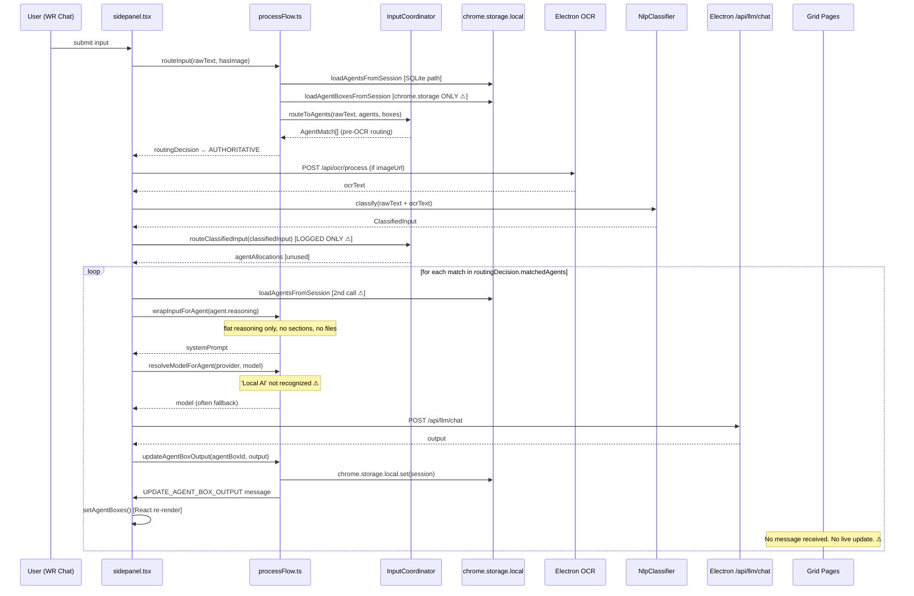

# 14 — Current vs Intended Runtime Sequence

**Status:** Analysis-only.  
**Date:** 2026-04-01  
**Evidence basis:** All prior documents in this series, confirmed against `sidepanel.tsx`, `processFlow.ts`, `InputCoordinator.ts`.

---

## Intended Runtime Sequence

The product intent (from prompt spec) is:

```
1. User submits content to WR Chat
2. OCR / parsing enriches input BEFORE routing decisions when relevant
3. Input coordinator determines which AI agent should listen
4. Listener evaluates wake-up signal
5. Reasoning provides system harness (goals, rules, WR Experts, context, memory)
6. Execution decides how to deliver output
7. Agent Box provides the selected brain/provider/model
8. Output lands in the correct Agent Box position (sidepanel OR display grid, equivalently)
```

---

## Current Runtime Sequence

The actual sequence in `handleSendMessage` (sidepanel.tsx lines 2813–3115):

```
1. User submits content to WR Chat

2. routeInput(rawText, hasImage)
   — loads agents and boxes from chrome.storage.local
   — evaluateAgentListener per agent (trigger/context/applyFor matching on RAW TEXT)
   — returns routingDecision.matchedAgents

3. processMessagesWithOCR(messages)
   — POSTs each image message to /api/ocr/process
   — appends OCR text to message content
   — returns processedMessages + ocrText

4. build inputTextForNlp = rawText + ocrText (if available)

5. nlpClassifier.classify(inputTextForNlp)
   — returns ClassifiedInput (triggers, entities, intents)

6. routeClassifiedInput(classifiedInput)  [RESULT LOGGED ONLY]
   — evaluateAgentListener on OCR-enriched NLP output
   — produces agentAllocations
   — NOT used for execution

7. routeEventTagInput(inputTextForNlp)  [RESULT LOGGED ONLY, only if triggers found]
   — second NLP classification
   — routeEventTagTrigger per agent
   — produces EventTagRoutingBatch
   — NOT used for execution

8. for each match in routingDecision.matchedAgents (from step 2):
   a. loadAgentsFromSession() [second call]
   b. find agent by match.agentId
   c. wrapInputForAgent(agent.reasoning, ocrText) → system prompt
      — reads flat top-level agent.reasoning ONLY
      — reasoningSections[] ignored
      — agentContextFiles not injected
      — memory/context not loaded
   d. resolveModelForAgent(match.agentBoxProvider, match.agentBoxModel)
      — 'Local AI' provider NOT recognized → fallback to activeLlmModel
      — cloud providers NOT implemented → fallback to activeLlmModel
   e. POST /api/llm/chat (system + last 3 processedMessages)
   f. if success and match.agentBoxId:
      updateAgentBoxOutput(match.agentBoxId, output)
      — writes to chrome.storage.local session blob
      — sends UPDATE_AGENT_BOX_OUTPUT runtime message
      — sidepanel setAgentBoxes → React re-render
      — grid pages: no listener, no update

9. [display-grid boxes: output only visible after page reload]
```

---

## Current Sequence Diagram



---

## Intended Sequence Diagram

```mermaid
sequenceDiagram
    participant U as User (WR Chat)
    participant SP as sidepanel.tsx
    participant OCR as OCR Service
    participant NLP as NlpClassifier
    participant IC as InputCoordinator
    participant Session as Session Store (canonical)
    participant Reasoning as Reasoning Harness
    participant Brain as Agent Box (Brain)
    participant LLM as LLM Provider
    participant Out as Output Target (sidepanel or grid)

    U->>SP: submit input (text + optional image)

    SP->>OCR: process image if present
    OCR-->>SP: enriched text (OCR result)

    SP->>NLP: classify(rawText + ocrText)
    NLP-->>SP: ClassifiedInput (triggers, entities, source)

    SP->>IC: route(classifiedInput, currentUrl, session)
    IC->>Session: load agents + boxes (single canonical read, SQLite)
    IC-->>SP: matchedAgents (ONE canonical routing result)

    loop for each matched agent
        SP->>Reasoning: buildSystemPrompt(agent, classifiedInput, ocrText)
        Note over Reasoning: reads reasoningSections[applyFor match]
        Note over Reasoning: injects WR Experts, contextFiles, memory signals
        Reasoning-->>SP: systemPrompt

        SP->>Brain: resolveBox(agent) → provider + model
        Note over Brain: 'Local AI' → ollama; cloud → API call
        Brain-->>SP: model + provider (real, no fallback needed)

        SP->>LLM: POST /api/llm/chat (provider-aware)
        LLM-->>SP: output

        SP->>Out: route output to correct box (sidepanel OR grid, live)
        Note over Out: grid pages receive UPDATE_AGENT_BOX_OUTPUT live
    end
```

---

## Stage-by-Stage Delta Table

| Stage | Intended | Current | Alignment |
|---|---|---|---|
| **1. Input collection** | Text + image, current turn only | Text + BEAP prefix; `hasImage` checks full history (not just current turn) | **Partially aligned** |
| **2. OCR** | Before routing decision | After `routeInput`; after routing decision | **Misordered** |
| **3. NLP classification** | After OCR, feeds routing | After OCR; feeds `routeClassifiedInput` — but that result is not used for execution | **Misordered** |
| **4. Routing / Input coordination** | One canonical routing decision after OCR+NLP | Three routing computations (routeInput pre-OCR, routeClassifiedInput post-NLP, routeEventTagInput); only the first (pre-OCR) drives execution | **Split across multiple concepts; misordered** |
| **5. Listener evaluation** | Agent wakes on trigger/context/applyFor | `evaluateAgentListener` evaluates trigger/context/applyFor — correct logic, wrong timing (pre-OCR) | **Partially aligned (logic ok, timing wrong)** |
| **6a. Reasoning sections** | Per-trigger reasoning section selected via `applyForList` | Flat `agent.reasoning` only; `reasoningSections[]` ignored in WR Chat path | **Partially aligned** |
| **6b. System prompt content** | Goals, role, rules, WR Experts, context files, memory signals | Goals, role, rules, custom fields, ocrText only | **Partially aligned — WR Experts/memory/files absent** |
| **7. Execution mode** | 4 modes: agent_workflow, direct_response, workflow_only, hybrid | Not evaluated — one behavior for all agents | **Not aligned** |
| **8. Brain/model resolution** | Box provider+model used; cloud providers functional | `'Local AI'` not recognized; cloud providers fall back to local silently | **Not aligned** |
| **9. Output routing** | Output lands in correct box (sidepanel OR grid), live | sidepanel boxes: live (React state update); grid boxes: not live, not found by routing | **Not aligned for grids** |
| **10. Box equivalence** | Sidepanel and grid boxes are the same runtime target | Grid boxes invisible to routing; no live update in grid pages | **Not aligned** |

---

## Known Mismatches (Ranked by Impact)

### M1: OCR order (Critical)
**Current:** `routeInput` runs before `processMessagesWithOCR`. Routing decisions are made on pre-OCR text.  
**Intended:** OCR should enrich input before routing.  
**Impact:** Any agent triggered by content that only appears in an image will never be activated.

### M2: Routing result fragmentation (Critical)
**Current:** Three routing computations per send. Only the first (pre-OCR, pre-NLP) drives execution.  
**Intended:** One canonical routing decision after full enrichment.  
**Impact:** The more complete routing paths (routeClassifiedInput, routeEventTagInput) run and produce correct results that are silently discarded.

### M3: Grid boxes invisible to routing (Critical)
**Current:** `loadAgentBoxesFromSession` reads chrome.storage.local only; grid boxes written to SQLite are not loaded.  
**Intended:** Sidepanel and grid boxes are equivalent targets.  
**Impact:** Any agent whose box was configured from a grid editor cannot route to that box.

### M4: Grid boxes not live (High)
**Current:** `UPDATE_AGENT_BOX_OUTPUT` has no handler in grid pages; no `chrome.storage.onChanged` for session.  
**Intended:** Output appears live in the correct box position regardless of surface.  
**Impact:** Grid page users must manually reload to see box output.

### M5: `'Local AI'` provider string mismatch (High)
**Current:** `resolveModelForAgent` does not recognize `'local ai'` (lowercased from `'Local AI'`). The configured model is discarded.  
**Intended:** The box's configured provider/model is used.  
**Impact:** All Local AI boxes silently use the fallback active Ollama model, ignoring user configuration.

### M6: Cloud providers unimplemented (High)
**Current:** All cloud providers (`OpenAI`, `Claude`, `Gemini`, `Grok`) fall back to local model.  
**Intended:** Box provider determines which LLM API is called.  
**Impact:** Users who configure OpenAI/Claude/Gemini/Grok boxes get local model output without any error indication.

### M7: Multi-section reasoning not used in WR Chat path (Medium)
**Current:** `wrapInputForAgent` reads flat `agent.reasoning`; `reasoningSections[]` ignored.  
**Intended:** Section selected by trigger match via `applyForList`.  
**Impact:** Multiple reasoning configurations per agent have no runtime effect via WR Chat.

### M8: Context files and memory not injected (Medium)
**Current:** `agentContextFiles`, `memorySettings`, `contextSettings` are persisted but not read during prompt assembly.  
**Intended:** Context files, memory signals, and WR Experts enrich the reasoning harness.  
**Impact:** The full reasoning harness as configured by the user is not reflected in what the LLM receives.

### M9: Double agent load on each send (Low-Medium)
**Current:** `loadAgentsFromSession` is called once in `routeInput` and again inside `processWithAgent` for each matched agent.  
**Intended:** Single canonical session read.  
**Impact:** Performance overhead; potential for stale data if session changes mid-send.

### M10: `executionMode` not consumed (Low)
**Current:** 4 execution modes defined in schema; not evaluated in `processWithAgent`.  
**Intended:** `direct_response`, `workflow_only`, `hybrid` produce different behaviors.  
**Impact:** UI setting has no effect. Low urgency until modes are designed.

---

## Likely Bottlenecks

| Bottleneck | Location | Risk |
|---|---|---|
| Double session read | `routeInput` + `processWithAgent` each call `loadAgentsFromSession` | Latency on each send; increases with agent count |
| Sequential agent processing | `for...of` loop with `await processWithAgent` | Multiple matched agents processed serially; N agents = N LLM round trips before any box updates |
| chrome.storage.local for box reads | `loadAgentBoxesFromSession` | chrome.storage has size/quota limits; large sessions with many boxes could hit limits |
| OCR for all image messages | `Promise.all` on all messages | If session has many prior image messages, all are re-OCR'd on each send |
| No caching on routing | Agents and boxes loaded fresh every send | No session-level cache; SQLite round trip on every send |

---

## Likely Hidden Failure Modes

| Failure mode | Where | Symptoms |
|---|---|---|
| Agent runs but box output silently dropped | `updateAgentBoxOutput` when `agentBoxId` undefined or box not in chrome.storage | LLM ran, console shows output, but no box updates — no user-visible error |
| Grid box configured but never receives output | Grid boxes in SQLite not in chrome.storage | Agent appears to work in sidepanel but grid page never shows output |
| `'Local AI'` box uses wrong model | `resolveModelForAgent` | Box is configured with model X, runs with fallback model Y — no error indicator |
| OCR race condition | `processMessagesWithOCR` parallel map | Multiple image messages → only last successful OCR in `ocrText` → earlier OCR text lost |
| `hasImage` false positive | `chatMessages.some(msg => msg.imageUrl)` | Prior turn had image → `hasImage = true` on current text-only turn → agents with `applyFor: 'image'` incorrectly activated |
| `routeClassifiedInput` result ignored | sidepanel.tsx after line 2989 | Correct routing result computed but execution ignores it — agents that should run don't |
| Event-tag routing result ignored | sidepanel.tsx after line 3043 | Event-tag agents correctly identified but never executed via this path |
| Cloud provider box returns local output | `resolveModelForAgent` fallback | User configured OpenAI GPT-4o; gets local Llama output — no error, no notification |
| Session divergence under Electron failure | `storageWrapper.ts` fallback | Session written to chrome.storage during outage; not in SQLite when Electron returns; `loadAgentsFromSession` reads SQLite (empty) |
