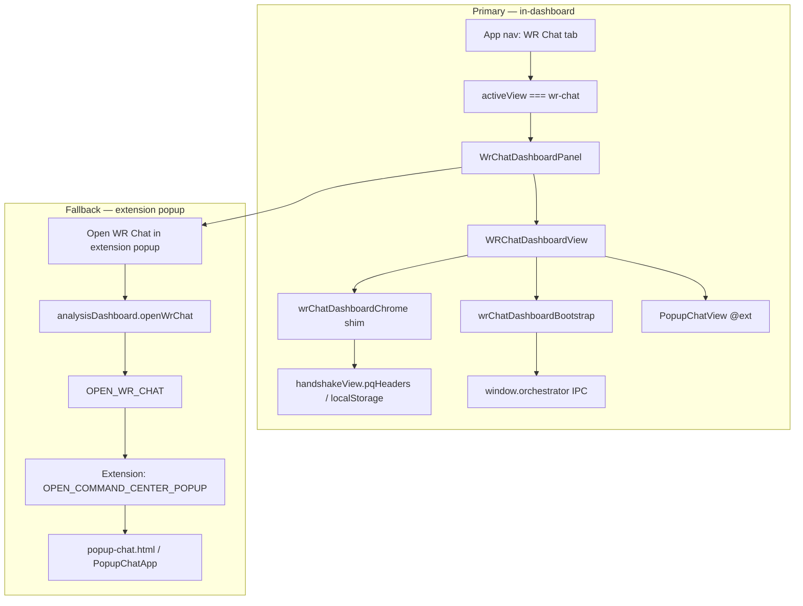

# WR Chat — Dashboard In-Content Integration (Final)

**Scope:** Dashboard-side path only. **Out of scope:** `HybridSearch` (BEAP top-bar chat), removing the extension popup, or BEAP-specific flows except shared code.

---

## Final architecture

| Layer | Responsibility |
|--------|----------------|
| **`App.tsx`** | `DashboardView` includes `'wr-chat'`; main nav sets `setActiveView('wr-chat')` and renders `WrChatDashboardPanel` in `<main>`. |
| **`WrChatDashboardPanel`** | Hosts `WRChatDashboardView` + **fallback** footer (popup opener only — not the primary entry). |
| **`WRChatDashboardView`** | Installs Chrome shim, sets `setWrChatRuntimeSurface('dashboard')`, awaits `ensureOrchestratorSessionForDashboard()`, mounts `PopupChatView` with `persistTranscriptStorageKey` + `wrChatEmbedContext="dashboard"`, wires `window.llm` for models. |
| **`wrChatDashboardChrome.ts`** | When `chrome.runtime.id` is missing, provides `sendMessage`, `storage.local`, `tabs.query` for dashboard WR Chat. |
| **`wrChatDashboardBootstrap.ts`** | Ensures orchestrator session keys via `window.orchestrator.connect` / `listSessions` when appropriate. |
| **`wrChatDashboardLog.ts`** | Prefixed `[WR Chat:Dashboard]` logging — `warn` always; `debug` only in dev. |

**BEAP / HybridSearch:** unchanged; no imports or edits in that path.

---

## Primary path (in-content)

1. User clicks **WR Chat** in the dashboard nav → `activeView === 'wr-chat'`.
2. `WrChatDashboardPanel` renders `WRChatDashboardView` (full `PopupChatView` embed with shims + bootstrap).
3. Transcript persistence uses `WR_CHAT_DASHBOARD_TRANSCRIPT_KEY` in `localStorage`.
4. Tag-trigger execution from chat is skipped in dashboard context (`wrChatEmbedContext === 'dashboard'`) — extension background is authoritative for those flows.

---

## Fallback path (extension popup)

**Purpose:** Parity with the legacy separate window, debugging, and flows that still require the extension background (e.g. tag automation). It is **not** the default entry.

| Step | Mechanism |
|------|-----------|
| UI | Footer on `WrChatDashboardPanel`: **“Open WR Chat in extension popup”** |
| Preload | `window.analysisDashboard.openWrChat()` |
| Main | `OPEN_WR_CHAT` → WebSocket → extension `OPEN_COMMAND_CENTER_POPUP` |
| Extension | `chrome.windows` popup → `popup-chat.html` → `PopupChatApp` |

If `openWrChat` is missing, the handler logs `[WR Chat:Dashboard] analysisDashboard.openWrChat unavailable — is preload loaded?` and returns.

---

## Logging and defensive guards

- **`wrChatDashboardLog`:** `wrChatDashboardWarn` / `wrChatDashboardDebug` — use for dashboard-mode failures and dev tracing (debug gated by `import.meta.env.DEV`).
- **Bootstrap (`wrChatDashboardBootstrap.ts`):** Early exit with warn if `window.orchestrator.connect` / `listSessions` are missing; handles `{ success: false }` from IPC.
- **Shim (`wrChatDashboardChrome.ts`):** Warns when `handshakeView.pqHeaders` is missing, `X-Launch-Secret` is empty, or header fetch throws; unknown `sendMessage` types log with the same prefix.
- **`WRChatDashboardView`:** Warns when `window.llm.getStatus` / `setActiveModel` are unavailable; logs orchestrator bootstrap errors and refresh failures.

---

## Known limitations

- **Tag triggers / `ELECTRON_EXECUTE_TRIGGER`:** Not executed from in-dashboard chat (intentional skip + shim no-op). Use the **fallback popup** or future IPC if background execution from the dashboard is required.
- **Storage parity:** Shim uses `localStorage`; extension popup uses `chrome.storage.local` — they can diverge for keys that are not explicitly aligned.
- **Large transcripts:** Persisted JSON in `localStorage` may hit quota for very large threads; **Clear** in the UI resets the dashboard key.
- **Orchestrator:** Session bootstrap depends on `window.orchestrator` and a healthy handshake; missing bridges surface as warnings in the console.

---

## Rollback

1. **Git:** `git checkout main` (or the pre-change branch), or revert the commit(s) that introduced the dashboard WR Chat wiring.
2. **Nav-only rollback (minimal diff):** In `App.tsx`, change the WR Chat tab `onClick` from `setActiveView('wr-chat')` to `() => window.analysisDashboard?.openWrChat()` (see comment above that button), and remove the `activeView === 'wr-chat'` branch in `<main>` that renders `WrChatDashboardPanel` if you want popup-only again.

No feature flag is required; rollback is branch revert or the small `App.tsx` edit above.

---

## Build verification

- `cd apps/electron-vite-project && npx vite build` should complete successfully.

---

## Reference — key files

| File | Role |
|------|------|
| `apps/electron-vite-project/src/App.tsx` | `wr-chat` view + nav; rollback comment |
| `apps/electron-vite-project/src/components/WrChatDashboardPanel.tsx` | Panel + fallback footer |
| `apps/electron-vite-project/src/components/WRChatDashboardView.tsx` | Embed, LLM wiring, bootstrap |
| `apps/electron-vite-project/src/shims/wrChatDashboardChrome.ts` | Electron chrome API shim |
| `apps/electron-vite-project/src/lib/wrChatDashboardBootstrap.ts` | Orchestrator session bootstrap |
| `apps/electron-vite-project/src/lib/wrChatDashboardLog.ts` | Prefixed logging |
| `apps/electron-vite-project/src/lib/wrChatDashboardConstants.ts` | Transcript storage key |
| `apps/electron-vite-project/src/lib/wrChatRuntimeMode.ts` | Dashboard surface flag |
| `apps/extension-chromium/src/ui/components/PopupChatView.tsx` | Shared chat UI (props for dashboard embed) |
| `apps/electron-vite-project/electron/preload.ts` | `openWrChat` (fallback) |

*Last updated: finalized dashboard integration — primary in-content path, separated fallback popup, logging/guards, rollback notes.*
